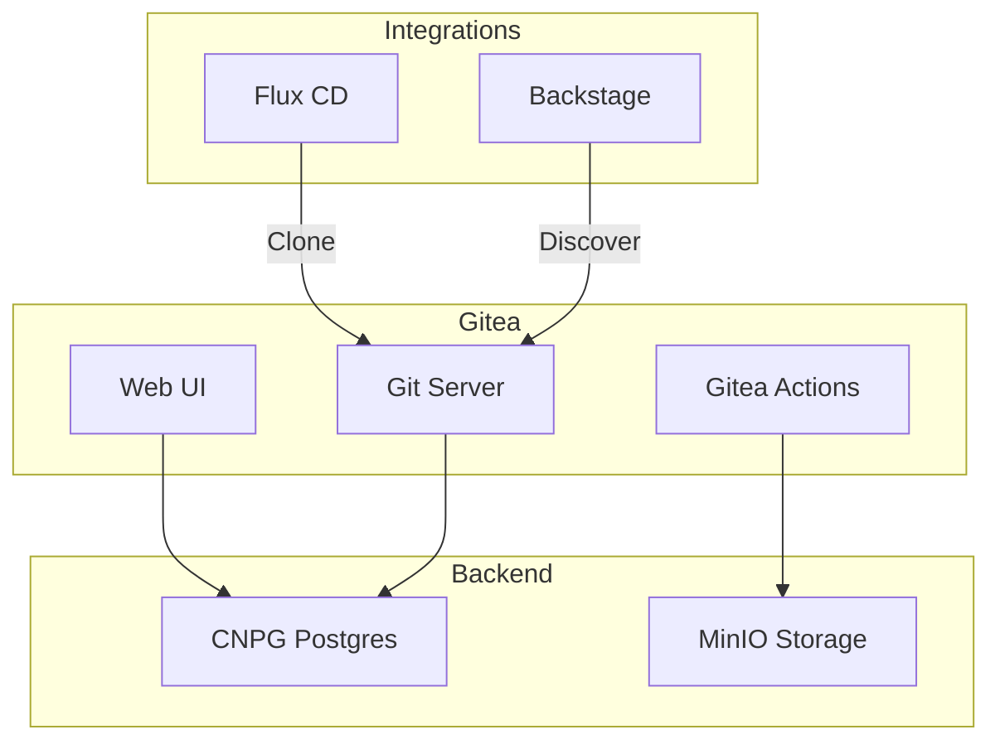
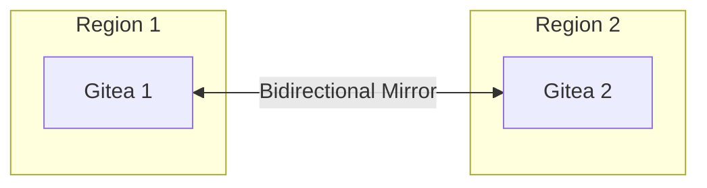

# Gitea

Self-hosted Git and CI/CD for OpenOva platform.

**Status:** Accepted | **Updated:** 2026-01-17

---

## Overview

Gitea provides self-hosted Git with CI/CD capabilities:
- Internal Git repository hosting
- Gitea Actions (GitHub Actions compatible)
- Bidirectional mirroring for multi-region
- CNPG PostgreSQL backend

---

## Architecture



---

## Multi-Region Mirroring



Both Gitea instances maintain full repository copies. Each Flux installation pulls from its local Gitea.

---

## Configuration

### Gitea Deployment

```yaml
apiVersion: apps/v1
kind: Deployment
metadata:
  name: gitea
  namespace: gitea
spec:
  replicas: 1
  template:
    spec:
      containers:
        - name: gitea
          image: gitea/gitea:1.21
          env:
            - name: GITEA__database__DB_TYPE
              value: postgres
            - name: GITEA__database__HOST
              value: gitea-postgres-rw.databases.svc:5432
            - name: GITEA__storage__STORAGE_TYPE
              value: minio
            - name: GITEA__storage__MINIO_ENDPOINT
              value: minio.storage.svc:9000
```

### Mirror Configuration

```yaml
# app.ini
[mirror]
ENABLED = true
DISABLE_NEW_PULL = false
DISABLE_NEW_PUSH = false
DEFAULT_INTERVAL = 1m
```

---

## Gitea Actions

GitHub Actions compatible CI/CD:

```yaml
# .gitea/workflows/ci.yaml
name: CI
on:
  push:
    branches: [main]

jobs:
  build:
    runs-on: ubuntu-latest
    steps:
      - uses: actions/checkout@v4
      - name: Build
        run: make build
      - name: Test
        run: make test
```

### Actions Runner

```yaml
apiVersion: apps/v1
kind: Deployment
metadata:
  name: gitea-runner
  namespace: gitea
spec:
  replicas: 2
  template:
    spec:
      containers:
        - name: runner
          image: gitea/act_runner:latest
          env:
            - name: GITEA_INSTANCE_URL
              value: https://gitea.<domain>
            - name: GITEA_RUNNER_REGISTRATION_TOKEN
              valueFrom:
                secretKeyRef:
                  name: gitea-runner-token
                  key: token
```

---

## Integration Points

| Integration | Purpose |
|-------------|---------|
| Flux CD | GitOps source repository |
| Backstage | Repository discovery, templates |
| External Secrets | Token management |
| CNPG | PostgreSQL database |
| MinIO | LFS and Actions storage |

---

## Backup

Gitea data is backed up via:
- CNPG for PostgreSQL (WAL streaming)
- MinIO replication for storage
- Repository mirror for redundancy

---

*Part of [OpenOva](https://openova.io)*
