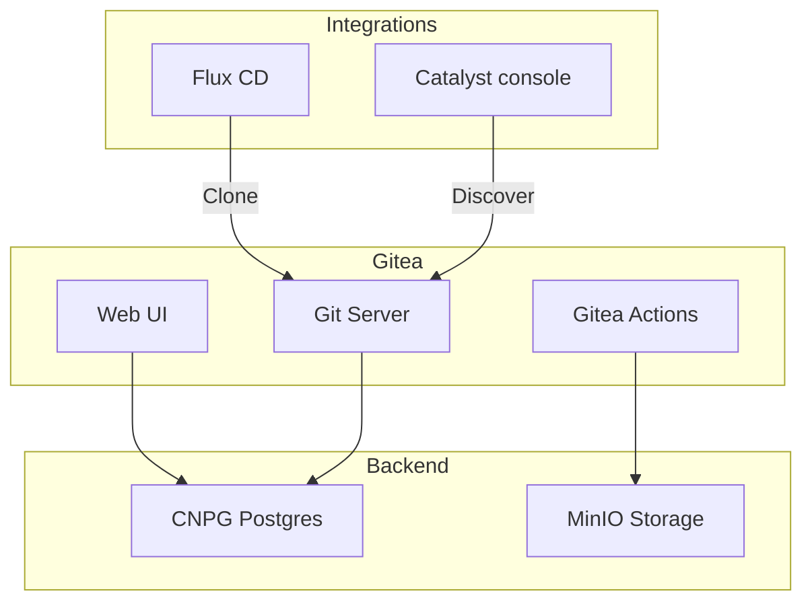
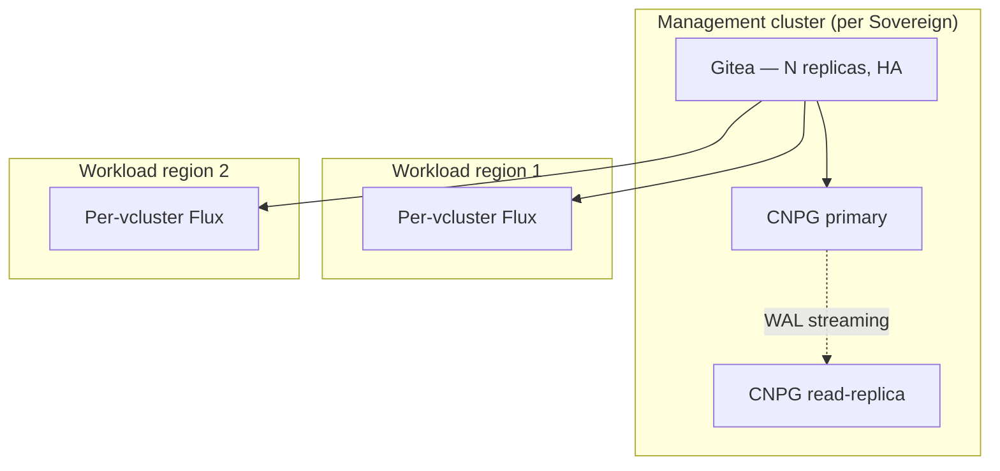

# Gitea

Per-Sovereign Git server for Catalyst. Hosts the public Blueprint catalog mirror, Org-private Blueprints, and per-Environment Gitea repos.

**Status:** Accepted | **Updated:** 2026-04-27

> **Catalyst role:** Per-Sovereign supporting service in the Catalyst control plane (one Gitea per Sovereign on the management cluster). See [`docs/PLATFORM-TECH-STACK.md`](../../docs/PLATFORM-TECH-STACK.md) §2.3 and [`docs/ARCHITECTURE.md`](../../docs/ARCHITECTURE.md) §3.

---

## Overview

Gitea provides self-hosted Git with CI/CD capabilities:
- Internal Git repository hosting (per-Sovereign).
- Gitea Actions (GitHub Actions compatible).
- HA via intra-cluster replicas (not cross-region mirror — see Multi-Region section below).
- CNPG PostgreSQL backend.

---

## Architecture


```mermaid
flowchart TB
    subgraph Gitea["Gitea"]
        Web[Web UI]
        Git[Git Server]
        Actions[Gitea Actions]
    end

    subgraph Backend["Backend"]
        CNPG[CNPG Postgres]
        MinIO[MinIO Storage]
    end

    subgraph Integrations
        Flux[Flux CD]
        Console[Catalyst console]
    end

    Web --> CNPG
    Git --> CNPG
    Actions --> MinIO
    Flux -->|"Clone"| Git
    Console -->|"Discover"| Git
```

---

## Multi-Region Strategy

Catalyst runs **one Gitea per Sovereign** on the management cluster. Cross-region resilience comes from intra-cluster HA (multiple replicas + CNPG primary-replica), not cross-region bidirectional mirror.


```mermaid
flowchart TB
    subgraph Mgt["Management cluster (per Sovereign)"]
        G[Gitea — N replicas, HA]
        PG[CNPG primary]
        PGR[CNPG read-replica]
        G --> PG
        PG -.->|"WAL streaming"| PGR
    end

    subgraph Region1["Workload region 1"]
        F1[Per-vcluster Flux]
    end

    subgraph Region2["Workload region 2"]
        F2[Per-vcluster Flux]
    end

    G --> F1
    G --> F2
```

**Why not cross-region bidirectional mirror?**
- Single source of truth simplifies the merge story (the Sovereign-wide Catalyst console writes once, all Flux instances pull from one place).
- Bidirectional mirror would create write-conflict semantics that complicate EnvironmentPolicy enforcement (which requires PR approvals to be authoritative on the destination repo).
- Workload region failures don't affect Gitea — Flux is read-mostly during outages and the management cluster is the primary failure domain to harden.

If the Sovereign needs Gitea continuity across a full management-cluster failure, the relevant pattern is a DR replica of the management cluster — not Gitea mirroring inside one Sovereign.

---

## Configuration

### Gitea Deployment

```yaml
apiVersion: apps/v1
kind: Deployment
metadata:
  name: gitea
  namespace: gitea
spec:
  replicas: 1
  template:
    spec:
      containers:
        - name: gitea
          image: gitea/gitea:1.21
          env:
            - name: GITEA__database__DB_TYPE
              value: postgres
            - name: GITEA__database__HOST
              value: gitea-postgres-rw.databases.svc:5432
            - name: GITEA__storage__STORAGE_TYPE
              value: minio
            - name: GITEA__storage__MINIO_ENDPOINT
              value: minio.storage.svc:9000
```

### Mirror Configuration

```yaml
# app.ini
[mirror]
ENABLED = true
DISABLE_NEW_PULL = false
DISABLE_NEW_PUSH = false
DEFAULT_INTERVAL = 1m
```

---

## Gitea Actions

GitHub Actions compatible CI/CD:

```yaml
# .gitea/workflows/ci.yaml
name: CI
on:
  push:
    branches: [main]

jobs:
  build:
    runs-on: ubuntu-latest
    steps:
      - uses: actions/checkout@v4
      - name: Build
        run: make build
      - name: Test
        run: make test
```

### Actions Runner

```yaml
apiVersion: apps/v1
kind: Deployment
metadata:
  name: gitea-runner
  namespace: gitea
spec:
  replicas: 2
  template:
    spec:
      containers:
        - name: runner
          image: gitea/act_runner:latest
          env:
            - name: GITEA_INSTANCE_URL
              value: https://gitea.<domain>
            - name: GITEA_RUNNER_REGISTRATION_TOKEN
              valueFrom:
                secretKeyRef:
                  name: gitea-runner-token
                  key: token
```

---

## Integration Points

| Integration | Purpose |
|-------------|---------|
| Flux CD | GitOps source repository |
| Catalyst console | Repository discovery, templates |
| External Secrets | Token management |
| CNPG | PostgreSQL database |
| MinIO | LFS and Actions storage |

---

## Backup

Gitea data is backed up via:
- CNPG for PostgreSQL (WAL streaming to async standby; backed up via Velero to MinIO + cloud archival).
- MinIO replication for LFS/Actions storage.
- Velero scheduled backups of the gitea namespace.

---

*Part of [OpenOva](https://openova.io)*
