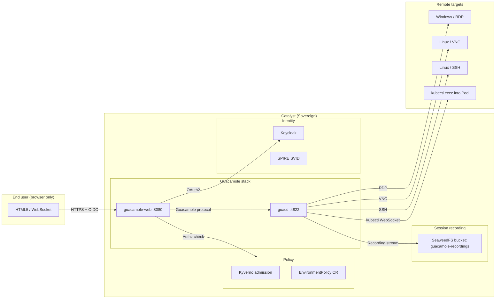

# Apache Guacamole

Clientless remote-desktop gateway. **Application Blueprint** (see [`docs/PLATFORM-TECH-STACK.md`](../../docs/PLATFORM-TECH-STACK.md) §4.5 — Communication). Provides browser-based RDP / VNC / SSH / Kubernetes-shell access to internal hosts and Pods, with Keycloak SSO, full session recording to SeaweedFS, and Kyverno-enforced access policies. Used by `bp-relay` and corporate Sovereigns that need auditable remote-access without distributing native clients to users.

**Status:** Accepted | **Updated:** 2026-04-28

---

## Overview

Apache Guacamole is an HTML5-based remote desktop gateway. End users open a browser, authenticate via Keycloak (Catalyst's identity), and reach RDP / VNC / SSH endpoints inside the Sovereign — without installing any native client. Every session is recorded as a `.guac` capture to SeaweedFS for compliance review.

Within OpenOva, Guacamole is the standard remote-access layer for:
- Sovereign-admins who need shell access to a vcluster's debug Pod (kubectl exec via Guacamole, JIT-elevated)
- Corporate Org-admins reaching Windows-based legacy systems hosted as Apps
- Auditors reviewing recorded sessions during compliance evidence gathering

It replaces VPN + native RDP/VNC client distribution with one browser-accessible, SSO-gated, fully-audited surface.

---

## Architecture



---

## Why Guacamole

| Factor | Guacamole |
|---|---|
| **License** | Apache 2.0 |
| **Clientless** | Pure HTML5 + WebSocket — no native RDP / VNC client distribution |
| **Auth** | OAuth2 / OIDC (works directly with Keycloak) — SSO across Catalyst |
| **Session recording** | Native `.guac` capture, replayable in browser; ships to SeaweedFS |
| **Protocols** | RDP, VNC, SSH, Telnet, kubernetes (via the Guacamole K8s plugin) |
| **Auditability** | Every connection logged with user identity, target, duration, recording URL |

---

## Configuration

### Deployment

```yaml
apiVersion: apps/v1
kind: Deployment
metadata:
  name: guacamole-web
  namespace: relay
spec:
  replicas: 2
  template:
    spec:
      containers:
        - name: guacamole
          image: guacamole/guacamole:1.5.5
          ports: [{ containerPort: 8080 }]
          env:
            - name: GUACD_HOSTNAME
              value: guacd.relay.svc
            - name: OPENID_AUTHORIZATION_ENDPOINT
              value: "https://keycloak.<location-code>.<sovereign-domain>/realms/<org>/protocol/openid-connect/auth"
            - name: OPENID_JWKS_ENDPOINT
              value: "https://keycloak.<location-code>.<sovereign-domain>/realms/<org>/protocol/openid-connect/certs"
            - name: OPENID_ISSUER
              value: "https://keycloak.<location-code>.<sovereign-domain>/realms/<org>"
            - name: OPENID_CLIENT_ID
              value: guacamole
            - name: OPENID_REDIRECT_URI
              value: "https://guacamole.<env>.<sovereign-domain>/"
            - name: RECORDING_PATH
              value: s3://seaweedfs.storage.svc:8333/guacamole-recordings/
            - name: POSTGRES_HOSTNAME
              value: guacamole-db-rw.relay.svc
---
apiVersion: apps/v1
kind: Deployment
metadata:
  name: guacd
  namespace: relay
spec:
  replicas: 2
  template:
    spec:
      containers:
        - name: guacd
          image: guacamole/guacd:1.5.5
          ports: [{ containerPort: 4822 }]
```

---

## Connection definitions (managed via Catalyst console)

```yaml
apiVersion: catalyst.openova.io/v1alpha1
kind: GuacamoleConnection
metadata:
  name: legacy-payment-gateway
  namespace: relay
spec:
  protocol: rdp
  hostname: "10.42.7.12"
  port: 3389
  audience:
    keycloakRoles: [legacy-app-operator, security-officer]
  recording:
    enabled: true
    bucket: guacamole-recordings
    retentionDays: 365              # compliance default
  jit:
    requiredApprovers: [team-platform]
    maxDurationMinutes: 60
```

`GuacamoleConnection` is reconciled by Catalyst's `relay-controller` into Guacamole's PostgreSQL backend (managed by CNPG). The Catalyst console exposes a "Connections" tab; sovereign-admin and org-admin grant connection access via Keycloak group membership.

---

## Use Cases

| Use case | Protocol | JIT required | Recording |
|---|---|---|---|
| Sovereign-admin debug into vcluster Pod | kubectl WebSocket | Yes | Always |
| Corporate-admin reaches legacy Windows ERP | RDP | Yes (per EnvironmentPolicy) | Always |
| Developer reaches lab VM in dev Environment | SSH | Optional | Configurable |
| Auditor reviews recorded session | replay only | No (read role only) | N/A |

---

## Compliance integration

Session recordings count as **PSD2/DORA/SOX evidence**:

- Every recording has the user's Keycloak `sub` claim, target identity, start/end timestamps, and content hash committed to the Catalyst audit log via OpenSearch SIEM.
- `bp-specter` Compliance Agent indexes recordings as audit evidence for the Compliance Mappings table (per [`BUSINESS-STRATEGY.md`](../../docs/BUSINESS-STRATEGY.md) §5.3).
- `EnvironmentPolicy.rules` of kind `recording-required` blocks any unrecorded session attempt to prod targets.

---

## Monitoring

| Metric | Description |
|---|---|
| `guacamole_active_sessions` | Live session count |
| `guacamole_session_duration_seconds` | Per-session duration histogram |
| `guacamole_recording_bytes_total` | Bytes written to SeaweedFS |
| `guacamole_auth_failures_total` | Failed Keycloak handshakes |

---

*Part of [OpenOva](https://openova.io)*
