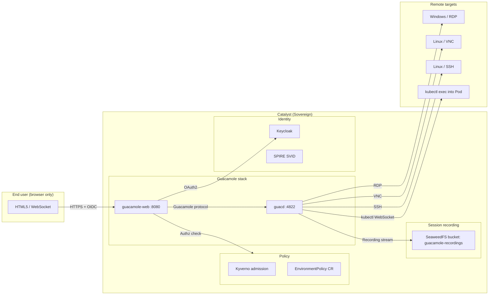

# Apache Guacamole

Clientless remote-desktop gateway. **Application Blueprint** (see [`docs/ARCHITECTURE.md`](../../docs/ARCHITECTURE.md) §4.5 — Communication). Provides browser-based RDP / VNC / SSH / Kubernetes-shell access to internal hosts and Pods, with Keycloak SSO, full session recording to SeaweedFS, and Kyverno-enforced access policies. Used by `bp-relay` and corporate Sovereigns that need auditable remote-access without distributing native clients to users.

**Status:** Accepted | **Updated:** 2026-04-28

---

## Overview

Apache Guacamole is an HTML5-based remote desktop gateway. End users open a browser, authenticate via Keycloak (Catalyst's identity), and reach RDP / VNC / SSH endpoints inside the Sovereign — without installing any native client. Every session is recorded as a `.guac` capture to SeaweedFS for compliance review.

Within OpenOva, Guacamole is the standard remote-access layer for:
- Sovereign-admins who need shell access to a vcluster's debug Pod (kubectl exec via Guacamole, JIT-elevated)
- Corporate Org-admins reaching Windows-based legacy systems hosted as Apps
- Auditors reviewing recorded sessions during compliance evidence gathering

It replaces VPN + native RDP/VNC client distribution with one browser-accessible, SSO-gated, fully-audited surface.

---

## Architecture


```mermaid
flowchart LR
    subgraph User["End user (browser only)"]
        Browser[HTML5 / WebSocket]
    end

    subgraph Catalyst["Catalyst (Sovereign)"]
        subgraph GuacamoleStack["Guacamole stack"]
            GuacWeb[guacamole-web :8080]
            Guacd[guacd :4822]
        end

        subgraph Identity["Identity"]
            KC[Keycloak]
            SPIRE[SPIRE SVID]
        end

        subgraph Recording["Session recording"]
            SW[SeaweedFS bucket: guacamole-recordings]
        end

        subgraph Policy["Policy"]
            Kyverno[Kyverno admission]
            EP[EnvironmentPolicy CR]
        end
    end

    subgraph Targets["Remote targets"]
        RDP[Windows / RDP]
        VNC[Linux / VNC]
        SSH[Linux / SSH]
        K8s[kubectl exec into Pod]
    end

    Browser -->|"HTTPS + OIDC"| GuacWeb
    GuacWeb -->|"OAuth2"| KC
    GuacWeb -->|"Guacamole protocol"| Guacd
    Guacd -->|"RDP"| RDP
    Guacd -->|"VNC"| VNC
    Guacd -->|"SSH"| SSH
    Guacd -->|"kubectl WebSocket"| K8s
    Guacd -->|"Recording stream"| SW
    GuacWeb -->|"Authz check"| Policy
```

---

## Why Guacamole

| Factor | Guacamole |
|---|---|
| **License** | Apache 2.0 |
| **Clientless** | Pure HTML5 + WebSocket — no native RDP / VNC client distribution |
| **Auth** | OAuth2 / OIDC (works directly with Keycloak) — SSO across Catalyst |
| **Session recording** | Native `.guac` capture, replayable in browser; ships to SeaweedFS |
| **Protocols** | RDP, VNC, SSH, Telnet, kubernetes (via the Guacamole K8s plugin) |
| **Auditability** | Every connection logged with user identity, target, duration, recording URL |

---

## Configuration

### Deployment

```yaml
apiVersion: apps/v1
kind: Deployment
metadata:
  name: guacamole-web
  namespace: relay
spec:
  replicas: 2
  template:
    spec:
      containers:
        - name: guacamole
          image: guacamole/guacamole:1.5.5
          ports: [{ containerPort: 8080 }]
          env:
            - name: GUACD_HOSTNAME
              value: guacd.relay.svc
            - name: OPENID_AUTHORIZATION_ENDPOINT
              value: "https://keycloak.<location-code>.<sovereign-domain>/realms/<org>/protocol/openid-connect/auth"
            - name: OPENID_JWKS_ENDPOINT
              value: "https://keycloak.<location-code>.<sovereign-domain>/realms/<org>/protocol/openid-connect/certs"
            - name: OPENID_ISSUER
              value: "https://keycloak.<location-code>.<sovereign-domain>/realms/<org>"
            - name: OPENID_CLIENT_ID
              value: guacamole
            - name: OPENID_REDIRECT_URI
              value: "https://guacamole.<env>.<sovereign-domain>/"
            - name: RECORDING_PATH
              value: s3://seaweedfs.storage.svc:8333/guacamole-recordings/
            - name: POSTGRES_HOSTNAME
              value: guacamole-db-rw.relay.svc
---
apiVersion: apps/v1
kind: Deployment
metadata:
  name: guacd
  namespace: relay
spec:
  replicas: 2
  template:
    spec:
      containers:
        - name: guacd
          image: guacamole/guacd:1.5.5
          ports: [{ containerPort: 4822 }]
```

---

## Connection definitions — seeded by the chart (0.2.38, mTLS target in 0.2.40)

**Status (2026-08-13, UAT row 115 / #5991).** The chart now ships a connection
**producer**. Until 0.2.38 nothing in this repository ever inserted into
`guacamole_connection` — the table is created empty by the Apache schema DDL
(`chart/files/postgresql/001-create-schema.sql:109`), the `GuacamoleConnection`
CRD and `relay-controller` this section once described were never written, and
catalyst-api's `GuacamoleClient` interface has no production implementation
(`SetGuacamoleClient` has no non-test caller). So a signed-in sovereign-admin
reached Guacamole successfully and landed on an empty connections list. The
`<adminGroup>` USER_GROUP with `ADMINISTER` + five `CREATE_*` system permissions
was already seeded — that is the *right* to create a connection, and it created
none.

**What produces the rows.** `seed_connections()` in
`chart/templates/jdbc-schema-seed-job.yaml`, alongside the existing identity
seed. It runs from `seed.sh` on install/upgrade and again from `promote.sh` on
the per-minute admin-enroll CronJob, so the set **converges**: a restored or
rebuilt database returns to the declared set on its own. Writes are idempotent —
the connection INSERT is `NOT EXISTS`-guarded (the schema's
`UNIQUE (connection_name, parent_id)` does *not* dedupe root-level connections,
because `parent_id` is NULL there and Postgres treats NULLs as distinct) and
parameters converge via `ON CONFLICT … DO UPDATE`. Each connection also gets a
`READ` grant for the admin USER_GROUP, so it renders for a member who is not a
system admin.

**The declared set** lives in `.Values.guacamole.database.connections`. The
default is one target — `sovereign-node`, protocol `ssh`, port 22, user `root`.
Its hostname is this Sovereign's own node address, taken from the seeder Pod's
**downward API** (`status.hostIP`): no node list is baked into a public chart and
the seeder needs no cluster read. Declare nothing and the producer's body
renders empty — zero rows, never a fabricated one, which matters on a table that
carries credentials.

**Credentials never come from values or the chart.** A target names an *optional*
Secret (`credentialSecretName`); the seeder mounts it read-only at
`/conn-cred/<connection-name>` and reads `username` / `password` / `private-key`
/ `passphrase` at run time. Setting a credential-shaped parameter under
`parameters` fails the helm render on purpose — this repo is public and those
values land in a ConfigMap.

**Honest limits, so the next reader does not re-derive them.**

- The Sovereign's node sshd is key-only (`PasswordAuthentication no`,
  `PermitRootLogin prohibit-password` —
  `infra/providers/_shared/cloudinit-control-plane.tftpl:118-136`), and the node
  SSH private key is deliberately **not** in the cluster. With no
  `credentialSecretName`, Guacamole opens the connection and prompts; point it at
  a Secret holding `private-key` and the session authenticates. Who holds that
  key is a Sovereign decision, not a platform one.
- The `sovereign-node` target above is therefore **listed but not usable** out of
  the box. That is the reason 0.2.40 adds a second target rather than calling
  row 115 done at 0.2.38.

### `cluster-shell` — the target that authenticates on click (0.2.40)

`cluster-shell` is guacd's `kubernetes` protocol pointed at **bp-k8s-ws-proxy's
mTLS listener**, and it is the one seeded connection whose credential the
platform holds end to end.

- **Why mTLS at all.** guacd cannot present the proxy's `X-Catalyst-HMAC`
  credential: its `kubernetes` protocol builds the WebSocket upgrade through
  libwebsockets with no hook for custom HTTP headers, and builds the path with a
  literal `snprintf` (guacamole-server 1.5.5,
  `src/protocols/kubernetes/{kubernetes,url}.c`). The only credential it *can*
  present is a TLS client certificate — `client-cert` / `client-key` / `ca-cert`,
  read as in-memory PEM in `src/protocols/kubernetes/ssl.c`. So `bp-k8s-ws-proxy`
  0.1.17 gained an mTLS listener that accepts a client certificate as an
  alternative to the HMAC pair, and serves the apiserver-shaped path guacd emits.
  The HMAC contract is untouched.
- **Where the certificate comes from.** `bp-k8s-ws-proxy` mints it from a private
  CA it owns (that CA signs two leaves — the proxy's server cert and this client
  cert — and nothing else), allowlists exactly that one subject, and mirrors the
  Secret into the `guacamole` namespace via reflector. The seeder reads
  `tls.crt` / `tls.key` / `ca.crt` from the read-only mount at run time and writes
  them as guacd's `client-cert` / `client-key` / `ca-cert`. **That rename is
  load-bearing**: written through unrenamed, guacd receives no client certificate
  and every click 401s with nothing in the row to explain it.
- **Why not the kube-apiserver directly**, which guacd also supports: an
  apiserver-trusted client certificate needs CSR **approve** on the
  `kubernetes.io/kube-apiserver-client` signer, which is not scopeable by CN and
  is therefore cluster-admin-equivalent escalation shipped default-on in a public
  chart. The proxy is our own service with its own CA and its own allowlist, so
  the same wire costs none of that.
- **`pod` names a WORKLOAD, not a Pod.** A connection is a row written once and
  read on every click, so a literal Deployment/DaemonSet pod name would 404 after
  the first rollout. The proxy resolves the segment against its
  `POD_ALIAS_LABEL`, trying the literal Pod name first and failing hard (404) when
  a workload name matches nothing. The default target is the proxy's own
  node-local DaemonSet Pod.
- **Reachability is part of the fix.** guacd dials the proxy itself, and the
  Sovereign applies a namespace-wide default-deny (`bp-plane-isolation`), so
  `chart/templates/networkpolicy.yaml` gained a `guacd-egress` policy for DNS +
  the proxy's mTLS port. Without it the connection renders in the list and hangs
  on click. NetworkPolicies are additive, so it only grants.

The browser shell into a Pod is unchanged and still the console's
`/shells/issue` → k8s-ws-proxy → xterm.js path over HMAC.

Tests: `chart/tests/connection-seed-render.sh` (render + the empty-set control +
the credential guard) and `chart/tests/connection-seed-sql.sh`, which executes
the shipped `seed.sh`/`common.sh` against a throwaway Postgres and reads the
tables back.

Design sketch (a CRD-shaped future, **not** reconciled by anything today — the
shipped model is the values-driven set above):

```yaml
apiVersion: catalyst.openova.io/v1alpha1
kind: GuacamoleConnection
metadata:
  name: legacy-payment-gateway
  namespace: relay
spec:
  protocol: rdp
  hostname: "10.42.7.12"
  port: 3389
  audience:
    keycloakRoles: [legacy-app-operator, security-officer]
  recording:
    enabled: true
    bucket: guacamole-recordings
    retentionDays: 365              # compliance default
  jit:
    requiredApprovers: [team-platform]
    maxDurationMinutes: 60
```

That sketch's model is a controller reconciling `GuacamoleConnection` into
Guacamole's PostgreSQL backend, a "Connections" tab in the Catalyst console, and
JIT approval — **none of those three is built**. What 0.2.38 ships instead is the
declarative values-driven set described above, written by the seed Job, which
covers the "the list must not be empty for a sovereign-admin" contract without a
CRD, a controller, or a console surface.

---

## Use Cases

| Use case | Protocol | JIT required | Recording |
|---|---|---|---|
| Sovereign-admin debug into vcluster Pod | kubectl WebSocket | Yes | Always |
| Corporate-admin reaches legacy Windows ERP | RDP | Yes (per EnvironmentPolicy) | Always |
| Developer reaches lab VM in dev Environment | SSH | Optional | Configurable |
| Auditor reviews recorded session | replay only | No (read role only) | N/A |

---

## Compliance integration

Session recordings count as **PSD2/DORA/SOX evidence**:

- Every recording has the user's Keycloak `sub` claim, target identity, start/end timestamps, and content hash committed to the Catalyst audit log via OpenSearch SIEM.
- `bp-specter` Compliance Agent indexes recordings as audit evidence for the Compliance Mappings table (per [`BUSINESS-STRATEGY.md`](../../docs/BUSINESS-STRATEGY.md) §5.3).
- `EnvironmentPolicy.rules` of kind `recording-required` blocks any unrecorded session attempt to prod targets.

---

## Monitoring

| Metric | Description |
|---|---|
| `guacamole_active_sessions` | Live session count |
| `guacamole_session_duration_seconds` | Per-session duration histogram |
| `guacamole_recording_bytes_total` | Bytes written to SeaweedFS |
| `guacamole_auth_failures_total` | Failed Keycloak handshakes |

---

## Operational notes — multi-region session semantics (the #5509 forensics)

**The webapp's REST session store is in-memory and unreplicated.** Guacamole
1.5.5 keeps auth tokens in an in-process `TokenSessionMap`; there is no
external/shared session backend in any released version. On a two-region
Sovereign, each region runs its own webapp copy behind the one public door, so
a token minted by one copy is **unknown** to the other. Any request that lands
on the non-minting copy fails with exactly:

```
HTTP 403, type PERMISSION_DENIED, message "Permission Denied."
```

produced by upstream `guacamole/src/main/java/org/apache/guacamole/rest/auth/
AuthenticationService.java:506` (`GuacamoleUnauthorizedException`, thrown when
the token is absent from the map; it extends `GuacamoleSecurityException` →
`CLIENT_UNAUTHORIZED(403)`). The same signature appears when a cached token
expires (see the `#5598` block in `chart/values.yaml`
`webapp.apiSessionTimeoutMinutes`).

**Do not re-root a per-data-source 403 as an authorization gap.** The hw291
walk behind #5509 observed `/session/data/postgresql-shared/self/
effectivePermissions` → 403 in 8/8 runs while plain `postgresql` failed only
2/8, and recorded it as "`postgresql-shared` deterministically rejects a
header-authenticated user". Upstream source refutes that reading:

- `postgresql-shared` is advertised to **every** authenticated principal by
  design, in every auth mode — the JDBC jar's second provider returns an
  (empty) `SharedUserContext` unconditionally
  (`...auth/jdbc/sharing/SharedAuthenticationProviderService.java:82-92`).
  The chart wires the jar via `POSTGRESQL_HOSTNAME`
  (`chart/templates/guacamole-deployment.yaml:130`); no upstream property
  exists to suppress the second registration (verified against the full
  1.5.5 property list), and nothing header-specific is involved.
- On the session-owning pod that endpoint **cannot** return 403: `SharedUser.
  getEffectivePermissions()` returns a valid empty permission view
  (`...sharing/user/SharedUser.java:111-112,154`) → HTTP 200. There is no
  permission check to fail, hence also nothing to "grant".
- A session genuinely lacking the context would return **404 NOT_FOUND**
  (`GuacamoleSession.java:161`), which the SPA explicitly tolerates per-source
  (`app/rest/services/dataSourceService.js:98-99` resolves 404s); only
  non-404 failures reject the whole fan-out and render `.fatal-page-error`.
- Therefore a run that returns 200 for `postgresql` and 403 for
  `postgresql-shared` under one token was served by **two different pods** —
  a single pod either knows the token (both 200) or not (both 403). The 8/8
  vs 2/8 split is one routing mechanism with systematic (non-independent)
  request-to-backend assignment — the SPA fires its per-source burst in a
  fixed order, so a deterministic distribution over two backends yields a
  fixed per-endpoint loser — not two defects. Probability arguments that
  assume i.i.d. per-request routing do not hold across reused/pooled
  connections (cf. `reference_browser_repeat_count_cannot_sample_a_round_
  robin_http2_pinning.md`).

**Discriminating live test** (settles owner-vs-routing in minutes): mint one
token, then replay BOTH endpoints ~20× each over **fresh TCP connections**
(fresh-TCP curl, never a browser loop). Routing class → both endpoints fail on
the same connections at the same per-region rate. A true per-source
authorization gap → `postgresql-shared` fails on every connection including
the minting region's.

**Fix ownership**: single-owner routing for the webapp (the A16
two-copies-behind-one-door class, #5480 family) — not chart/values changes in
this Blueprint. Neither "grant postgresql-shared" (nothing to grant) nor
"stop advertising it" (no upstream knob; and the plain-`postgresql` leg keeps
failing at the per-region routing rate, so the SPA still fatals) can close
UAT rows 35/115. Refs #5509 #5480.

---

*Part of [OpenOva](https://openova.io)*
