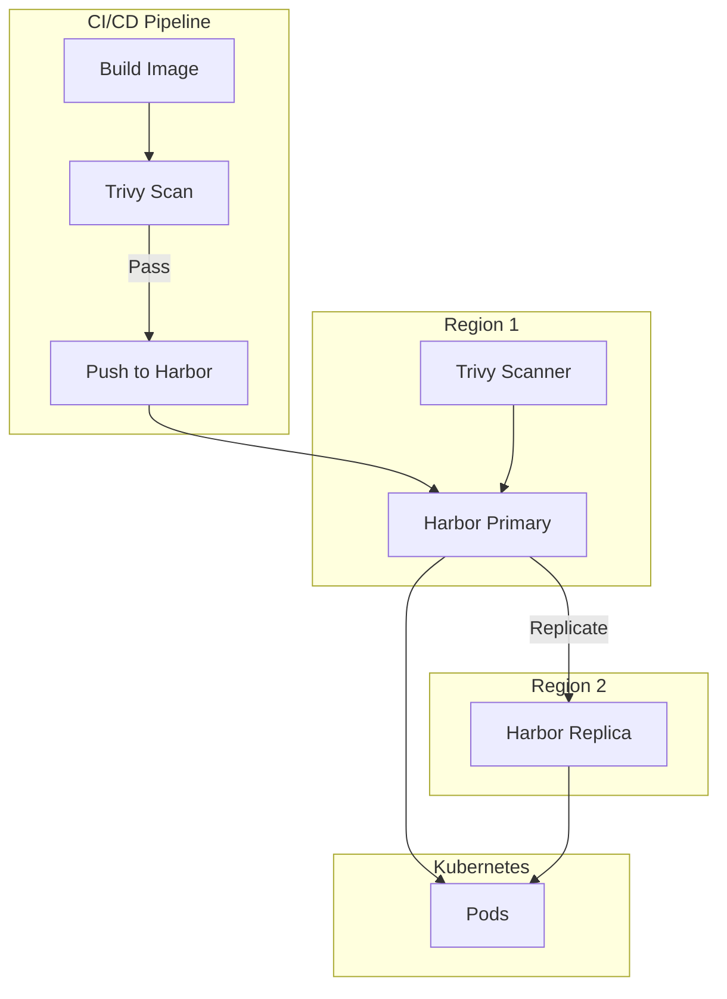
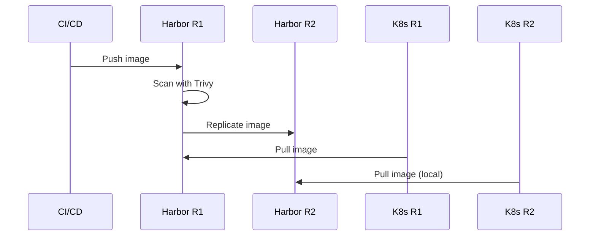
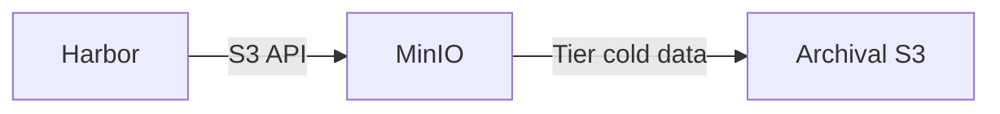
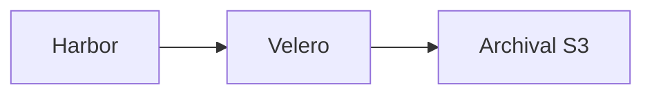

# Harbor

Container registry with vulnerability scanning and multi-region replication.

**Status:** Accepted | **Updated:** 2026-02-07

---

## Overview

**Harbor is mandatory** as the container registry for all OpenOva deployments. It provides secure storage, vulnerability scanning, and cross-region replication.



---

## Why Mandatory?

| Requirement | Harbor | External Registry |
|-------------|--------|-------------------|
| Multi-region replication | ✅ Built-in | ❌ |
| Vulnerability scanning | ✅ Trivy integrated | ⚠️ Depends on provider |
| Air-gap support | ✅ Self-hosted | ❌ |
| RBAC | ✅ Full control | ⚠️ Provider-specific |
| Audit logging | ✅ Complete | ⚠️ Limited |
| No external dependency | ✅ | ❌ |

---

## Features

| Feature | Support |
|---------|---------|
| Image storage | OCI-compliant |
| Vulnerability scanning | Trivy integration |
| Image signing | Cosign/Notary |
| Replication | Push/pull between regions |
| RBAC | Project-based access |
| Quotas | Per-project storage limits |
| Garbage collection | Automatic cleanup |

---

## Multi-Region Replication



**Replication Modes:**
- **Push-based**: Primary pushes to replicas (default)
- **Pull-based**: Replicas pull from primary
- **Bidirectional**: Both push and pull (active-active)

**Benefits:**
- Images available locally in each region
- Survives regional failure
- Faster pulls (no cross-region traffic)

---

## Storage Backend Options

| Backend | Use Case | Notes |
|---------|----------|-------|
| PVC | Small deployments | Local storage |
| S3 (MinIO) | Production | Recommended - tiered archiving |
| Cloud S3 | Managed | AWS S3 / GCS / Azure Blob |

### Recommended: S3 via MinIO



---

## Configuration

### Helm Values

```yaml
expose:
  type: ingress
  ingress:
    className: cilium
    hosts:
      core: harbor.<domain>
    annotations:
      cert-manager.io/cluster-issuer: letsencrypt-prod

# S3 Storage (MinIO)
persistence:
  imageChartStorage:
    type: s3
    s3:
      region: us-east-1
      bucket: harbor-registry
      accesskey: ""  # From ESO secret
      secretkey: ""  # From ESO secret
      regionendpoint: http://minio.minio-system.svc:9000
      v4auth: true

trivy:
  enabled: true

database:
  type: internal  # or external for CNPG

redis:
  type: internal  # or external for Valkey

core:
  secretName: harbor-core-secret
```

### Replication Policy

```json
{
  "name": "cross-region-replication",
  "dest_registry": {
    "id": 1,
    "name": "harbor-region2"
  },
  "trigger": {
    "type": "event_based"
  },
  "filters": [
    {
      "type": "name",
      "value": "**"
    }
  ],
  "replicate_deletion": true,
  "enabled": true
}
```

---

## Security Scanning

### Trivy Integration

| Scan Type | Trigger |
|-----------|---------|
| On push | Automatic when image pushed |
| Scheduled | Daily full scan |
| Manual | On-demand via UI/API |

### Scan Policy

| Severity | Action |
|----------|--------|
| Critical | Block pull |
| High | Allow (configurable) |
| Medium | Allow |
| Low | Allow |

---

## Kyverno Policies

### Require Harbor Images

```yaml
apiVersion: kyverno.io/v1
kind: ClusterPolicy
metadata:
  name: require-harbor-images
spec:
  validationFailureAction: Enforce
  rules:
    - name: require-harbor-registry
      match:
        any:
          - resources:
              kinds:
                - Pod
      validate:
        message: "Images must be pulled from Harbor registry"
        pattern:
          spec:
            containers:
              - image: "harbor.<domain>/*"
```

---

## Resource Requirements

| Component | CPU | Memory |
|-----------|-----|--------|
| Harbor Core | 0.5 | 512Mi |
| Registry | 0.5 | 512Mi |
| Database | 0.5 | 512Mi |
| Redis | 0.25 | 256Mi |
| Trivy | 0.5 | 1Gi |
| **Total** | **2.25** | **2.75Gi** |

---

## Backup Strategy

Harbor data backed up via Velero to Archival S3:



**Backed up:**
- Database (PostgreSQL)
- Registry storage (blobs)
- Configuration

---

## Consequences

**Positive:**
- Complete control over image lifecycle
- Built-in vulnerability scanning
- Multi-region replication for DR
- Air-gap ready
- Audit trail for compliance

**Negative:**
- Resource overhead (~3GB RAM)
- Operational responsibility
- Backup requirements (handled by Velero)

---

*Part of [OpenOva](https://openova.io)*
