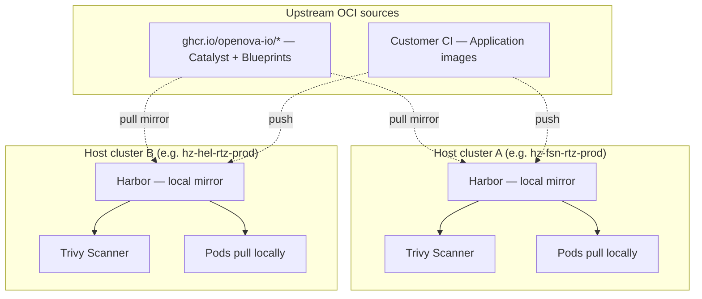
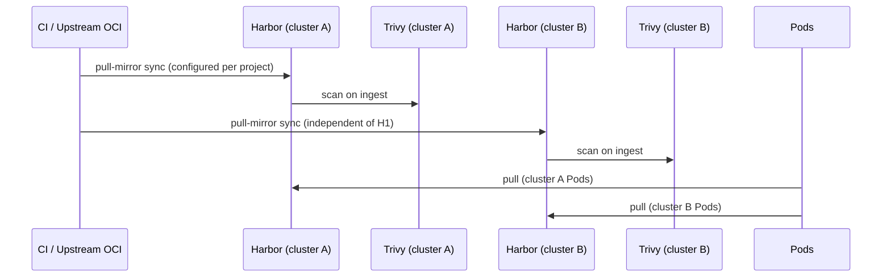
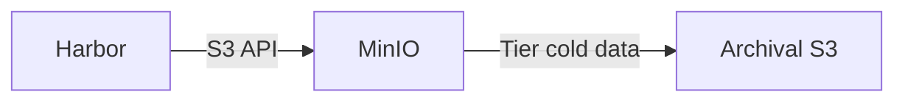
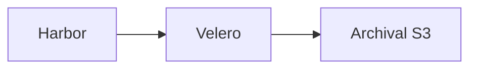

# Harbor

Container registry with vulnerability scanning. Per-host-cluster infrastructure (see [`docs/PLATFORM-TECH-STACK.md`](../../docs/PLATFORM-TECH-STACK.md) §3.5) — every host cluster runs a Harbor instance for Catalyst component images, mirrored Blueprint OCI artifacts, and customer images.

**Status:** Accepted | **Updated:** 2026-04-27

---

## Overview

**Harbor is mandatory** on every host cluster. Each host cluster runs its own Harbor instance that mirrors from upstream sources (`ghcr.io/openova-io/...` for Catalyst components and Blueprint OCI artifacts; the customer's own CI for application images). Local Harbor = fast Pod pulls, no cross-region traffic on every image pull, air-gap ready.


```mermaid
flowchart TB
    subgraph Upstream["Upstream OCI sources"]
        GHCR[ghcr.io/openova-io/* — Catalyst + Blueprints]
        CustCI[Customer CI — Application images]
    end

    subgraph Cluster1["Host cluster A (e.g. hz-fsn-rtz-prod)"]
        H1[Harbor — local mirror]
        T1[Trivy Scanner]
        Pods1[Pods pull locally]
    end

    subgraph Cluster2["Host cluster B (e.g. hz-hel-rtz-prod)"]
        H2[Harbor — local mirror]
        T2[Trivy Scanner]
        Pods2[Pods pull locally]
    end

    GHCR -.->|"pull mirror"| H1
    CustCI -.->|"push"| H1
    GHCR -.->|"pull mirror"| H2
    CustCI -.->|"push"| H2
    H1 --> T1
    H2 --> T2
    H1 --> Pods1
    H2 --> Pods2
```

---

## Why Mandatory?

| Requirement | Harbor (per host cluster) | External Registry |
|-------------|---------------------------|-------------------|
| Local pulls (no cross-region traffic) | ✅ Each cluster's Pods pull from local Harbor | ❌ Pods pull cross-region |
| Vulnerability scanning | ✅ Trivy integrated | ⚠️ Depends on provider |
| Air-gap support | ✅ Self-hosted | ❌ |
| RBAC | ✅ Full control | ⚠️ Provider-specific |
| Audit logging | ✅ Complete | ⚠️ Limited |
| No external dependency at runtime | ✅ Once mirrored | ❌ |

---

## Features

| Feature | Support |
|---------|---------|
| Image storage | OCI-compliant |
| Vulnerability scanning | Trivy integration |
| Image signing | Cosign/Notary |
| Replication | Push/pull between regions |
| RBAC | Project-based access |
| Quotas | Per-project storage limits |
| Garbage collection | Automatic cleanup |

---

## Per-host-cluster mirroring (NOT primary-replica)

Catalyst's agreed model is **one Harbor per host cluster**, each independently pulling from upstream OCI sources. There is no Harbor-to-Harbor replication primary/replica.


```mermaid
sequenceDiagram
    participant CI as CI / Upstream OCI
    participant H1 as Harbor (cluster A)
    participant T1 as Trivy (cluster A)
    participant H2 as Harbor (cluster B)
    participant T2 as Trivy (cluster B)
    participant Pods as Pods

    CI->>H1: pull-mirror sync (configured per project)
    H1->>T1: scan on ingest
    CI->>H2: pull-mirror sync (independent of H1)
    H2->>T2: scan on ingest
    Pods->>H1: pull (cluster A Pods)
    Pods->>H2: pull (cluster B Pods)
```

**Why pull-mirror, not Harbor-to-Harbor replication:**
- Single source of truth = upstream (`ghcr.io/openova-io/...` or customer CI), not a "primary Harbor".
- Each cluster is its own failure domain — primary-replica drift between Harbors would be one more thing to fail.
- Air-gap path is the same shape: a one-time mirror import vs ongoing primary-pushed replication.

**Benefits:**
- Images available locally in each cluster.
- Survives any cluster (including the management cluster) going down — workload clusters keep pulling locally.
- Faster pulls (no cross-region traffic per Pod start).

---

## Storage Backend Options

| Backend | Use Case | Notes |
|---------|----------|-------|
| PVC | Small deployments | Local storage |
| S3 (MinIO) | Production | Recommended - tiered archiving |
| Cloud S3 | Managed | AWS S3 / GCS / Azure Blob |

### Recommended: S3 via MinIO


```mermaid
flowchart LR
    Harbor[Harbor] -->|"S3 API"| MinIO[MinIO]
    MinIO -->|"Tier cold data"| Archive[Archival S3]
```

---

## Configuration

### Helm Values

```yaml
expose:
  type: ingress
  ingress:
    className: cilium
    hosts:
      core: harbor.<location-code>.<sovereign-domain>
    annotations:
      cert-manager.io/cluster-issuer: letsencrypt-prod

# S3 Storage (MinIO)
persistence:
  imageChartStorage:
    type: s3
    s3:
      region: us-east-1
      bucket: harbor-registry
      accesskey: ""  # From ESO secret
      secretkey: ""  # From ESO secret
      regionendpoint: http://minio.storage.svc:9000
      v4auth: true

trivy:
  enabled: true

database:
  type: internal  # or external for CNPG

redis:
  type: internal  # or external for Valkey

core:
  secretName: harbor-core-secret
```

### Pull-mirror policy

```json
{
  "name": "ghcr-openova-mirror",
  "src_registry": {
    "type": "harbor",
    "url": "https://ghcr.io",
    "credential": {
      "access_key": "",
      "access_secret": ""
    }
  },
  "trigger": {
    "type": "scheduled",
    "trigger_settings": {
      "cron": "0 */6 * * *"
    }
  },
  "filters": [
    {
      "type": "name",
      "value": "openova-io/**"
    }
  ],
  "enabled": true
}
```

---

## Security Scanning

### Trivy Integration

| Scan Type | Trigger |
|-----------|---------|
| On push | Automatic when image pushed |
| Scheduled | Daily full scan |
| Manual | On-demand via UI/API |

### Scan Policy

| Severity | Action |
|----------|--------|
| Critical | Block pull |
| High | Allow (configurable) |
| Medium | Allow |
| Low | Allow |

---

## Kyverno Policies

### Require Harbor Images

```yaml
apiVersion: kyverno.io/v1
kind: ClusterPolicy
metadata:
  name: require-harbor-images
spec:
  validationFailureAction: Enforce
  rules:
    - name: require-harbor-registry
      match:
        any:
          - resources:
              kinds:
                - Pod
      validate:
        message: "Images must be pulled from Harbor registry"
        pattern:
          spec:
            containers:
              - image: "harbor.<location-code>.<sovereign-domain>/*"
```

---

## Resource Requirements

| Component | CPU | Memory |
|-----------|-----|--------|
| Harbor Core | 0.5 | 512Mi |
| Registry | 0.5 | 512Mi |
| Database | 0.5 | 512Mi |
| Redis | 0.25 | 256Mi |
| Trivy | 0.5 | 1Gi |
| **Total** | **2.25** | **2.75Gi** |

---

## Backup Strategy

Harbor data backed up via Velero to Archival S3:


```mermaid
flowchart LR
    Harbor[Harbor] --> Velero[Velero]
    Velero --> S3[Archival S3]
```

**Backed up:**
- Database (PostgreSQL)
- Registry storage (blobs)
- Configuration

---

## Consequences

**Positive:**
- Complete control over image lifecycle.
- Built-in vulnerability scanning (Trivy on ingest).
- Per-cluster mirror = no cross-region pull traffic; each cluster is an independent failure domain.
- Air-gap ready (one-time import works the same way as ongoing pull-mirror).
- Audit trail for compliance.

**Negative:**
- Resource overhead (~3GB RAM)
- Operational responsibility
- Backup requirements (handled by Velero)

---

*Part of [OpenOva](https://openova.io)*
