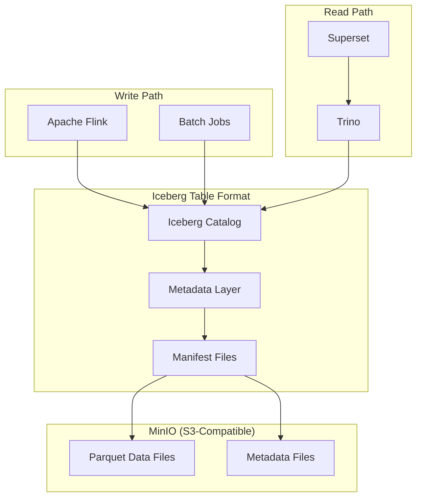

# Apache Iceberg

Open table format for huge analytic datasets.

**Status:** Accepted | **Updated:** 2026-02-09

---

## Overview

Apache Iceberg is an open table format designed for petabyte-scale analytic datasets. It brings ACID transactions, schema evolution, and time travel to data lakes, closing the gap between traditional data warehouses and raw object storage. Iceberg has become the de facto standard for modern data lakehouse architecture, supported by every major compute engine in the ecosystem.

Within OpenOva, Iceberg provides the storage layer for the **Titan** data lakehouse product. All analytic tables are stored as Iceberg tables on MinIO (S3-compatible object storage), giving customers warehouse-grade reliability without vendor lock-in. Flink writes streaming and batch data into Iceberg tables, Trino queries them with full SQL, and Superset visualises the results.

Iceberg's metadata-driven design means that operations like schema changes, partition layout changes, and snapshot isolation happen without rewriting data files. This makes it safe to evolve table structures in production without downtime or data migration scripts.

---

## Architecture



---

## Key Features

| Feature | Description |
|---------|-------------|
| ACID Transactions | Serializable isolation for concurrent readers and writers |
| Schema Evolution | Add, drop, rename, reorder columns without rewriting data |
| Partition Evolution | Change partition layout without rewriting existing data |
| Time Travel | Query any historical snapshot by timestamp or snapshot ID |
| Hidden Partitioning | Users write queries against logical columns; Iceberg handles physical layout |
| Row-level Deletes | Merge-on-read and copy-on-write delete strategies |
| Compaction | Background rewriting of small files into optimally sized ones |
| Metadata Filtering | Skip files and row groups using column-level statistics |

---

## Catalog Configuration

Iceberg requires a catalog to track table metadata. OpenOva uses a JDBC-backed catalog stored in CNPG (PostgreSQL).

### Catalog Setup

```yaml
apiVersion: v1
kind: ConfigMap
metadata:
  name: iceberg-catalog-config
  namespace: data-lakehouse
data:
  catalog.properties: |
    catalog-impl=org.apache.iceberg.jdbc.JdbcCatalog
    uri=jdbc:postgresql://titan-postgres.databases.svc:5432/iceberg_catalog
    warehouse=s3://iceberg-warehouse/
    io-impl=org.apache.iceberg.aws.s3.S3FileIO
    s3.endpoint=http://minio.storage.svc:9000
    s3.access-key-id=${MINIO_ACCESS_KEY}
    s3.secret-access-key=${MINIO_SECRET_KEY}
    s3.path-style-access=true
```

### Trino Connector

```yaml
apiVersion: v1
kind: ConfigMap
metadata:
  name: trino-iceberg-connector
  namespace: data-lakehouse
data:
  iceberg.properties: |
    connector.name=iceberg
    iceberg.catalog.type=jdbc
    iceberg.jdbc-catalog.connection-url=jdbc:postgresql://titan-postgres.databases.svc:5432/iceberg_catalog
    iceberg.jdbc-catalog.connection-user=${PG_USER}
    iceberg.jdbc-catalog.connection-password=${PG_PASSWORD}
    iceberg.file-format=PARQUET
    iceberg.compression-codec=ZSTD
    hive.s3.endpoint=http://minio.storage.svc:9000
    hive.s3.aws-access-key=${MINIO_ACCESS_KEY}
    hive.s3.aws-secret-key=${MINIO_SECRET_KEY}
    hive.s3.path-style-access=true
```

---

## Table Management

### Create Table (via Trino)

```sql
CREATE TABLE iceberg.analytics.events (
    event_id    VARCHAR,
    event_type  VARCHAR,
    user_id     VARCHAR,
    payload     VARCHAR,
    created_at  TIMESTAMP(6) WITH TIME ZONE
)
WITH (
    format = 'PARQUET',
    partitioning = ARRAY['day(created_at)'],
    sorted_by = ARRAY['event_type']
);
```

### Time Travel

```sql
-- Query a specific snapshot
SELECT * FROM iceberg.analytics.events
FOR VERSION AS OF 123456789;

-- Query at a point in time
SELECT * FROM iceberg.analytics.events
FOR TIMESTAMP AS OF TIMESTAMP '2026-02-01 00:00:00 UTC';
```

### Schema Evolution

```sql
-- Safe column operations (no data rewrite)
ALTER TABLE iceberg.analytics.events ADD COLUMN region VARCHAR;
ALTER TABLE iceberg.analytics.events RENAME COLUMN payload TO event_payload;
ALTER TABLE iceberg.analytics.events DROP COLUMN region;
```

---

## Storage Layout

| Bucket | Path | Contents |
|--------|------|----------|
| `iceberg-warehouse` | `/analytics/events/` | Parquet data files |
| `iceberg-warehouse` | `/analytics/events/metadata/` | Iceberg metadata JSON |
| `iceberg-warehouse` | `/analytics/events/data/` | Partition directories |

### Compaction

Iceberg tables accumulate small files from streaming writes. Periodic compaction merges them into optimally sized files.

```sql
-- Trigger compaction via Trino
ALTER TABLE iceberg.analytics.events EXECUTE optimize
WHERE created_at >= CURRENT_DATE - INTERVAL '1' DAY;
```

---

## Monitoring

| Metric | Description |
|--------|-------------|
| `iceberg_table_snapshot_count` | Number of snapshots per table |
| `iceberg_table_data_files` | Count of data files |
| `iceberg_table_total_records` | Total row count |
| `iceberg_table_total_size_bytes` | Total data size |
| `iceberg_compaction_duration_seconds` | Time spent in compaction |

---

## Consequences

**Positive:**
- ACID transactions on object storage eliminate data corruption risks
- Schema and partition evolution without downtime or data rewrites
- Time travel enables reproducible analytics and audit compliance
- Engine-agnostic format avoids lock-in to any single compute engine
- Hidden partitioning simplifies queries for end users
- Parquet + ZSTD compression delivers excellent storage efficiency

**Negative:**
- Requires a metadata catalog (JDBC/PostgreSQL) as an additional dependency
- Small-file problem from streaming writes requires periodic compaction
- Snapshot accumulation needs expiration policies to manage metadata growth
- Learning curve for teams accustomed to traditional RDBMS or Hive tables

---

*Part of [OpenOva Titan](https://openova.io) - Data Lakehouse*
