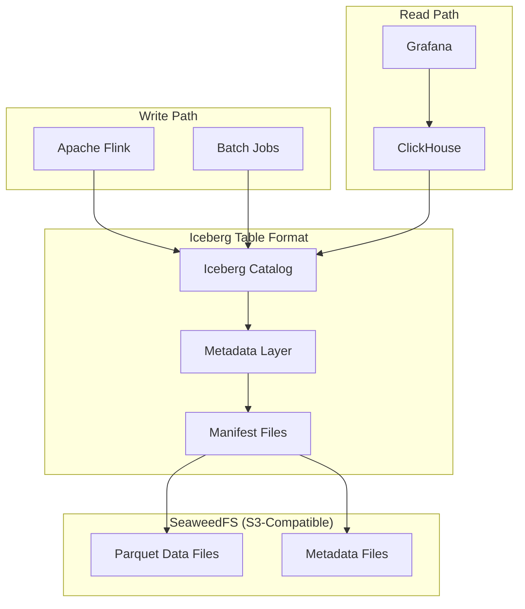

# Apache Iceberg

Open table format for huge analytic datasets. **Application Blueprint** (see [`docs/PLATFORM-TECH-STACK.md`](../../docs/PLATFORM-TECH-STACK.md) §4.4 — Data lakehouse). Used by `bp-fabric` to organize lakehouse tables on top of SeaweedFS / cloud archival S3 with ACID transactions, time travel, and schema evolution.

**Status:** Accepted | **Updated:** 2026-04-27

---

## Overview

Apache Iceberg is an open table format designed for petabyte-scale analytic datasets. It brings ACID transactions, schema evolution, and time travel to data lakes, closing the gap between traditional data warehouses and raw object storage. Iceberg has become the de facto standard for modern data lakehouse architecture, supported by every major compute engine in the ecosystem.

Within OpenOva, Iceberg provides the storage layer for the **Fabric** data and integration product. All analytic tables are stored as Iceberg tables on SeaweedFS (S3-compatible object storage), giving customers warehouse-grade reliability without vendor lock-in. Flink writes streaming and batch data into Iceberg tables, and ClickHouse queries them with full SQL for analytics and dashboarding via Grafana.

Iceberg's metadata-driven design means that operations like schema changes, partition layout changes, and snapshot isolation happen without rewriting data files. This makes it safe to evolve table structures in production without downtime or data migration scripts.

---

## Architecture


```mermaid
flowchart TB
    subgraph Writers["Write Path"]
        Flink[Apache Flink]
        Batch[Batch Jobs]
    end

    subgraph Iceberg["Iceberg Table Format"]
        Catalog[Iceberg Catalog]
        Metadata[Metadata Layer]
        Manifests[Manifest Files]
    end

    subgraph Storage["SeaweedFS (S3-Compatible)"]
        Parquet[Parquet Data Files]
        Meta[Metadata Files]
    end

    subgraph Readers["Read Path"]
        CH[ClickHouse]
        Grafana[Grafana]
    end

    Flink --> Catalog
    Batch --> Catalog
    Catalog --> Metadata
    Metadata --> Manifests
    Manifests --> Parquet
    Manifests --> Meta
    CH --> Catalog
    Grafana --> CH
```

---

## Key Features

| Feature | Description |
|---------|-------------|
| ACID Transactions | Serializable isolation for concurrent readers and writers |
| Schema Evolution | Add, drop, rename, reorder columns without rewriting data |
| Partition Evolution | Change partition layout without rewriting existing data |
| Time Travel | Query any historical snapshot by timestamp or snapshot ID |
| Hidden Partitioning | Users write queries against logical columns; Iceberg handles physical layout |
| Row-level Deletes | Merge-on-read and copy-on-write delete strategies |
| Compaction | Background rewriting of small files into optimally sized ones |
| Metadata Filtering | Skip files and row groups using column-level statistics |

---

## Catalog Configuration

Iceberg requires a catalog to track table metadata. OpenOva uses a JDBC-backed catalog stored in CNPG (PostgreSQL).

### Catalog Setup

```yaml
apiVersion: v1
kind: ConfigMap
metadata:
  name: iceberg-catalog-config
  namespace: data-lakehouse
data:
  catalog.properties: |
    catalog-impl=org.apache.iceberg.jdbc.JdbcCatalog
    uri=jdbc:postgresql://fabric-postgres.databases.svc:5432/iceberg_catalog
    warehouse=s3://iceberg-warehouse/
    io-impl=org.apache.iceberg.aws.s3.S3FileIO
    s3.endpoint=http://seaweedfs.storage.svc:8333
    s3.access-key-id=${SEAWEEDFS_ACCESS_KEY}
    s3.secret-access-key=${SEAWEEDFS_SECRET_KEY}
    s3.path-style-access=true
```

### ClickHouse Iceberg Integration

ClickHouse queries Iceberg tables directly via its built-in Iceberg table engine:

```sql
-- Create an Iceberg table in ClickHouse
CREATE TABLE iceberg_events
ENGINE = Iceberg('http://seaweedfs.storage.svc:8333/iceberg-warehouse/analytics/events/',
    'SEAWEEDFS_ACCESS_KEY', 'SEAWEEDFS_SECRET_KEY')
```

---

## Table Management

### Create Table (via Flink SQL)

```sql
CREATE TABLE iceberg.analytics.events (
    event_id    STRING,
    event_type  STRING,
    user_id     STRING,
    payload     STRING,
    created_at  TIMESTAMP(6),
    event_date  DATE
) PARTITIONED BY (event_date)
WITH (
    'write.format.default' = 'parquet',
    'write.parquet.compression-codec' = 'zstd'
);
```

### Time Travel

Iceberg supports querying historical snapshots by snapshot ID or timestamp. Access time travel via Flink SQL or the Iceberg Java API.

### Schema Evolution

```sql
-- Safe column operations via Flink SQL (no data rewrite)
ALTER TABLE iceberg.analytics.events ADD COLUMN region STRING;
ALTER TABLE iceberg.analytics.events DROP COLUMN region;
```

---

## Storage Layout

| Bucket | Path | Contents |
|--------|------|----------|
| `iceberg-warehouse` | `/analytics/events/` | Parquet data files |
| `iceberg-warehouse` | `/analytics/events/metadata/` | Iceberg metadata JSON |
| `iceberg-warehouse` | `/analytics/events/data/` | Partition directories |

### Compaction

Iceberg tables accumulate small files from streaming writes. Periodic compaction merges them into optimally sized files. Compaction can be triggered via Flink's Iceberg maintenance actions or the Iceberg Java API.

---

## Monitoring

| Metric | Description |
|--------|-------------|
| `iceberg_table_snapshot_count` | Number of snapshots per table |
| `iceberg_table_data_files` | Count of data files |
| `iceberg_table_total_records` | Total row count |
| `iceberg_table_total_size_bytes` | Total data size |
| `iceberg_compaction_duration_seconds` | Time spent in compaction |

---

## Consequences

**Positive:**
- ACID transactions on object storage eliminate data corruption risks
- Schema and partition evolution without downtime or data rewrites
- Time travel enables reproducible analytics and audit compliance
- Engine-agnostic format avoids lock-in to any single compute engine
- Hidden partitioning simplifies queries for end users
- Parquet + ZSTD compression delivers excellent storage efficiency

**Negative:**
- Requires a metadata catalog (JDBC/PostgreSQL) as an additional dependency
- Small-file problem from streaming writes requires periodic compaction
- Snapshot accumulation needs expiration policies to manage metadata growth
- Learning curve for teams accustomed to traditional RDBMS or Hive tables

---

*Part of [OpenOva Fabric](https://openova.io) - Data & Integration*
