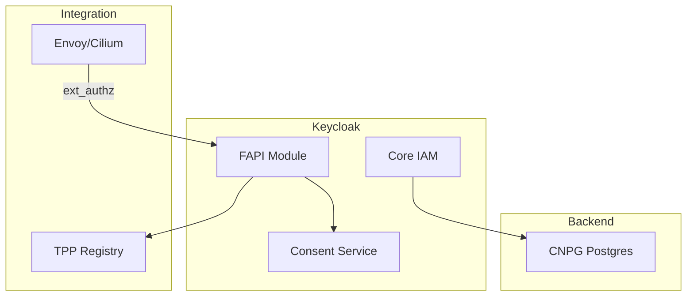
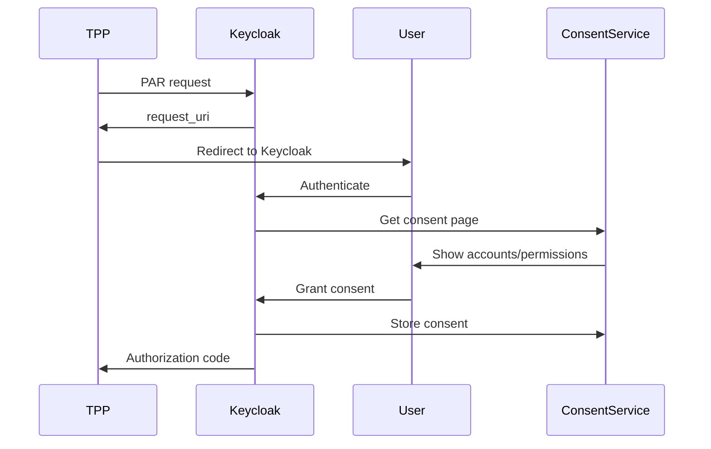

# Keycloak

FAPI Authorization Server for OpenOva Open Banking blueprint.

**Status:** Accepted | **Updated:** 2026-01-17

---

## Overview

Keycloak provides FAPI 2.0 compliant authorization for Open Banking:
- PSD2/FAPI 2.0 certification path
- eIDAS certificate validation
- Consent management
- Multi-tenant TPP support

---

## Architecture



---

## FAPI 2.0 Compliance

| Feature | Status |
|---------|--------|
| PKCE | Required |
| Signed JWT requests | Required |
| mTLS client auth | Required |
| PAR (Pushed Authorization) | Required |
| JARM responses | Required |

---

## Configuration

### Keycloak Deployment

```yaml
apiVersion: k8s.keycloak.org/v2alpha1
kind: Keycloak
metadata:
  name: keycloak
  namespace: open-banking
spec:
  instances: 2
  db:
    vendor: postgres
    host: keycloak-postgres-rw.databases.svc
    port: 5432
    database: keycloak
    usernameSecret:
      name: keycloak-db-credentials
      key: username
    passwordSecret:
      name: keycloak-db-credentials
      key: password
  http:
    tlsSecret: keycloak-tls
  hostname:
    hostname: auth.<domain>
```

### FAPI Realm Configuration

```json
{
  "realm": "open-banking",
  "enabled": true,
  "sslRequired": "all",
  "attributes": {
    "fapi.compliance.mode": "strict",
    "pkce.required": "S256",
    "require.pushed.authorization.requests": "true"
  },
  "clientPolicies": {
    "policies": [
      {
        "name": "fapi-advanced",
        "enabled": true,
        "conditions": [
          {
            "condition": "client-roles",
            "configuration": {
              "roles": ["fapi-client"]
            }
          }
        ],
        "profiles": ["fapi-2-security-profile"]
      }
    ]
  }
}
```

---

## eIDAS Certificate Validation

TPP certificates are validated against qualified trust service providers:

```yaml
apiVersion: v1
kind: ConfigMap
metadata:
  name: eidas-config
  namespace: open-banking
data:
  trust-anchors: |
    # QTSPs for eIDAS validation
    - name: qualified-tsp-1
      certificate: |
        -----BEGIN CERTIFICATE-----
        ...
        -----END CERTIFICATE-----
```

---

## TPP Client Registration

```json
{
  "clientId": "tpp-12345",
  "clientAuthenticatorType": "client-jwt",
  "redirectUris": ["https://tpp.example.com/callback"],
  "attributes": {
    "tpp.authorization.number": "PSDGB-FCA-123456",
    "tpp.eidas.certificate": "...",
    "tpp.roles": ["AISP", "PISP"]
  },
  "defaultClientScopes": [
    "openid",
    "accounts",
    "payments"
  ]
}
```

---

## Consent Flow



---

## High Availability

Keycloak runs with:
- 2+ replicas per region
- CNPG PostgreSQL with WAL streaming
- Session replication via Infinispan

---

*Part of [OpenOva](https://openova.io)*
