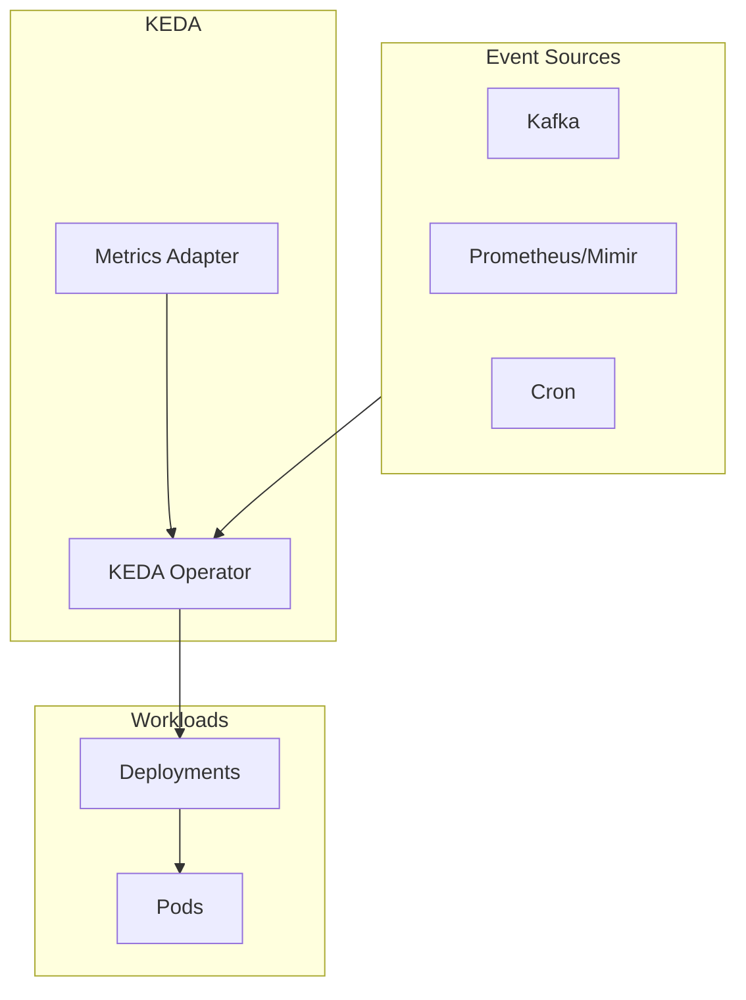
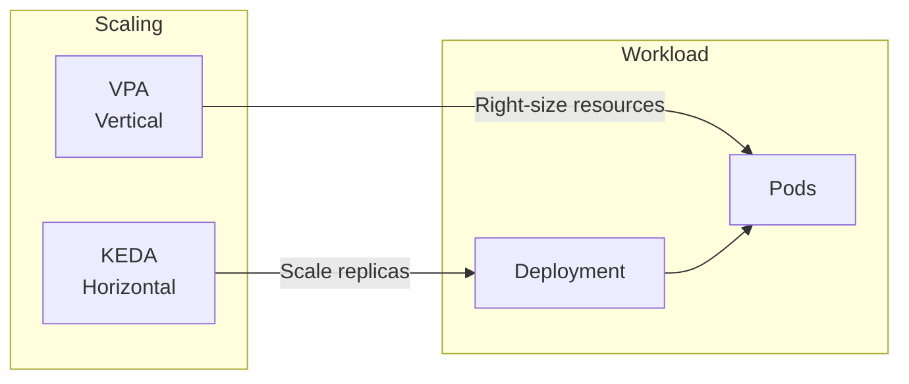

# KEDA

Event-driven horizontal autoscaling for OpenOva platform.

**Status:** Accepted | **Updated:** 2026-01-16

---

## Overview

KEDA (Kubernetes Event-driven Autoscaling) provides horizontal pod autoscaling based on external metrics and events:
- Queue-based scaling (Kafka (Strimzi), RabbitMQ)
- Metric-based scaling (Prometheus, custom metrics)
- Cron-based scaling
- Scale-to-zero capability

---

## Architecture



---

## Scalers

| Scaler | Use Case |
|--------|----------|
| kafka | Kafka consumer lag |
| prometheus | Custom metrics |
| cron | Time-based scaling |
| cpu/memory | Resource utilization |

---

## Configuration

### ScaledObject

```yaml
apiVersion: keda.sh/v1alpha1
kind: ScaledObject
metadata:
  name: <tenant>-worker
  namespace: <tenant>
spec:
  scaleTargetRef:
    name: <tenant>-worker
  minReplicaCount: 1
  maxReplicaCount: 10
  cooldownPeriod: 300
  triggers:
    - type: kafka
      metadata:
        bootstrapServers: kafka-kafka-bootstrap.databases.svc:9092
        consumerGroup: <tenant>-workers
        topic: <tenant>-jobs
        lagThreshold: "100"
```

### Prometheus Scaler

```yaml
apiVersion: keda.sh/v1alpha1
kind: ScaledObject
metadata:
  name: <tenant>-api
  namespace: <tenant>
spec:
  scaleTargetRef:
    name: <tenant>-api
  minReplicaCount: 2
  maxReplicaCount: 20
  triggers:
    - type: prometheus
      metadata:
        serverAddress: http://mimir.monitoring.svc:8080/prometheus
        metricName: http_requests_per_second
        query: |
          sum(rate(http_requests_total{namespace="<tenant>"}[1m]))
        threshold: "100"
```

### Cron Scaler

```yaml
apiVersion: keda.sh/v1alpha1
kind: ScaledObject
metadata:
  name: <tenant>-batch
  namespace: <tenant>
spec:
  scaleTargetRef:
    name: <tenant>-batch
  minReplicaCount: 0
  maxReplicaCount: 5
  triggers:
    - type: cron
      metadata:
        timezone: UTC
        start: "0 8 * * 1-5"
        end: "0 18 * * 1-5"
        desiredReplicas: "3"
```

---

## VPA + KEDA Coordination



- **VPA**: Optimizes CPU/memory per pod
- **KEDA**: Scales replica count based on events
- **Combined**: Optimal resource utilization with event-driven elasticity

---

## Scale-to-Zero

KEDA supports scaling to zero for batch workloads:

```yaml
spec:
  minReplicaCount: 0  # Allow scale-to-zero
  idleReplicaCount: 0  # Scale to zero when idle
```

---

## Monitoring

| Metric | Description |
|--------|-------------|
| `keda_scaler_active` | Whether scaler is active |
| `keda_scaler_metrics_value` | Current metric value |
| `keda_scaled_object_errors` | Scaling errors |

---

*Part of [OpenOva](https://openova.io)*
