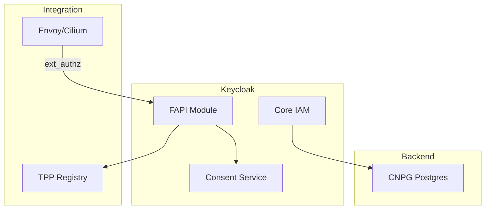
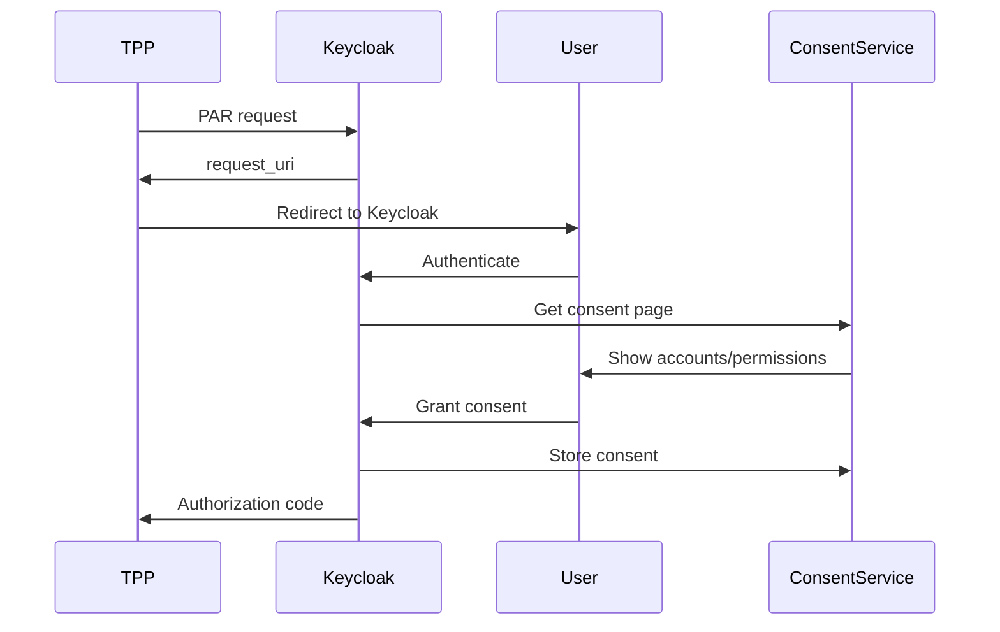

# Keycloak

User identity for Catalyst Sovereigns. Per-Sovereign supporting service in the Catalyst control plane (see [`docs/PLATFORM-TECH-STACK.md`](../../docs/PLATFORM-TECH-STACK.md) §2.3). Also serves as the FAPI Authorization Server for the Fingate (Open Banking) Blueprint.

**Status:** Accepted | **Updated:** 2026-04-27

> **Catalyst topology** (set at Sovereign provisioning time, see [`docs/SECURITY.md`](../../docs/SECURITY.md) §6):
> - **`per-organization`** (SME-style Sovereigns, e.g. omantel): one minimal Keycloak per Organization (single replica, embedded H2/sqlite, ~150 MB RAM, no HA). Blast radius limited to one Org.
> - **`shared-sovereign`** (corporate self-host, e.g. bankdhofar): one HA Keycloak for the entire Sovereign with multiple realms (one per Organization), federating to the corporation's identity provider (Azure AD, Okta).

---

## Overview

Keycloak provides:
- **User identity** for the Catalyst console, marketplace, admin, REST/GraphQL API, and per-Application SSO.
- **OIDC / OAuth 2.0 / SAML** federation to corporate IdPs.
- **FAPI 2.0** compliant authorization for the Fingate Open Banking Blueprint:
  - PSD2/FAPI 2.0 certification path
  - eIDAS certificate validation
  - Consent management
  - Multi-tenant TPP support (PSD2 sense — Third Party Providers, not platform tenants)

---

## Architecture



---

## FAPI 2.0 Compliance

| Feature | Status |
|---------|--------|
| PKCE | Required |
| Signed JWT requests | Required |
| mTLS client auth | Required |
| PAR (Pushed Authorization) | Required |
| JARM responses | Required |

---

## Configuration

### Keycloak Deployment

The deployment shape depends on Catalyst's `keycloakTopology` choice (see banner above):

**Corporate (`shared-sovereign`)** — one HA Keycloak per Sovereign in `catalyst-keycloak` namespace on the management cluster:

```yaml
apiVersion: k8s.keycloak.org/v2alpha1
kind: Keycloak
metadata:
  name: keycloak
  namespace: catalyst-keycloak
spec:
  instances: 3                          # HA, multiple replicas
  db:
    vendor: postgres
    host: keycloak-postgres-rw.catalyst-keycloak.svc
    port: 5432
    database: keycloak
    usernameSecret:                     # ESO-managed via OpenBao
      name: keycloak-db-credentials
      key: username
    passwordSecret:
      name: keycloak-db-credentials
      key: password
  http:
    tlsSecret: keycloak-tls
  hostname:
    hostname: auth.<sovereign-domain>
```

**SME (`per-organization`)** — one minimal Keycloak per Organization in the Org's namespace on the management cluster:

```yaml
apiVersion: k8s.keycloak.org/v2alpha1
kind: Keycloak
metadata:
  name: keycloak
  namespace: <org>                     # per-Org namespace
spec:
  instances: 1                          # no HA at SME tier
  db:
    vendor: postgres                    # or H2/sqlite for the smallest tier
    host: keycloak-postgres-rw.<org>.svc
    port: 5432
    database: keycloak
    # ... credentials
  hostname:
    hostname: auth.<org>.<sovereign-domain>
```

### FAPI Realm Configuration

```json
{
  "realm": "open-banking",
  "enabled": true,
  "sslRequired": "all",
  "attributes": {
    "fapi.compliance.mode": "strict",
    "pkce.required": "S256",
    "require.pushed.authorization.requests": "true"
  },
  "clientPolicies": {
    "policies": [
      {
        "name": "fapi-advanced",
        "enabled": true,
        "conditions": [
          {
            "condition": "client-roles",
            "configuration": {
              "roles": ["fapi-client"]
            }
          }
        ],
        "profiles": ["fapi-2-security-profile"]
      }
    ]
  }
}
```

---

## eIDAS Certificate Validation

TPP certificates are validated against qualified trust service providers:

```yaml
apiVersion: v1
kind: ConfigMap
metadata:
  name: eidas-config
  namespace: open-banking
data:
  trust-anchors: |
    # QTSPs for eIDAS validation
    - name: qualified-tsp-1
      certificate: |
        -----BEGIN CERTIFICATE-----
        ...
        -----END CERTIFICATE-----
```

---

## TPP Client Registration

```json
{
  "clientId": "tpp-12345",
  "clientAuthenticatorType": "client-jwt",
  "redirectUris": ["https://tpp.example.com/callback"],
  "attributes": {
    "tpp.authorization.number": "PSDGB-FCA-123456",
    "tpp.eidas.certificate": "...",
    "tpp.roles": ["AISP", "PISP"]
  },
  "defaultClientScopes": [
    "openid",
    "accounts",
    "payments"
  ]
}
```

---

## Consent Flow



---

## High Availability

HA shape depends on Catalyst's `keycloakTopology`:

- **`shared-sovereign`** (corporate): 3 replicas behind a Service, CNPG PostgreSQL with WAL streaming to async standby, session replication via Infinispan.
- **`per-organization`** (SME): single replica, no session replication, restart-on-deploy is acceptable for SME-tier SLAs. Larger SMEs can opt into HA via tier upgrade — same Catalyst CR shape, just bumped `instances`.

---

*Part of [OpenOva](https://openova.io)*
