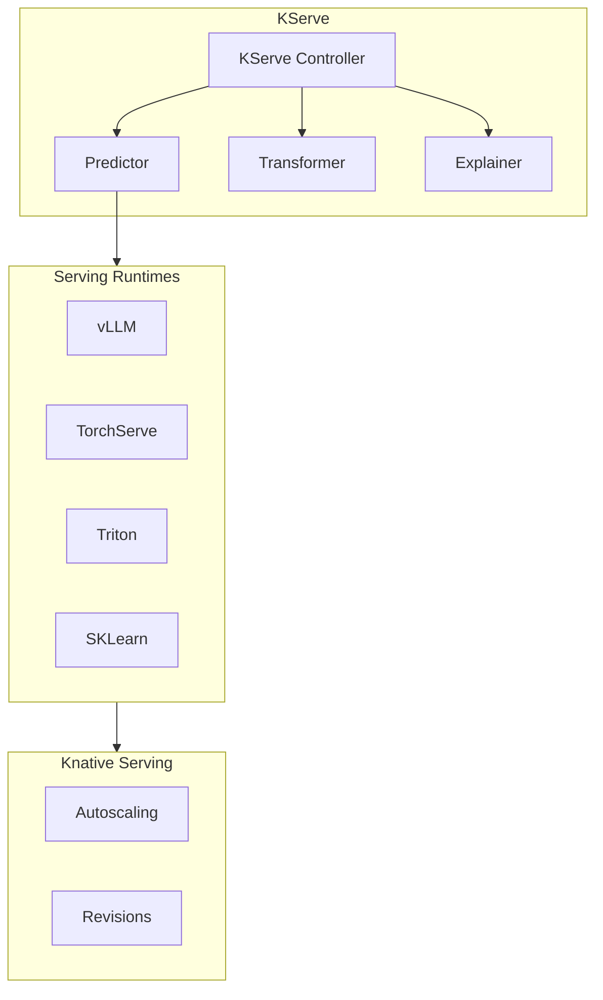

# KServe

Kubernetes-native model serving for ML/AI inference.

**Status:** Accepted | **Updated:** 2026-02-07

---

## Overview

KServe provides standardized model serving on Kubernetes with support for multiple ML frameworks, autoscaling, and inference graphs.



---

## Why KServe?

| Feature | Benefit |
|---------|---------|
| Multi-framework | TensorFlow, PyTorch, ONNX, vLLM, etc. |
| Autoscaling | Scale-to-zero via Knative |
| InferenceService | Standardized deployment pattern |
| Inference Graph | Multi-model pipelines |
| Model explainability | Integrated explainers |

---

## Components

| Component | Purpose |
|-----------|---------|
| **InferenceService** | Model deployment abstraction |
| **ServingRuntime** | Framework-specific runtime |
| **InferenceGraph** | Multi-model orchestration |
| **ClusterStorageContainer** | Model storage configuration |

---

## Serving Runtimes

| Runtime | Use Case |
|---------|----------|
| **vLLM** | LLM inference (recommended) |
| **TorchServe** | PyTorch models |
| **Triton** | Multi-framework, high performance |
| **SKLearn** | Scikit-learn models |
| **XGBoost** | Gradient boosting models |
| **ONNX** | ONNX format models |

---

## Configuration

### InferenceService Example

```yaml
apiVersion: serving.kserve.io/v1beta1
kind: InferenceService
metadata:
  name: llm-service
  namespace: ai-hub
spec:
  predictor:
    model:
      modelFormat:
        name: vllm
      runtime: vllm-runtime
      storageUri: pvc://model-cache/models/qwen-32b
      resources:
        requests:
          cpu: "4"
          memory: 32Gi
          nvidia.com/gpu: "2"
        limits:
          cpu: "8"
          memory: 64Gi
          nvidia.com/gpu: "2"
```

### ServingRuntime for vLLM

```yaml
apiVersion: serving.kserve.io/v1alpha1
kind: ServingRuntime
metadata:
  name: vllm-runtime
spec:
  supportedModelFormats:
    - name: vllm
      autoSelect: true
  containers:
    - name: kserve-container
      image: vllm/vllm-openai:latest
      args:
        - --model=$(MODEL_ID)
        - --tensor-parallel-size=2
        - --max-model-len=32768
      resources:
        requests:
          nvidia.com/gpu: "2"
```

---

## Inference Graph

Multi-model pipeline for complex inference:

```yaml
apiVersion: serving.kserve.io/v1alpha1
kind: InferenceGraph
metadata:
  name: rag-pipeline
spec:
  nodes:
    root:
      routerType: Sequence
      steps:
        - serviceName: embedder
        - serviceName: retriever
        - serviceName: llm
    embedder:
      serviceName: bge-embedder
    retriever:
      serviceName: vector-search
    llm:
      serviceName: qwen-llm
```

---

## GPU Scheduling

```yaml
# Node selector for GPU nodes
spec:
  predictor:
    nodeSelector:
      nvidia.com/gpu.product: NVIDIA-A10
    tolerations:
      - key: nvidia.com/gpu
        operator: Exists
        effect: NoSchedule
```

---

## Model Storage

### PVC-based Storage

```yaml
apiVersion: v1
kind: PersistentVolumeClaim
metadata:
  name: model-cache
  namespace: ai-hub
spec:
  accessModes:
    - ReadWriteOnce
  resources:
    requests:
      storage: 100Gi
  storageClassName: oci-bv
```

### S3-based Storage (MinIO)

```yaml
apiVersion: serving.kserve.io/v1alpha1
kind: ClusterStorageContainer
metadata:
  name: minio-storage
spec:
  container:
    name: storage-initializer
    image: kserve/storage-initializer:latest
    env:
      - name: AWS_ACCESS_KEY_ID
        valueFrom:
          secretKeyRef:
            name: minio-credentials
            key: accesskey
      - name: AWS_SECRET_ACCESS_KEY
        valueFrom:
          secretKeyRef:
            name: minio-credentials
            key: secretkey
      - name: S3_ENDPOINT
        value: http://minio.minio-system.svc:9000
```

---

## Monitoring

| Metric | Query |
|--------|-------|
| Inference latency | `kserve_inference_duration_seconds` |
| Request count | `kserve_inference_count` |
| GPU utilization | `DCGM_FI_DEV_GPU_UTIL` |
| Model load time | `kserve_model_load_duration_seconds` |

---

## Consequences

**Positive:**
- Standardized model deployment
- Multi-framework support
- Autoscaling via Knative
- Inference graphs for pipelines
- GPU scheduling support

**Negative:**
- Complexity for simple deployments
- Requires Knative
- Learning curve for KServe concepts

---

*Part of [OpenOva](https://openova.io)*
