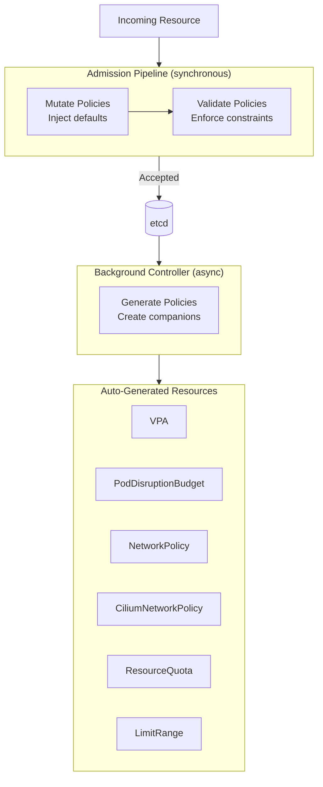
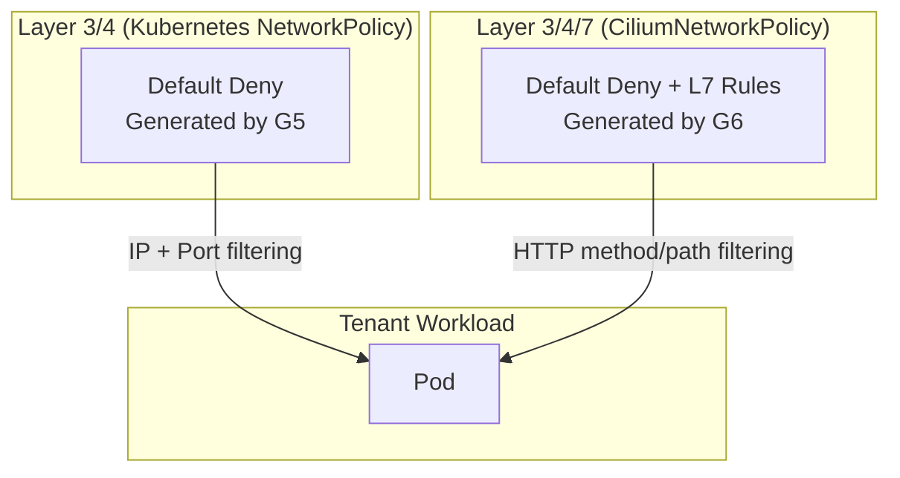

# Kyverno

Policy engine for OpenOva platform resilience, security, and operational excellence.

**Status:** Accepted | **Updated:** 2026-02-09

---

## Overview

Kyverno is the single enforcement point for all platform-wide guarantees. Every Deployment, StatefulSet, and Namespace that enters the cluster passes through Kyverno admission control. Policies are grouped into three operational domains:

| Domain | Goal |
|--------|------|
| **Resilience** | Workloads survive node failures, zone outages, and rolling updates without downtime |
| **Security** | Zero-trust posture: least privilege, no implicit trust, defense in depth |
| **Operational** | Consistent labeling, image provenance, resource hygiene |

Policy types and when each is used:

| Type | Timing | Mechanism | Use Case |
|------|--------|-----------|----------|
| **Validate** | Admission (sync) | Reject non-compliant resources | Enforce hard constraints that must never be violated |
| **Mutate** | Admission (sync) | Patch resources before persistence | Inject sensible defaults so teams don't have to remember every field |
| **Generate** | Background (async) | Create companion resources | Produce derived objects that always accompany a parent resource |

---

## Architecture



---

## Policy Matrix — Resilience

The following table is the authoritative reference for every resilience policy enforced on the platform. Each row describes **what** is enforced, **how** (mutate / generate / validate), **why**, and the opt-out mechanism.

### Generate — Companion Resources

These policies create companion resources whenever a qualifying parent resource is persisted.

| # | Policy Name | Trigger Resource | Generated Resource | Match Condition | Default Behavior | Opt-Out Annotation |
|---|-------------|------------------|--------------------|-----------------|------------------|--------------------|
| G1 | `generate-vpa` | Deployment | `VerticalPodAutoscaler` | All Deployments | `updateMode: Auto`, min 50m CPU / 64Mi, max 2 CPU / 4Gi | `vpa.openova.io/skip: "true"` |
| G2 | `generate-vpa-statefulset` | StatefulSet | `VerticalPodAutoscaler` | All StatefulSets | `updateMode: Initial` (avoids disruptive eviction of stateful pods) | `vpa.openova.io/skip: "true"` |
| G3 | `generate-pdb` | Deployment | `PodDisruptionBudget` | `spec.replicas >= 2` | `minAvailable: 50%` (round up) | `pdb.openova.io/skip: "true"` |
| G4 | `generate-pdb-statefulset` | StatefulSet | `PodDisruptionBudget` | `spec.replicas >= 2` | `maxUnavailable: 1` (strict for stateful workloads) | `pdb.openova.io/skip: "true"` |
| G5 | `generate-default-deny` | Namespace | `NetworkPolicy` (default-deny ingress+egress) | Label `openova.io/tenant` exists | Deny all ingress and egress; teams must explicitly allow | `networkpolicy.openova.io/skip: "true"` |
| G6 | `generate-cilium-default-deny` | Namespace | `CiliumNetworkPolicy` (L3/L4/L7 deny) | Label `openova.io/tenant` exists | L7-aware default deny (complements K8s NetworkPolicy) | `networkpolicy.openova.io/skip: "true"` |
| G7 | `generate-resource-quota` | Namespace | `ResourceQuota` | Label `openova.io/tier` exists | Quotas derived from tier label (see Resource Tiers below) | `quota.openova.io/skip: "true"` |
| G8 | `generate-limit-range` | Namespace | `LimitRange` | Label `openova.io/tier` exists | Default container requests: 50m/64Mi, limits: 500m/512Mi | `limitrange.openova.io/skip: "true"` |

### Mutate — Injected Defaults

These policies patch resources at admission time so that every workload gets resilience primitives without requiring teams to configure them manually.

| # | Policy Name | Target Resource | What Is Injected | Match Condition | Behavior | Opt-Out Annotation |
|---|-------------|-----------------|------------------|-----------------|----------|--------------------|
| M1 | `inject-topology-spread` | Deployment, StatefulSet | `topologySpreadConstraints` for zone + node spread | `spec.replicas >= 2` | Zone: `maxSkew: 1, whenUnsatisfiable: ScheduleAnyway`; Node: `maxSkew: 1, whenUnsatisfiable: ScheduleAnyway` | `topology.openova.io/skip: "true"` |
| M2 | `inject-pod-anti-affinity` | Deployment | `affinity.podAntiAffinity` (preferred) | `spec.replicas >= 2` and no existing anti-affinity | Prefer spreading across nodes using `app.kubernetes.io/name` label | `affinity.openova.io/skip: "true"` |
| M3 | `inject-security-context` | Pod | Default `securityContext` on all containers | All Pods without explicit securityContext | `runAsNonRoot: true`, `readOnlyRootFilesystem: true`, `allowPrivilegeEscalation: false`, drop `ALL` capabilities | `securitycontext.openova.io/skip: "true"` |
| M4 | `inject-seccomp-profile` | Pod | `seccompProfile` on pod spec | All Pods without explicit seccomp | `type: RuntimeDefault` | `seccomp.openova.io/skip: "true"` |
| M5 | `rewrite-image-registry` | Pod | Rewrite container image to Harbor mirror | All Pods with images not already from Harbor | `docker.io/library/nginx:1.25` → `harbor.<cluster>/dockerhub-proxy/library/nginx:1.25` | `harbor.openova.io/skip: "true"` |
| M6 | `inject-priority-class` | Deployment, StatefulSet | `priorityClassName` | No existing `priorityClassName` set | Derived from namespace tier label: `platform-critical`, `tenant-high`, `tenant-default` | `priority.openova.io/skip: "true"` |
| M7 | `disable-service-account-token` | Pod | `automountServiceAccountToken: false` | All Pods without explicit setting | Prevents unnecessary API server access | `sa-token.openova.io/skip: "true"` |
| M8 | `inject-gpu-tolerations` | Pod | GPU node tolerations + nodeSelector | Pods requesting `nvidia.com/gpu` | Adds `nvidia.com/gpu: NoSchedule` toleration and GPU node selector | N/A (conditional on GPU request) |

### Validate — Hard Constraints

These policies reject resources that violate resilience requirements. `Enforce` means the resource is blocked; `Audit` means it is logged but allowed (used during migration periods).

| # | Policy Name | Target Resource | What Is Checked | Action | Rationale |
|---|-------------|-----------------|-----------------|--------|-----------|
| V1 | `require-resource-requests` | Pod | All containers must set `resources.requests.cpu` and `resources.requests.memory` | Enforce | VPA and scheduler require requests to function; without them, bin-packing and right-sizing are impossible |
| V2 | `require-resource-limits-memory` | Pod | All containers must set `resources.limits.memory` | Enforce | Prevents OOM-killed neighbors; CPU limits deliberately not enforced (VPA + CFS throttling handles it) |
| V3 | `require-health-probes` | Deployment, StatefulSet | Must define `readinessProbe` and `livenessProbe` on all containers | Enforce | Without probes, failed pods stay in rotation and PDB disruption calculations are meaningless |
| V4 | `require-startup-probe-slow-start` | Deployment, StatefulSet | Must define `startupProbe` if `initialDelaySeconds > 30` on liveness probe | Audit | Prevents premature kills of slow-starting apps (JVM, ML model loading) |
| V5 | `minimum-replicas-production` | Deployment | `spec.replicas >= 2` in namespaces labeled `openova.io/env: production` | Enforce | Single-replica deployments have zero fault tolerance; PDB and topology spread are useless with 1 replica |
| V6 | `minimum-replicas-statefulset` | StatefulSet | `spec.replicas >= 2` in production namespaces (except where `singleton.openova.io/allowed: "true"`) | Audit | StatefulSets often have leader-election singletons; audit mode catches unintentional single replicas |
| V7 | `restrict-pdb-max-unavailable` | PodDisruptionBudget | `maxUnavailable` must not be set to `100%` or total replica count | Enforce | A PDB that allows all pods to be disrupted simultaneously provides no protection |
| V8 | `require-emptydir-sizelimit` | Pod | `emptyDir` volumes must set `sizeLimit` | Enforce | Unbounded emptyDir can exhaust node disk, causing eviction storms across all pods on the node |
| V9 | `prevent-hpa-keda-conflict` | HorizontalPodAutoscaler | Reject HPA if a KEDA ScaledObject already targets the same Deployment | Enforce | HPA and KEDA both manage replica count; dual ownership causes flapping and unpredictable scaling |
| V10 | `require-pdb-for-replicated` | Deployment | Deployments with `replicas >= 3` in production must have a corresponding PDB | Audit | Catches cases where PDB generation was skipped but manual PDB was not created |

---

## Policy Matrix — Security & Zero Trust

### Validate — Pod Security

Based on the Kubernetes Pod Security Standards (Restricted profile) with OpenOva-specific additions.

| # | Policy Name | Target | What Is Checked | Action | Rationale |
|---|-------------|--------|-----------------|--------|-----------|
| S1 | `disallow-privileged` | Pod | `securityContext.privileged` must be `false` or unset | Enforce | Privileged containers have full host access; equivalent to root on the node |
| S2 | `disallow-privilege-escalation` | Pod | `allowPrivilegeEscalation` must be `false` | Enforce | Prevents child processes from gaining more privileges than parent via setuid/setgid |
| S3 | `require-non-root` | Pod | `runAsNonRoot: true` on pod or all containers | Enforce | Running as root inside the container is unnecessary for all platform workloads |
| S4 | `require-non-root-uid` | Pod | `runAsUser` must be >= 1000 (if set) | Audit | UIDs below 1000 are conventionally reserved for system accounts; catches hardcoded `runAsUser: 0` |
| S5 | `restrict-capabilities` | Pod | Only `NET_BIND_SERVICE` allowed; all others must be dropped | Enforce | Least-privilege capability set; Cilium handles networking, so `NET_RAW`, `SYS_ADMIN` etc. are unnecessary |
| S6 | `require-readonly-rootfs` | Pod | `readOnlyRootFilesystem: true` | Enforce | Prevents runtime binary modification; apps write to mounted volumes only |
| S7 | `disallow-host-namespaces` | Pod | `hostNetwork`, `hostPID`, `hostIPC` must all be `false` | Enforce | Host namespace access breaks pod isolation boundaries completely |
| S8 | `disallow-host-ports` | Pod | `containerPort.hostPort` must be unset or 0 | Enforce | Host port bindings conflict across pods and bypass service abstraction |
| S9 | `restrict-volume-types` | Pod | Only allow: `configMap`, `csi`, `downwardAPI`, `emptyDir`, `ephemeral`, `persistentVolumeClaim`, `projected`, `secret` | Enforce | Blocks `hostPath`, `nfs`, `gitRepo` and other dangerous volume types |
| S10 | `disallow-hostpath` | Pod | No `hostPath` volume mounts | Enforce | HostPath provides arbitrary read/write to node filesystem; most common container escape vector |
| S11 | `require-seccomp-profile` | Pod | `seccompProfile.type` must be `RuntimeDefault` or `Localhost` | Enforce | Seccomp restricts system calls; `Unconfined` leaves full syscall surface exposed |
| S12 | `restrict-sysctls` | Pod | Only safe sysctls allowed: `net.ipv4.ip_local_port_range`, `net.ipv4.tcp_syncookies`, `kernel.shm_rmid_forced` | Enforce | Unsafe sysctls affect the entire node; only whitelisted safe sysctls permitted |
| S13 | `restrict-proc-mount` | Pod | `procMount` must be `Default` (not `Unmasked`) | Enforce | Unmasked /proc exposes sensitive kernel parameters to container processes |
| S14 | `restrict-apparmor` | Pod | AppArmor annotation must be `runtime/default` or `localhost/*` if set | Enforce | Prevents explicitly setting `unconfined` to bypass AppArmor profiles |

### Validate — Image Supply Chain

| # | Policy Name | Target | What Is Checked | Action | Rationale |
|---|-------------|--------|-----------------|--------|-----------|
| S15 | `disallow-latest-tag` | Pod | No container may use `:latest` tag or omit the tag | Enforce | Mutable tags make rollbacks impossible and break GitOps reproducibility |
| S16 | `require-harbor-registry` | Pod | All images must be pulled from `harbor.<cluster-domain>/` | Enforce | Ensures all images pass Harbor's Trivy vulnerability scanning before deployment |
| S17 | `verify-image-signature` | Pod | Images must have a valid cosign signature (Sigstore) | Audit | Ensures image provenance; audit mode until all teams sign images |

### Validate — Network & Zero Trust

| # | Policy Name | Target | What Is Checked | Action | Rationale |
|---|-------------|--------|-----------------|--------|-----------|
| S18 | `disallow-default-namespace` | Deployment, StatefulSet, DaemonSet, Pod | Must not be deployed to `default` namespace | Enforce | Default namespace has no NetworkPolicy isolation; all workloads must live in explicit namespaces |
| S19 | `disallow-nodeport-services` | Service | `spec.type` must not be `NodePort` | Enforce | NodePort exposes services directly on node IPs, bypassing Gateway API and Cilium L7 policies |
| S20 | `disallow-external-lb-annotation` | Service | Must not carry cloud-provider LB annotations unless in `openova-system` namespace | Enforce | Load balancers are provisioned via Gateway API; ad-hoc LB annotations cause cost leaks and security gaps |
| S21 | `require-network-policy-exists` | Namespace | Namespaces labeled `openova.io/tenant` must contain at least one NetworkPolicy | Audit | Catches deleted or missing network policies; complements the generate policy G5 |
| S22 | `restrict-external-names` | Service | `type: ExternalName` only allowed when annotated `externalname.openova.io/approved: "true"` | Enforce | ExternalName services can redirect to arbitrary external endpoints, bypassing egress policies |

### Validate — Operational Hygiene

| # | Policy Name | Target | What Is Checked | Action | Rationale |
|---|-------------|--------|-----------------|--------|-----------|
| S23 | `require-labels` | Deployment, StatefulSet | Must have `app.kubernetes.io/name`, `app.kubernetes.io/version`, `app.kubernetes.io/part-of` | Enforce | Required for PDB label selectors, topology spread, monitoring dashboards, and cost attribution |
| S24 | `require-owner-label` | Namespace | Must have `openova.io/owner` label | Audit | Enables cost attribution and orphaned-namespace detection |
| S25 | `disallow-wildcard-rbac` | ClusterRole, Role | No rule may use `*` for resources or verbs | Enforce | Wildcard RBAC grants full cluster admin; roles must be scoped to specific resources and verbs |
| S26 | `restrict-automount-sa-token` | ServiceAccount | `automountServiceAccountToken` must be `false` unless annotated `sa-token.openova.io/required: "true"` | Audit | Most workloads don't need API server access; leaked tokens enable lateral movement |

---

## Resource Tiers

Namespace-level tier labels drive ResourceQuota and PriorityClass injection.

| Tier Label Value | CPU Quota | Memory Quota | PriorityClass | Use Case |
|------------------|-----------|--------------|---------------|----------|
| `platform` | 16 cores | 32Gi | `platform-critical` (1000000) | OpenOva system components |
| `high` | 8 cores | 16Gi | `tenant-high` (100000) | Production tenant workloads |
| `default` | 4 cores | 8Gi | `tenant-default` (10000) | Development / staging |
| `batch` | 2 cores | 4Gi | `tenant-batch` (1000) | Background jobs, scale-to-zero |

---

## Interaction with Scaling Components

Kyverno's policies are designed to complement VPA, KEDA, and the platform's scaling architecture. The following table clarifies ownership boundaries.

| Concern | Owner | Kyverno's Role |
|---------|-------|----------------|
| **Vertical sizing** (CPU/memory per pod) | VPA | Generate VPA for every Deployment (G1) and StatefulSet (G2); Validate that resource requests exist (V1) so VPA has a baseline to optimize |
| **Horizontal scaling** (replica count) | KEDA | Validate that HPA and KEDA don't both target the same workload (V9); Enforce minimum replicas in production (V5) |
| **HPA** | KEDA replaces HPA | Validate no HPA when ScaledObject exists (V9); mutate policies do not inject HPA — KEDA is the sole horizontal scaler |
| **PDB** (disruption budget) | Kyverno (generated) | Generate PDB for replicated workloads (G3, G4); Validate PDB is not set to allow 100% unavailability (V7) |
| **Topology spread** | Kyverno (mutated) | Inject `topologySpreadConstraints` at admission (M1) so pods spread across zones and nodes |
| **Anti-affinity** | Kyverno (mutated) | Inject preferred pod anti-affinity (M2) for zone-level resilience |
| **Priority / preemption** | Kyverno (mutated) | Inject `priorityClassName` based on namespace tier (M6) so critical workloads preempt batch workloads under pressure |
| **Resource quotas** | Kyverno (generated) | Generate `ResourceQuota` per namespace (G7) to prevent noisy-neighbor resource exhaustion |
| **LimitRange** | Kyverno (generated) | Generate `LimitRange` per namespace (G8) so pods without explicit requests get safe defaults |

### VPA + PDB Coordination

VPA in `Auto` mode evicts pods to apply new resource recommendations. The generated PDB ensures that VPA evictions respect availability:

```
VPA Updater wants to evict Pod-A
  → Checks PDB: minAvailable 50%
    → 3/4 pods running → eviction allowed (3 > 50% of 4)
    → 2/4 pods running → eviction blocked (2 = 50% of 4, not > 50%)
```

For StatefulSets, VPA is generated with `updateMode: Initial` (G2), meaning resource changes apply only on pod restart — no VPA-initiated evictions. This avoids disruption to stateful workloads where pod identity matters.

### KEDA Scale-to-Zero and PDB

When KEDA scales a workload to zero replicas, the PDB is effectively dormant (no pods to protect). On scale-up, the PDB re-activates. This is safe because:
- Scale-to-zero is only allowed for `batch` tier namespaces
- KEDA's `minReplicaCount: 0` is only valid when the workload has no SLO requiring availability

---

## Network Policy Strategy

Network isolation follows a **default-deny, explicit-allow** model at two layers:



| Layer | Resource | Managed By | Scope |
|-------|----------|------------|-------|
| L3/L4 | `NetworkPolicy` | Kyverno generates default-deny (G5); teams add allow rules | IP addresses, port numbers, namespace selectors |
| L3-L7 | `CiliumNetworkPolicy` | Kyverno generates default-deny (G6); platform team adds L7 rules | HTTP methods, paths, headers, DNS names, gRPC services |
| Egress | `CiliumNetworkPolicy` | Platform team | Restrict external egress to known endpoints (DNS-based FQDN policies) |
| mTLS | Cilium WireGuard | Cilium agent (automatic) | All pod-to-pod traffic encrypted transparently |

### Zero-Trust Enforcement Checklist

| Principle | How Enforced | Policy ID |
|-----------|-------------|-----------|
| No implicit network access | Default-deny NetworkPolicy + CiliumNetworkPolicy per namespace | G5, G6 |
| No host-level access | Disallow hostNetwork, hostPID, hostIPC, hostPath, hostPort | S7, S8, S10 |
| Least-privilege containers | Drop all capabilities, non-root, read-only rootfs, no privilege escalation | S1-S6 |
| Encrypted pod-to-pod | Cilium WireGuard mTLS (transparent, no sidecar) | Cilium config (automatic) |
| Image provenance | Harbor-only registry, signature verification, no latest tags | S15, S16, S17 |
| Service account lockdown | automountServiceAccountToken: false by default, no wildcard RBAC | M7, S25, S26 |
| Namespace isolation | No default namespace usage, mandatory tenant labels | S18, S23, S24 |
| Ingress control | No NodePort, no ad-hoc LBs, Gateway API only | S19, S20 |
| Egress control | Default deny egress, FQDN-based allow policies via Cilium | G5, G6 |
| Syscall restriction | Seccomp RuntimeDefault on all pods | M4, S11 |

---

## Example Policy Manifests

### G1 — Generate VPA for Deployments

```yaml
apiVersion: kyverno.io/v1
kind: ClusterPolicy
metadata:
  name: generate-vpa
  annotations:
    policies.kyverno.io/category: Resilience
    policies.kyverno.io/description: >-
      Generate a VPA for every Deployment to enable vertical right-sizing.
      VPA Updater respects PDB during evictions.
spec:
  rules:
    - name: generate-vpa-for-deployment
      match:
        any:
          - resources:
              kinds:
                - Deployment
      exclude:
        any:
          - resources:
              annotations:
                vpa.openova.io/skip: "true"
          - resources:
              namespaces:
                - kube-system
                - kyverno
      generate:
        synchronize: true
        apiVersion: autoscaling.k8s.io/v1
        kind: VerticalPodAutoscaler
        name: "{{request.object.metadata.name}}-vpa"
        namespace: "{{request.object.metadata.namespace}}"
        data:
          spec:
            targetRef:
              apiVersion: apps/v1
              kind: Deployment
              name: "{{request.object.metadata.name}}"
            updatePolicy:
              updateMode: Auto
            resourcePolicy:
              containerPolicies:
                - containerName: "*"
                  minAllowed:
                    cpu: 50m
                    memory: 64Mi
                  maxAllowed:
                    cpu: "2"
                    memory: 4Gi
                  controlledResources:
                    - cpu
                    - memory
                  controlledValues: RequestsAndLimits
```

### G3 — Generate PDB for Replicated Deployments

```yaml
apiVersion: kyverno.io/v1
kind: ClusterPolicy
metadata:
  name: generate-pdb
  annotations:
    policies.kyverno.io/category: Resilience
    policies.kyverno.io/description: >-
      Generate a PDB for Deployments with 2+ replicas to protect availability
      during voluntary disruptions (node drain, cluster upgrade, VPA eviction).
spec:
  rules:
    - name: generate-pdb-for-deployment
      match:
        any:
          - resources:
              kinds:
                - Deployment
      exclude:
        any:
          - resources:
              annotations:
                pdb.openova.io/skip: "true"
      preconditions:
        all:
          - key: "{{request.object.spec.replicas}}"
            operator: GreaterThanOrEquals
            value: 2
      generate:
        synchronize: true
        apiVersion: policy/v1
        kind: PodDisruptionBudget
        name: "{{request.object.metadata.name}}-pdb"
        namespace: "{{request.object.metadata.namespace}}"
        data:
          spec:
            minAvailable: "50%"
            selector:
              matchLabels:
                app.kubernetes.io/name: "{{request.object.metadata.labels.\"app.kubernetes.io/name\"}}"
```

### M1 — Inject TopologySpreadConstraints

```yaml
apiVersion: kyverno.io/v1
kind: ClusterPolicy
metadata:
  name: inject-topology-spread
  annotations:
    policies.kyverno.io/category: Resilience
    policies.kyverno.io/description: >-
      Inject zone and node topology spread constraints for multi-replica
      workloads to survive zone failures and balance node utilization.
spec:
  rules:
    - name: spread-across-zones
      match:
        any:
          - resources:
              kinds:
                - Deployment
                - StatefulSet
      exclude:
        any:
          - resources:
              annotations:
                topology.openova.io/skip: "true"
      preconditions:
        all:
          - key: "{{request.object.spec.replicas}}"
            operator: GreaterThanOrEquals
            value: 2
          - key: "{{ request.object.spec.template.spec.topologySpreadConstraints[] || `[]` | length(@) }}"
            operator: Equals
            value: 0
      mutate:
        patchStrategicMerge:
          spec:
            template:
              spec:
                topologySpreadConstraints:
                  - maxSkew: 1
                    topologyKey: topology.kubernetes.io/zone
                    whenUnsatisfiable: ScheduleAnyway
                    labelSelector:
                      matchLabels:
                        app.kubernetes.io/name: "{{request.object.metadata.labels.\"app.kubernetes.io/name\"}}"
                  - maxSkew: 1
                    topologyKey: kubernetes.io/hostname
                    whenUnsatisfiable: ScheduleAnyway
                    labelSelector:
                      matchLabels:
                        app.kubernetes.io/name: "{{request.object.metadata.labels.\"app.kubernetes.io/name\"}}"
```

### V5 — Minimum Replicas in Production

```yaml
apiVersion: kyverno.io/v1
kind: ClusterPolicy
metadata:
  name: minimum-replicas-production
  annotations:
    policies.kyverno.io/category: Resilience
    policies.kyverno.io/description: >-
      Production Deployments must have at least 2 replicas. Single-replica
      workloads have zero fault tolerance and render PDB, topology spread,
      and anti-affinity policies meaningless.
spec:
  validationFailureAction: Enforce
  rules:
    - name: min-replicas
      match:
        any:
          - resources:
              kinds:
                - Deployment
              namespaceSelector:
                matchLabels:
                  openova.io/env: production
      validate:
        message: >-
          Production Deployments must have at least 2 replicas.
          Found {{request.object.spec.replicas}} replica(s) in
          Deployment {{request.object.metadata.name}}.
        pattern:
          spec:
            replicas: ">=2"
```

### S1 + S2 + S3 — Pod Security Baseline

```yaml
apiVersion: kyverno.io/v1
kind: ClusterPolicy
metadata:
  name: pod-security-restricted
  annotations:
    policies.kyverno.io/category: Security
    policies.kyverno.io/description: >-
      Enforces Kubernetes Pod Security Standards (Restricted) profile.
      Covers privileged mode, privilege escalation, and non-root enforcement.
spec:
  validationFailureAction: Enforce
  rules:
    - name: disallow-privileged
      match:
        any:
          - resources:
              kinds:
                - Pod
      validate:
        message: "Privileged containers are not allowed."
        pattern:
          spec:
            =(initContainers):
              - =(securityContext):
                  =(privileged): false
            containers:
              - =(securityContext):
                  =(privileged): false

    - name: disallow-privilege-escalation
      match:
        any:
          - resources:
              kinds:
                - Pod
      validate:
        message: "allowPrivilegeEscalation must be set to false."
        pattern:
          spec:
            =(initContainers):
              - securityContext:
                  allowPrivilegeEscalation: false
            containers:
              - securityContext:
                  allowPrivilegeEscalation: false

    - name: require-run-as-non-root
      match:
        any:
          - resources:
              kinds:
                - Pod
      validate:
        message: "Pods must run as non-root. Set runAsNonRoot to true."
        anyPattern:
          - spec:
              securityContext:
                runAsNonRoot: true
          - spec:
              containers:
                - securityContext:
                    runAsNonRoot: true
```

### G5 — Generate Default-Deny NetworkPolicy

```yaml
apiVersion: kyverno.io/v1
kind: ClusterPolicy
metadata:
  name: generate-default-deny
  annotations:
    policies.kyverno.io/category: Network Security
    policies.kyverno.io/description: >-
      Generate a default-deny NetworkPolicy for every tenant namespace.
      All ingress and egress must be explicitly allowed via additional policies.
spec:
  rules:
    - name: default-deny-all
      match:
        any:
          - resources:
              kinds:
                - Namespace
              selector:
                matchExpressions:
                  - key: openova.io/tenant
                    operator: Exists
      exclude:
        any:
          - resources:
              annotations:
                networkpolicy.openova.io/skip: "true"
      generate:
        synchronize: true
        apiVersion: networking.k8s.io/v1
        kind: NetworkPolicy
        name: default-deny
        namespace: "{{request.object.metadata.name}}"
        data:
          spec:
            podSelector: {}
            policyTypes:
              - Ingress
              - Egress
```

---

## Skip Annotations Reference

All skip annotations follow the pattern `<resource>.openova.io/skip: "true"`.

| Annotation | Skips Policy | When to Use |
|------------|-------------|-------------|
| `vpa.openova.io/skip: "true"` | G1, G2 | Workloads with custom VPA configuration or external VPA controllers |
| `pdb.openova.io/skip: "true"` | G3, G4 | Workloads with custom PDB requirements (e.g., `maxUnavailable: 0` for databases) |
| `networkpolicy.openova.io/skip: "true"` | G5, G6 | Namespaces with fully custom network policies managed by Flux |
| `quota.openova.io/skip: "true"` | G7 | Namespaces with externally managed quotas |
| `limitrange.openova.io/skip: "true"` | G8 | Namespaces with custom LimitRange |
| `topology.openova.io/skip: "true"` | M1 | Single-zone clusters, DaemonSet-like workloads, or custom spread constraints |
| `affinity.openova.io/skip: "true"` | M2 | Workloads with hand-crafted affinity rules |
| `securitycontext.openova.io/skip: "true"` | M3 | System components that require specific security contexts |
| `seccomp.openova.io/skip: "true"` | M4 | Workloads requiring custom seccomp profiles |
| `harbor.openova.io/skip: "true"` | M5 | Development namespaces with local image builds |
| `priority.openova.io/skip: "true"` | M6 | Workloads with explicit priority class requirements |
| `sa-token.openova.io/skip: "true"` | M7 | Workloads that legitimately need API server access |

---

## Policy Enforcement Modes

Policies are deployed in phases to avoid disrupting existing workloads.

| Phase | Mode | Behavior | Duration |
|-------|------|----------|----------|
| 1. Observe | `Audit` | Log violations, no blocking | 2 weeks |
| 2. Warn | `Audit` + webhook warning | Admission succeeds but user sees warning | 1 week |
| 3. Enforce | `Enforce` | Reject non-compliant resources | Permanent |

New policies always start in Phase 1. The rollout timeline per policy is tracked in the platform's Backstage catalog.

---

## Monitoring

| Metric | Description |
|--------|-------------|
| `kyverno_policy_results_total{rule_result="pass\|fail\|warn\|error\|skip"}` | Policy evaluation results by outcome |
| `kyverno_admission_review_duration_seconds` | Admission webhook latency (p99 target: <500ms) |
| `kyverno_policy_execution_duration_seconds` | Individual policy execution time |
| `kyverno_controller_reconcile_total` | Background controller reconciliation count |

### Alerting Rules

| Alert | Condition | Severity |
|-------|-----------|----------|
| `KyvernoAdmissionLatencyHigh` | p99 > 1s for 5m | Warning |
| `KyvernoAdmissionLatencyCritical` | p99 > 3s for 2m | Critical |
| `KyvernoPolicyFailuresHigh` | > 50 failures/min for 5m | Warning |
| `KyvernoWebhookDown` | Webhook endpoint unreachable for 2m | Critical |
| `KyvernoBackgroundScanBehind` | Background scan queue > 1000 for 10m | Warning |

---

## Kyverno High Availability

Kyverno itself must be resilient. The following configuration is applied to the Kyverno deployment:

| Setting | Value | Reason |
|---------|-------|--------|
| Replicas | 3 | Webhook availability during node failures |
| PDB | `minAvailable: 2` | At least 2 replicas must survive during drains |
| TopologySpreadConstraints | Zone + Node | Spread admission webhooks across failure domains |
| PriorityClass | `system-cluster-critical` | Kyverno must not be preempted |
| Resource requests | 500m CPU, 512Mi memory | Sized for ~50 policies with moderate admission volume |
| Resource limits | 2 CPU, 2Gi memory | Prevent runaway memory during large generate batches |
| Anti-affinity | Required (not preferred) | Hard requirement: no two Kyverno pods on same node |

---

*Part of [OpenOva](https://openova.io)*
