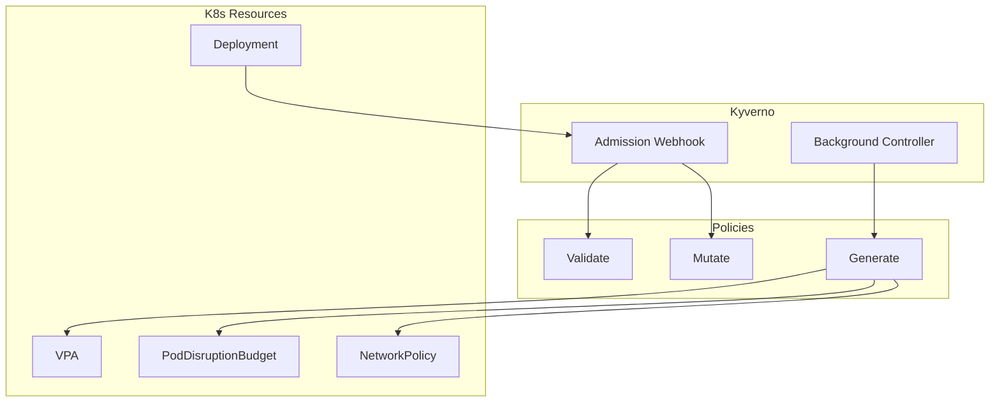

# Kyverno

Policy engine for OpenOva platform.

**Status:** Accepted | **Updated:** 2026-01-17

---

## Overview

Kyverno provides Kubernetes-native policy management:
- Validate resources against policies
- Mutate resources with defaults
- Generate companion resources
- No external dependencies (pure CRDs)

---

## Architecture



---

## Policy Types

| Type | Timing | Use Case |
|------|--------|----------|
| Validate | Admission | Enforce security policies |
| Mutate | Admission | Add defaults, labels |
| Generate | Background | Create companion resources |

---

## Auto-Generated Resources

Kyverno automatically generates companion resources for deployments:

### VPA Generation

```yaml
apiVersion: kyverno.io/v1
kind: ClusterPolicy
metadata:
  name: generate-vpa
spec:
  rules:
    - name: generate-vpa-for-deployment
      match:
        any:
          - resources:
              kinds:
                - Deployment
      exclude:
        any:
          - resources:
              annotations:
                vpa.openova.io/skip: "true"
      generate:
        apiVersion: autoscaling.k8s.io/v1
        kind: VerticalPodAutoscaler
        name: "{{request.object.metadata.name}}-vpa"
        namespace: "{{request.object.metadata.namespace}}"
        data:
          spec:
            targetRef:
              apiVersion: apps/v1
              kind: Deployment
              name: "{{request.object.metadata.name}}"
            updatePolicy:
              updateMode: Auto
```

### PodDisruptionBudget Generation

```yaml
apiVersion: kyverno.io/v1
kind: ClusterPolicy
metadata:
  name: generate-pdb
spec:
  rules:
    - name: generate-pdb-for-deployment
      match:
        any:
          - resources:
              kinds:
                - Deployment
              selector:
                matchExpressions:
                  - key: app.kubernetes.io/part-of
                    operator: Exists
      generate:
        apiVersion: policy/v1
        kind: PodDisruptionBudget
        name: "{{request.object.metadata.name}}-pdb"
        namespace: "{{request.object.metadata.namespace}}"
        data:
          spec:
            minAvailable: 1
            selector:
              matchLabels:
                app: "{{request.object.metadata.name}}"
```

### NetworkPolicy Generation

```yaml
apiVersion: kyverno.io/v1
kind: ClusterPolicy
metadata:
  name: generate-network-policy
spec:
  rules:
    - name: generate-default-deny
      match:
        any:
          - resources:
              kinds:
                - Namespace
              selector:
                matchLabels:
                  openova.io/tenant: "*"
      generate:
        apiVersion: networking.k8s.io/v1
        kind: NetworkPolicy
        name: default-deny
        namespace: "{{request.object.metadata.name}}"
        data:
          spec:
            podSelector: {}
            policyTypes:
              - Ingress
              - Egress
```

---

## Validation Policies

### Require Labels

```yaml
apiVersion: kyverno.io/v1
kind: ClusterPolicy
metadata:
  name: require-labels
spec:
  validationFailureAction: Enforce
  rules:
    - name: require-app-label
      match:
        any:
          - resources:
              kinds:
                - Deployment
                - StatefulSet
      validate:
        message: "The label 'app' is required."
        pattern:
          metadata:
            labels:
              app: "?*"
```

### Disallow Privileged Containers

```yaml
apiVersion: kyverno.io/v1
kind: ClusterPolicy
metadata:
  name: disallow-privileged
spec:
  validationFailureAction: Enforce
  rules:
    - name: no-privileged
      match:
        any:
          - resources:
              kinds:
                - Pod
      validate:
        message: "Privileged containers are not allowed."
        pattern:
          spec:
            containers:
              - securityContext:
                  privileged: "false"
```

---

## Skip Annotations

Deployments can opt out of auto-generation:

| Annotation | Effect |
|------------|--------|
| `vpa.openova.io/skip: "true"` | Skip VPA generation |
| `pdb.openova.io/skip: "true"` | Skip PDB generation |
| `networkpolicy.openova.io/skip: "true"` | Skip NetworkPolicy |

---

## Monitoring

| Metric | Description |
|--------|-------------|
| `kyverno_policy_results_total` | Policy evaluation results |
| `kyverno_admission_review_duration_seconds` | Admission review latency |
| `kyverno_policy_execution_duration_seconds` | Policy execution time |

---

*Part of [OpenOva](https://openova.io)*
