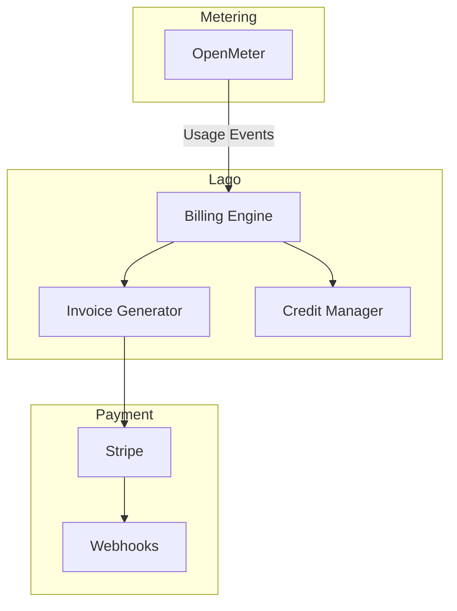
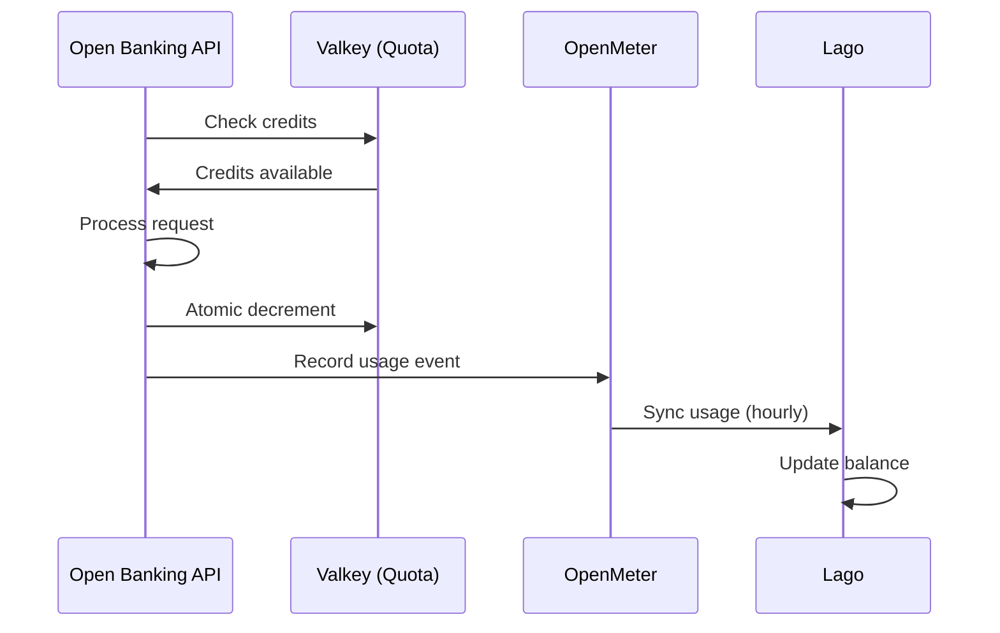

# Lago

Billing and invoicing for OpenOva Open Banking blueprint.

**Status:** Accepted | **Updated:** 2026-01-17

---

## Overview

Lago provides usage-based billing and invoicing:
- Integration with OpenMeter for usage data
- Prepaid credits and post-paid billing
- Automated invoice generation
- Payment gateway integration

---

## Architecture



---

## Billing Models

| Model | Description | Use Case |
|-------|-------------|----------|
| Prepaid | Buy credits upfront | API credits, startups |
| Subscription + Overage | Monthly fee + per-call | Enterprise standard |
| Post-paid | Pay for actual usage | Enterprise with trust |

---

## Configuration

### Lago Deployment

```yaml
apiVersion: apps/v1
kind: Deployment
metadata:
  name: lago
  namespace: open-banking
spec:
  template:
    spec:
      containers:
        - name: lago-api
          image: getlago/api:v0.50.0
          env:
            - name: DATABASE_URL
              valueFrom:
                secretKeyRef:
                  name: lago-db-credentials
                  key: url
            - name: REDIS_URL
              value: redis://valkey.databases.svc:6379
            - name: LAGO_API_URL
              value: https://billing.<domain>
```

### Billable Metric (from OpenMeter)

```json
{
  "name": "api_calls",
  "code": "api_calls",
  "description": "Number of API calls",
  "aggregation_type": "count_agg",
  "field_name": "calls"
}
```

### Plan Definition

```json
{
  "name": "API Pro Plan",
  "code": "api_pro",
  "interval": "monthly",
  "amount_cents": 9900,
  "amount_currency": "USD",
  "charges": [
    {
      "billable_metric_code": "api_calls",
      "charge_model": "graduated",
      "graduated_ranges": [
        { "from_value": 0, "to_value": 10000, "per_unit_amount": "0.00" },
        { "from_value": 10001, "to_value": null, "per_unit_amount": "0.001" }
      ]
    }
  ]
}
```

---

## Credit System

### Prepaid Credits

```json
{
  "customer_external_id": "tpp-12345",
  "paid_credits": "1000.00",
  "granted_credits": "100.00",
  "expiration_at": "2025-12-31T23:59:59Z"
}
```

### Credit Deduction Flow



---

## Invoice Generation

Lago automatically generates invoices:

| Event | Action |
|-------|--------|
| End of billing period | Generate invoice |
| Credit exhausted | Generate invoice |
| Plan upgrade | Prorate and invoice |
| Cancellation | Final invoice |

---

## Webhooks

Lago sends webhooks for billing events:

```yaml
apiVersion: v1
kind: ConfigMap
metadata:
  name: lago-webhooks
  namespace: open-banking
data:
  endpoints: |
    - url: https://api.<domain>/webhooks/lago
      events:
        - invoice.created
        - invoice.payment_status_updated
        - credit.exhausted
        - subscription.terminated
```

---

*Part of [OpenOva](https://openova.io)*
