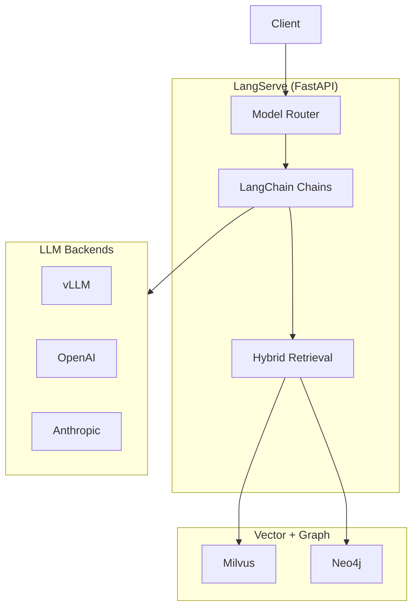

# LangServe

LangChain-based RAG service with OpenAI-compatible API.

**Status:** Accepted | **Updated:** 2026-02-07

---

## Overview

LangServe provides a production-ready RAG service using LangChain, offering hybrid retrieval, model routing, and OpenAI-compatible endpoints.



---

## Why LangServe?

| Feature | Benefit |
|---------|---------|
| LangChain ecosystem | Rich integrations |
| OpenAI-compatible | Drop-in replacement |
| Hybrid retrieval | Vector + graph search |
| Model routing | Multi-agent support |
| Streaming | Real-time responses |

---

## API Endpoints

| Endpoint | Purpose |
|----------|---------|
| `/v1/chat/completions` | OpenAI-compatible chat |
| `/v1/models` | List available agents |
| `/ingest/file` | Document ingestion |
| `/query` | Direct retrieval query |
| `/health` | Health check |
| `/metrics` | Prometheus metrics |

---

## Configuration

### Deployment

```yaml
apiVersion: apps/v1
kind: Deployment
metadata:
  name: langserve
  namespace: ai-hub
spec:
  replicas: 2
  template:
    spec:
      containers:
        - name: langserve
          image: harbor.<domain>/ai-hub/langserve:latest
          ports:
            - containerPort: 8000
          env:
            - name: LLM_ENDPOINT
              value: "http://vllm.ai-hub.svc:8000/v1"
            - name: MILVUS_HOST
              value: "milvus.ai-hub.svc"
            - name: NEO4J_URI
              value: "bolt://neo4j.ai-hub.svc:7687"
            - name: EMBEDDING_ENDPOINT
              value: "http://bge.ai-hub.svc:8080"
          resources:
            requests:
              cpu: 500m
              memory: 1Gi
```

---

## Agent Configuration

```python
# agents.py
from langchain_core.prompts import ChatPromptTemplate
from langchain_openai import ChatOpenAI

agents = {
    "deep-thinker": {
        "model": "qwen3-32b",
        "temperature": 0.7,
        "system": "Think step by step. Show your reasoning.",
        "enable_thinking": True,
        "retrieval": None
    },
    "quick-thinker": {
        "model": "qwen3-32b",
        "temperature": 0.3,
        "system": "Be concise and direct.",
        "enable_thinking": False,
        "retrieval": None
    },
    "compliance-advisor": {
        "model": "qwen3-32b",
        "temperature": 0.1,
        "system": "You are a compliance expert. Cite sources.",
        "retrieval": "hybrid",  # vector + graph
        "collection": "compliance"
    },
    "internet-search": {
        "model": "qwen3-32b",
        "temperature": 0.5,
        "system": "Search the web and synthesize results.",
        "retrieval": "web",
        "search_engine": "searxng"
    }
}
```

---

## Hybrid Retrieval

```python
from langchain.retrievers import EnsembleRetriever
from langchain_milvus import Milvus
from langchain_neo4j import Neo4jVector

# Vector retrieval
vector_retriever = Milvus(
    collection_name="documents",
    embedding=bge_embeddings,
    connection_args={"host": "milvus.ai-hub.svc"}
).as_retriever(search_kwargs={"k": 20})

# Graph retrieval
graph_retriever = Neo4jGraphRetriever(
    url="bolt://neo4j.ai-hub.svc:7687",
    query="""
        MATCH (d:Document)-[:HAS_TOPIC]->(t:Topic {name: $topic})
        WHERE d.status = 'active'
        RETURN d.text, d.document_id
    """
)

# Ensemble with reranking
retriever = EnsembleRetriever(
    retrievers=[vector_retriever, graph_retriever],
    weights=[0.7, 0.3]
)
```

---

## Document Ingestion

```python
from langchain_text_splitters import RecursiveCharacterTextSplitter
from langchain_unstructured import UnstructuredLoader

@app.post("/ingest/file")
async def ingest_file(file: UploadFile, source: str = "general"):
    # Parse document
    loader = UnstructuredLoader(file.file)
    documents = loader.load()

    # Chunk
    splitter = RecursiveCharacterTextSplitter(
        chunk_size=1000,
        chunk_overlap=200
    )
    chunks = splitter.split_documents(documents)

    # Embed and store
    Milvus.from_documents(
        chunks,
        embedding=bge_embeddings,
        collection_name="documents",
        partition_name=source
    )

    return {"status": "ingested", "chunks": len(chunks)}
```

---

## Streaming Response

```python
from langchain.callbacks import StreamingStdOutCallbackHandler
from fastapi.responses import StreamingResponse

@app.post("/v1/chat/completions")
async def chat(request: ChatRequest):
    agent = agents[request.model]

    chain = create_chain(agent)

    async def generate():
        async for chunk in chain.astream(request.messages):
            yield f"data: {chunk.json()}\n\n"
        yield "data: [DONE]\n\n"

    return StreamingResponse(generate(), media_type="text/event-stream")
```

---

## Monitoring

| Metric | Query |
|--------|-------|
| Request latency | `langserve_request_duration_seconds` |
| Token count | `langserve_tokens_total` |
| Retrieval time | `langserve_retrieval_duration_seconds` |
| Cache hits | `langserve_cache_hits_total` |

---

## Dependencies

| Package | Purpose |
|---------|---------|
| `langchain` | Core framework |
| `langchain-openai` | OpenAI integration |
| `langchain-milvus` | Vector store |
| `langchain-neo4j` | Graph store |
| `langserve` | FastAPI deployment |
| `fastapi` | Web framework |

---

## Consequences

**Positive:**
- LangChain ecosystem
- OpenAI-compatible API
- Hybrid retrieval
- Easy to extend
- Active community

**Negative:**
- LangChain dependency
- Abstraction overhead
- Version compatibility issues

---

*Part of [OpenOva](https://openova.io)*
