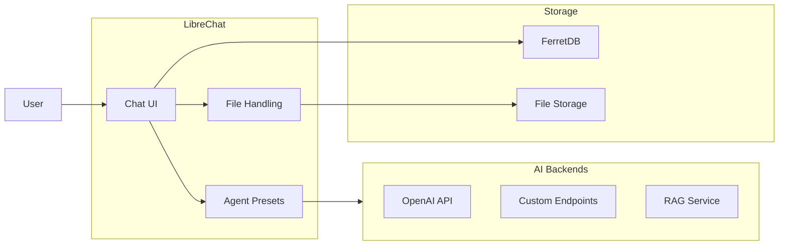
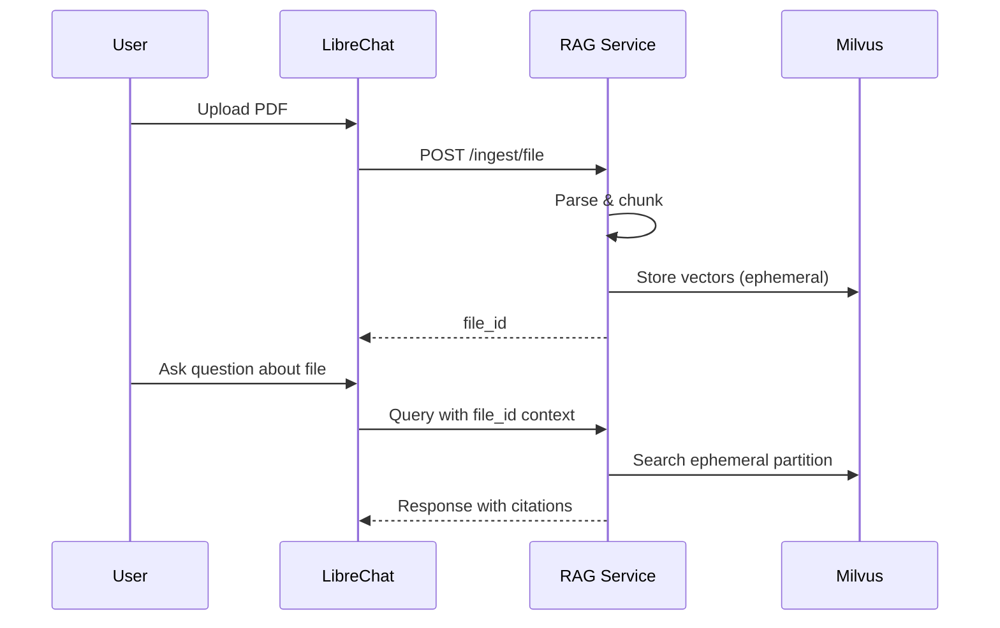

# LibreChat

Open-source chat UI with multi-model support and file uploads. **Application Blueprint** (see [`docs/PLATFORM-TECH-STACK.md`](../../docs/PLATFORM-TECH-STACK.md) §4.6). Default end-user chat surface in `bp-cortex` — fronts the LLM Gateway and routes through NeMo Guardrails for safety.

**Status:** Accepted | **Updated:** 2026-04-30

---

## Chart layout

`platform/librechat/chart/` is a Catalyst-authored scratch chart (no upstream Helm chart is published by LibreChat). It hand-wires the official `ghcr.io/danny-avila/librechat` container as a Deployment + Service + Ingress (with cert-manager TLS) + ConfigMap + ServiceAccount + NetworkPolicy + ServiceMonitor (gated by Capabilities, default off) + HPA (default off).

The chart's `Chart.yaml` declares a stub `sigstore/common` library subchart **only** to satisfy the platform-wide hollow-chart CI gate (issue #181) — `common` is a tiny library chart (helper templates, zero runtime resources) and contributes nothing to the rendered manifests. Same shape as `platform/coraza/`.

| File | Purpose |
|---|---|
| `chart/Chart.yaml` | Umbrella metadata + stub library dependency (hollow-chart gate). |
| `chart/values.yaml` | Operator-tunable values (every endpoint URL, model, secret ref). |
| `chart/templates/deployment.yaml` | LibreChat container, env wiring (Mongo URI, JWT/CREDS, OpenID, RAG embeddings). |
| `chart/templates/service.yaml` | ClusterIP on port 3080. |
| `chart/templates/ingress.yaml` | cert-manager-issued TLS at `chat-app.<sovereign-fqdn>` (host is operator-supplied; never defaulted, per [INVIOLABLE-PRINCIPLES.md #4](../../docs/INVIOLABLE-PRINCIPLES.md)). |
| `chart/templates/configmap.yaml` | `librechat.yaml` declaring the bp-llm-gateway custom endpoint, model list, file-upload limits. |
| `chart/templates/networkpolicy.yaml` | Default-deny shell + explicit allows to bp-llm-gateway, bp-bge, FerretDB, bp-keycloak, kube-dns. |
| `chart/templates/serviceaccount.yaml` | Per-release SA. |
| `chart/templates/servicemonitor.yaml` | `monitoring.coreos.com/v1` ServiceMonitor — default off, double-gated by `.Values.serviceMonitor.enabled` AND `Capabilities.APIVersions.Has` per [`docs/BLUEPRINT-AUTHORING.md` §11.2](../../docs/BLUEPRINT-AUTHORING.md). |
| `chart/templates/hpa.yaml` | HorizontalPodAutoscaler — default off; flipped on by multi-tenant Sovereigns. |
| `chart/templates/_helpers.tpl` | Standard `bp-librechat.{name,fullname,labels,selectorLabels,serviceAccountName,configMapName}`. |
| `chart/tests/observability-toggle.sh` | CI gate ([`docs/BLUEPRINT-AUTHORING.md` §11.2](../../docs/BLUEPRINT-AUTHORING.md)) — proves `serviceMonitor.enabled` defaults false, opt-in renders cleanly, explicit-off renders cleanly. |

### Connectors

| Connector | Backend | Wire shape |
|---|---|---|
| Chat completions | `bp-llm-gateway` (transitively `bp-vllm` + `bp-anthropic-adapter`) | OpenAI-compatible `/v1/chat/completions` exposed as a "custom" endpoint named `Catalyst LLM`. |
| Embeddings (RAG) | `bp-bge` | OpenAI-compatible `/v1/embeddings`; LibreChat configured with `EMBEDDINGS_PROVIDER=openai` + `RAG_OPENAI_BASEURL=<bge.svc>`. |
| SSO | `bp-keycloak` | OpenID Connect — operator-supplied issuer + client secret via ExternalSecret. Callback `/oauth/openid/callback`. |
| Conversation store | FerretDB on `bp-cnpg` | MongoDB wire protocol over Postgres — operator-supplied connection URI. |

### Observability

`serviceMonitor.enabled` defaults `false` per [`docs/BLUEPRINT-AUTHORING.md` §11.2](../../docs/BLUEPRINT-AUTHORING.md). Operators flip it on at `clusters/<sovereign>/bootstrap-kit/48-librechat.yaml` once `bp-kube-prometheus-stack` reconciles.

### Hosting

`chat-app.${SOVEREIGN_FQDN}` (e.g. `chat-app.omantel.omani.works`). The host MUST be supplied by the cluster overlay — the chart `fail`s render if `ingress.host` is empty.

---

## Overview

LibreChat provides a ChatGPT-like interface supporting multiple AI backends, file uploads, and customizable agent presets.



---

## Why LibreChat?

| Feature | Benefit |
|---------|---------|
| Multi-model | Switch between AI backends |
| Agent presets | Pre-configured assistants |
| File uploads | Document analysis |
| Conversation history | Persistent chat storage |
| SSO integration | Enterprise authentication |

---

## Configuration

### Helm Values

```yaml
librechat:
  replicas: 2

  config:
    endpoints:
      custom:
        - name: "AI Hub"
          apiKey: "${RAG_SERVICE_API_KEY}"
          baseURL: "http://rag-service.ai-hub.svc:8000/v1"
          models:
            default: ["deep-thinker", "quick-thinker", "compliance-advisor"]
          titleModel: "quick-thinker"
          dropParams: ["stop", "user"]

    registration:
      socialLogins: ["openid"]

    fileConfig:
      endpoints:
        custom:
          fileLimit: 10
          fileSizeLimit: 50  # MB
          supportedMimeTypes:
            - "application/pdf"
            - "application/vnd.openxmlformats-officedocument.wordprocessingml.document"
            - "text/plain"

ferretdb:
  enabled: true
  # FerretDB provides MongoDB wire protocol compatibility
  # backed by CNPG PostgreSQL
  auth:
    rootPassword: ""  # From ESO
  persistence:
    size: 10Gi
```

---

## Agent Presets

### Deep Thinker

```json
{
  "name": "Deep Thinker",
  "model": "deep-thinker",
  "description": "Complex reasoning with visible chain-of-thought",
  "systemPrompt": "You are a thoughtful analyst. Think step by step and show your reasoning.",
  "temperature": 0.7,
  "maxTokens": 8192
}
```

### Quick Thinker

```json
{
  "name": "Quick Thinker",
  "model": "quick-thinker",
  "description": "Fast responses for simple queries",
  "systemPrompt": "You are a helpful assistant. Be concise and direct.",
  "temperature": 0.3,
  "maxTokens": 2048
}
```

### Compliance Advisor

```json
{
  "name": "Compliance Advisor",
  "model": "compliance-advisor",
  "description": "Regulatory knowledge with citations",
  "systemPrompt": "You are a compliance expert. Always cite your sources with document references.",
  "temperature": 0.1,
  "maxTokens": 4096
}
```

---

## SSO Configuration

### Azure AD OIDC

```yaml
socialLogins:
  - openid

openidConfig:
  issuer: "https://login.microsoftonline.com/${TENANT_ID}/v2.0"
  clientId: "${CLIENT_ID}"
  clientSecret: "${CLIENT_SECRET}"
  scope: ["openid", "profile", "email"]
  callbackURL: "https://chat.<env>.<sovereign-domain>/oauth/openid/callback"
```

### Keycloak

```yaml
openidConfig:
  issuer: "https://keycloak.<location-code>.<sovereign-domain>/realms/<org>"
  clientId: "librechat"
  clientSecret: ""  # From ESO
  scope: ["openid", "profile", "email"]
```

---

## File Upload Flow



---

## Environment Variables

| Variable | Purpose |
|----------|---------|
| `MONGO_URI` | FerretDB connection string (MongoDB wire protocol) |
| `OPENID_CLIENT_ID` | SSO client ID |
| `OPENID_CLIENT_SECRET` | SSO client secret |
| `CREDS_KEY` | Encryption key for credentials |
| `CREDS_IV` | Encryption IV |
| `JWT_SECRET` | JWT signing secret |

---

## Custom Endpoints

```yaml
endpoints:
  custom:
    - name: "RAG Service"
      baseURL: "http://rag-service.ai-hub.svc:8000/v1"
      apiKey: "${API_KEY}"
      models:
        default:
          - deep-thinker
          - quick-thinker
          - compliance-advisor
          - aiops-advisor
          - dev-advisor
          - internet-search
```

---

## Monitoring

| Metric | Description |
|--------|-------------|
| Active users | Concurrent chat sessions |
| Message count | Total messages sent |
| File uploads | Documents processed |
| Response time | Backend latency |

---

## Consequences

**Positive:**
- ChatGPT-like experience
- Multi-model switching
- File upload support
- Enterprise SSO
- Customizable presets

**Negative:**
- Requires FerretDB (MongoDB wire protocol on CNPG)
- Complex configuration
- UI customization limited

---

*Part of [OpenOva](https://openova.io)*
