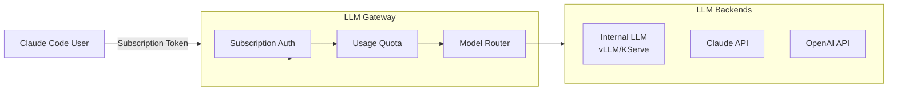
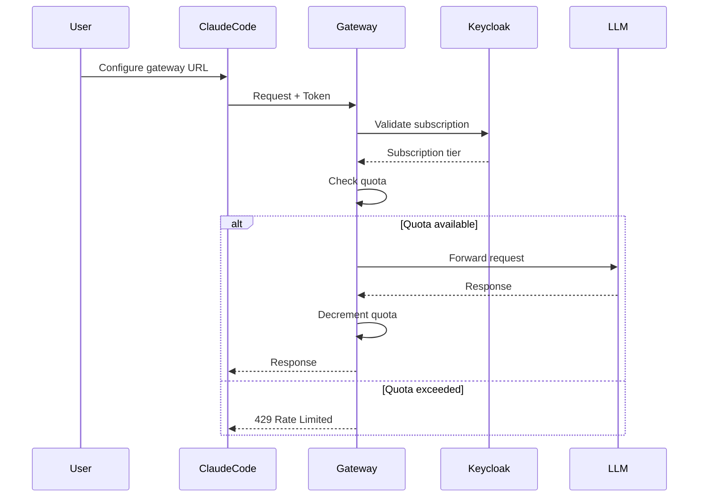

# LLM Gateway

Subscription-based proxy for LLM access via Claude Code.

**Status:** Accepted | **Updated:** 2026-02-07

---

## Overview

LLM Gateway enables users with Claude/OpenAI subscriptions to use Claude Code with internal models without requiring API pay-as-you-go billing.



---

## Why LLM Gateway?

| Feature | Benefit |
|---------|---------|
| Subscription-based | No API billing required |
| Quota management | Fair usage limits |
| Model routing | Internal + external models |
| Claude Code support | Native integration |

---

## How It Works

1. User authenticates with their subscription credentials
2. Gateway validates subscription status
3. Requests are routed to internal or external LLMs
4. Usage is tracked against subscription quota

---

## Configuration

### Deployment

```yaml
apiVersion: apps/v1
kind: Deployment
metadata:
  name: llm-gateway
  namespace: ai-hub
spec:
  replicas: 2
  template:
    spec:
      containers:
        - name: gateway
          image: harbor.<domain>/ai-hub/llm-gateway:latest
          ports:
            - containerPort: 8000
          env:
            - name: INTERNAL_LLM_URL
              value: "http://vllm.ai-hub.svc:8000/v1"
            - name: CLAUDE_API_KEY
              valueFrom:
                secretKeyRef:
                  name: gateway-secrets
                  key: claude-api-key
            - name: OPENAI_API_KEY
              valueFrom:
                secretKeyRef:
                  name: gateway-secrets
                  key: openai-api-key
            - name: QUOTA_REDIS_URL
              value: "redis://valkey.ai-hub.svc:6379"
            - name: AUTH_PROVIDER
              value: "keycloak"
            - name: KEYCLOAK_URL
              value: "https://keycloak.<domain>/realms/ai-hub"
```

---

## Subscription Tiers

| Tier | Daily Quota | Models |
|------|-------------|--------|
| Free | 10 requests | Internal only |
| Pro | 1,000 requests | Internal + Claude Haiku |
| Enterprise | Unlimited | All models |

---

## Authentication Flow



---

## Model Routing

```python
# Model routing logic
def route_model(request_model: str, tier: str) -> str:
    routing = {
        "free": {
            "claude-3-opus": "qwen3-32b",  # Route to internal
            "claude-3-sonnet": "qwen3-32b",
            "gpt-4": "qwen3-32b"
        },
        "pro": {
            "claude-3-opus": "claude-3-haiku",  # Downgrade
            "claude-3-sonnet": "claude-3-haiku",
            "claude-3-haiku": "claude-3-haiku",  # Pass through
            "gpt-4": "qwen3-32b"
        },
        "enterprise": {
            # Pass through all models
        }
    }
    return routing.get(tier, {}).get(request_model, request_model)
```

---

## Quota Management

```python
# Redis-based quota tracking
async def check_quota(user_id: str, tier: str) -> bool:
    key = f"quota:{user_id}:{today()}"
    current = await redis.get(key) or 0

    limits = {"free": 10, "pro": 1000, "enterprise": float("inf")}

    if int(current) >= limits[tier]:
        return False

    await redis.incr(key)
    await redis.expire(key, 86400)  # Reset daily
    return True
```

---

## Claude Code Setup

```bash
# Configure Claude Code to use gateway
export ANTHROPIC_API_KEY="your-subscription-token"
export ANTHROPIC_BASE_URL="https://llm-gateway.ai-hub.<domain>/v1"

# Or in claude code config
claude config set api_base "https://llm-gateway.ai-hub.<domain>/v1"
claude config set api_key "your-subscription-token"
```

---

## API Endpoints

| Endpoint | Purpose |
|----------|---------|
| `/v1/messages` | Anthropic-compatible chat |
| `/v1/chat/completions` | OpenAI-compatible chat |
| `/v1/models` | List available models |
| `/quota` | Check remaining quota |
| `/health` | Health check |

---

## Monitoring

| Metric | Query |
|--------|-------|
| Requests by tier | `gateway_requests_total{tier}` |
| Quota usage | `gateway_quota_used{user}` |
| Model routing | `gateway_model_routes_total{from, to}` |
| Latency | `gateway_request_duration_seconds` |

---

## Consequences

**Positive:**
- No API billing for users
- Subscription-based access
- Quota management
- Model routing flexibility
- Claude Code compatible

**Negative:**
- Additional infrastructure
- Quota management complexity
- Subscription validation overhead

---

*Part of [OpenOva](https://openova.io)*
