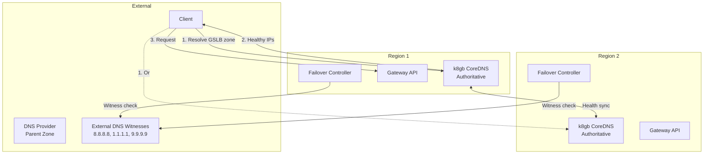
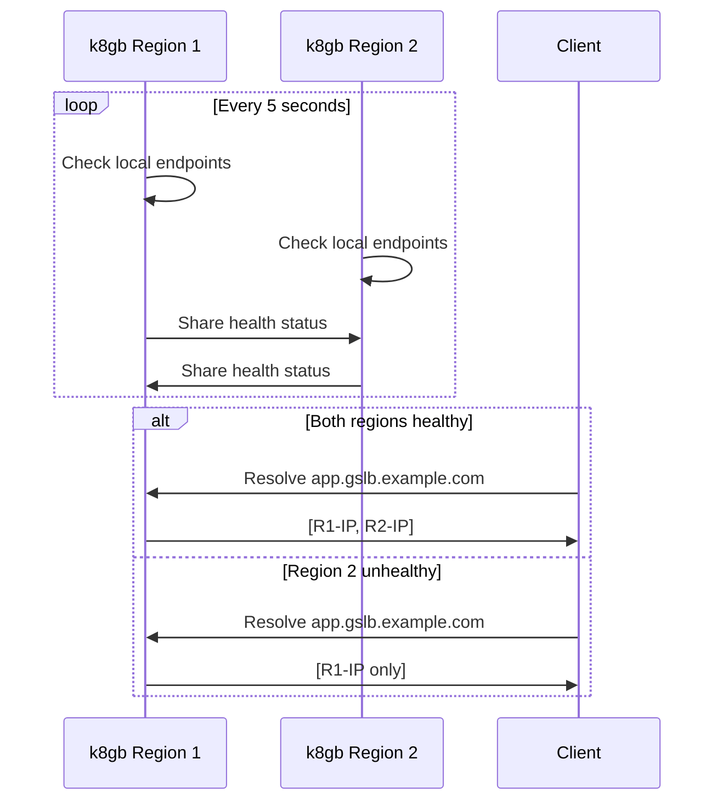

# k8gb

Kubernetes Global Balancer for cross-region DNS-based load balancing.

**Status:** Accepted | **Updated:** 2026-02-07

---

## Overview

k8gb provides cross-region DNS-based load balancing that routes traffic to healthy endpoints only. It acts as **authoritative DNS** for the GSLB zone.



---

## How k8gb Works

### Health-Based DNS Routing



### Mechanism

| Aspect | Mechanism |
|--------|-----------|
| Local health | Direct check of Ingress/Gateway endpoints |
| Cross-cluster "health" | DNS query to `localtargets-*` record |
| Communication | **DNS only** - no direct health checks |

---

## k8gb Limitations (Critical)

### The Split-Brain Problem

**k8gb cannot distinguish between:**
- "Region is down" (failover needed)
- "Network partition" (failover NOT wanted)

Both produce the same symptom: DNS query fails or times out.

| Scenario | k8gb Behavior | Correct? |
|----------|---------------|----------|
| Region truly down | Removes from DNS | Yes |
| Network partition | Also removes from DNS | **No** |
| Both healthy | Returns both | Yes |

### Mitigation: Failover Controller

For **stateless services**: k8gb's behavior is acceptable.

For **stateful services**: Use **Failover Controller** with cloud witness (external DNS) to control Gateway/Service readiness. See [ADR-FAILOVER-CONTROLLER](../failover-controller/docs/ADR-FAILOVER-CONTROLLER.md).

---

## k8gb as Authoritative DNS

k8gb CoreDNS serves as the **authoritative DNS server** for the GSLB zone:

### DNS Hierarchy

```
example.com                    → DNS Provider (Cloudflare, Hetzner)
  └── gslb.example.com (NS)    → k8gb CoreDNS (authoritative)
        ├── app.gslb.example.com     → R1, R2 IPs (health-based)
        ├── api.gslb.example.com     → R1, R2 IPs (health-based)
        └── db.gslb.example.com      → Primary region only (failover)
```

### NS Record Setup

ExternalDNS creates NS records pointing to k8gb LoadBalancer IPs:

```yaml
# Created by ExternalDNS in parent zone
gslb.example.com.  NS  ns1.gslb.example.com.
gslb.example.com.  NS  ns2.gslb.example.com.
ns1.gslb.example.com.  A  <k8gb-region1-lb-ip>
ns2.gslb.example.com.  A  <k8gb-region2-lb-ip>
```

---

## Routing Strategies

| Strategy | Description | Use Case |
|----------|-------------|----------|
| `roundRobin` | Even distribution across healthy endpoints | Active-Active |
| `failover` | Primary region preferred, DR on failure | Active-Passive |
| `geoip` | Route by client geography | Latency optimization |

### GeoIP Limitations

DNS queries come from **resolver IPs**, not client IPs. EDNS Client Subnet (ECS) mitigates this but isn't universally supported.

| DNS Resolver | ECS Support | Accuracy |
|--------------|-------------|----------|
| Google (8.8.8.8) | Yes | Good |
| Cloudflare (1.1.1.1) | No (privacy) | Poor |

**Recommendation:** Use `failover` or `roundRobin` for predictable behavior.

---

## Configuration

### Gslb Custom Resource

```yaml
apiVersion: k8gb.absa.oss/v1beta1
kind: Gslb
metadata:
  name: <tenant>-app
  namespace: <tenant>-prod
spec:
  ingress:
    ingressClassName: cilium
    rules:
      - host: app.gslb.<domain>
        http:
          paths:
            - path: /
              pathType: Prefix
              backend:
                service:
                  name: app-service
                  port:
                    number: 80
  strategy:
    type: roundRobin  # or failover, geoip
    splitBrainThresholdSeconds: 300
    dnsTtlSeconds: 30
```

### Active-Passive Configuration

```yaml
apiVersion: k8gb.absa.oss/v1beta1
kind: Gslb
metadata:
  name: app
  annotations:
    k8gb.io/primary-geotag: "region-1"
    k8gb.io/weight-region-1: "100"
    k8gb.io/weight-region-2: "0"
spec:
  strategy:
    type: failover
```

| Scenario | Region 1 Weight | Region 2 Weight | Traffic |
|----------|-----------------|-----------------|---------|
| Both healthy | 100 | 0 | 100% Region 1 |
| Region 1 fails | - | 100 (auto) | 100% Region 2 |
| Region 1 recovers | 100 | 0 | Back to Region 1 |

---

## Deployment

### Helm Release

```yaml
apiVersion: v1
kind: Namespace
metadata:
  name: k8gb
---
apiVersion: helm.toolkit.fluxcd.io/v2beta1
kind: HelmRelease
metadata:
  name: k8gb
  namespace: k8gb
spec:
  interval: 10m
  chart:
    spec:
      chart: k8gb
      version: "0.12.x"
      sourceRef:
        kind: HelmRepository
        name: k8gb
        namespace: flux-system
  values:
    k8gb:
      dnsZone: "gslb.<domain>"
      edgeDNSZone: "<domain>"
      edgeDNSServers:
        - "8.8.8.8"
        - "1.1.1.1"
      clusterGeoTag: "<region>"
      extGslbClustersGeoTags: "<other-region>"
      reconcileRequeueSeconds: 30
```

### k8gb CoreDNS Configuration

```yaml
.:5353 {
    k8gb_coredns
    health
    ready
    prometheus :9153
}
```

---

## Split-Brain Protection

### Cloud Witness (External DNS)

Failover Controller uses external DNS witnesses to determine who should be active:

| Component | Role |
|-----------|------|
| External DNS (8.8.8.8, 1.1.1.1, 9.9.9.9) | Witness reachability |
| Failover Controller | Per-cluster controller managing readiness |

### How This Prevents Split-Brain

| Scenario | R1 FC | R2 FC | Result |
|----------|-------|-------|--------|
| Normal | Reaches witnesses, ACTIVE | Reaches witnesses, STANDBY | Traffic to R1 |
| R1 down | Unreachable | Witnesses confirm R1 down | Failover to R2 |
| Network partition | Both reach witnesses | R1 keeps priority | **No split-brain** |

---

## TTL Configuration

| Setting | Value | Purpose |
|---------|-------|---------|
| DNS TTL | 30s | Balance caching vs failover speed |
| Health check interval | 5s | Detect failures quickly |
| Split-brain threshold | 300s | Prevent flapping |

**Failover time:** 30-60 seconds (DNS TTL + propagation)

---

## Monitoring

### Key Metrics

| Metric | Query | Threshold |
|--------|-------|-----------|
| GSLB healthy endpoints | `k8gb_gslb_healthy_records` | <2 = warning |
| Witness reachability | `splitbrain_witness_reachable` | 0 = warning |
| Quorum status | `splitbrain_quorum_reached` | 0 when quorum lost |

### Grafana Dashboard Queries

```promql
# GSLB health by region
sum by (gslb_name) (k8gb_gslb_healthy_records)

# Witness status
splitbrain_witness_reachable

# Recent promotions
increase(splitbrain_promotions_total[1h])
```

### Alert Rules

```yaml
apiVersion: monitoring.coreos.com/v1
kind: PrometheusRule
metadata:
  name: k8gb-alerts
  namespace: monitoring
spec:
  groups:
    - name: k8gb
      rules:
        - alert: GslbEndpointDown
          expr: k8gb_gslb_healthy_records < 2
          for: 1m
          labels:
            severity: warning

        - alert: GslbAllEndpointsDown
          expr: k8gb_gslb_healthy_records == 0
          for: 30s
          labels:
            severity: critical
```

---

## Operations

### Health Checks

```bash
# k8gb pods
kubectl get pods -n k8gb

# Gslb resources
kubectl get gslb -A

# Gslb status
kubectl describe gslb <tenant>-app -n <tenant>-prod

# Verify DNS resolution
kubectl run -it --rm dns-test --image=busybox --restart=Never -- \
  nslookup app.gslb.<domain>
```

### Troubleshooting

**Endpoint Not Being Added to DNS:**

```bash
# Check Gslb resource status
kubectl describe gslb <name> -n <namespace>

# Check k8gb logs
kubectl logs -l app.kubernetes.io/name=k8gb -n k8gb | grep -i error

# Verify backend service is healthy
kubectl get endpoints <service> -n <namespace>
```

**Force DNS Update:**

```bash
# Trigger k8gb reconciliation
kubectl annotate gslb <name> -n <namespace> k8gb.io/reconcile=$(date +%s) --overwrite

# Verify DNS records updated
dig app.gslb.<domain> +short
```

### Recovery Procedures

**k8gb Down:**

```bash
# Force restart
kubectl rollout restart deployment/k8gb -n k8gb
```

**Region Recovery After Failover:**

```bash
# Verify region is healthy
kubectl get pods -A | grep -v Running

# Verify Gslb status shows region
kubectl describe gslb <name> -n <namespace>
```

---

## Component Responsibilities

| Component | Responsibility | When Active |
|-----------|---------------|-------------|
| **k8gb** | DNS-based traffic routing (automatic failover) | Always |
| **Failover Controller** | Stateful service promotion (CNPG, MongoDB) | Only when region fails |
| **ExternalDNS** | NS record delegation (one-time setup) | Initial delegation only |

**Key Clarifications:**

- k8gb handles all DNS failover natively
- Failover Controller is ONLY for **data service promotion** (e.g., CNPG replica to primary)
- If you only have stateless services, you don't need Failover Controller

---

## Consequences

**Positive:**
- Self-hosted authoritative DNS for GSLB
- Health-based routing (only healthy endpoints)
- External witness verification prevents split-brain
- Multiple routing strategies
- Native Kubernetes integration
- "Poor man's LoadBalancer" option (free, DNS-based)

**Negative:**
- DNS-based (subject to TTL delays)
- Requires cross-cluster communication
- Requires external DNS witnesses for split-brain protection

---

*Part of [OpenOva](https://openova.io)*
