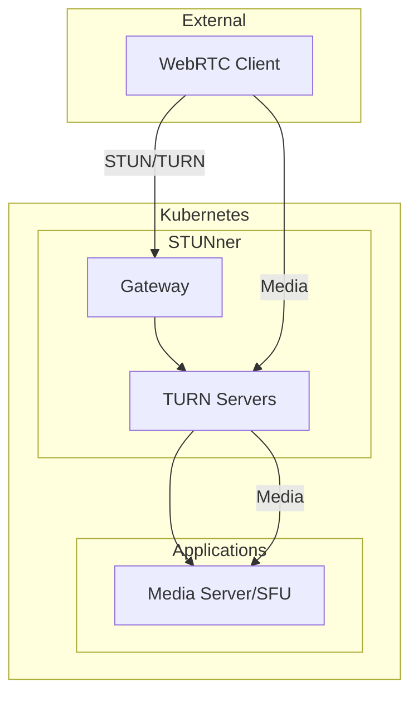

# STUNner

Kubernetes-native WebRTC gateway for OpenOva platform.

**Status:** Accepted | **Updated:** 2026-01-17

---

## Overview

STUNner provides WebRTC connectivity:
- Kubernetes-native STUN/TURN server
- Gateway API integration
- Scalable media relay
- NAT traversal for video/audio

---

## Architecture



---

## Why STUNner

| Factor | STUNner | Traditional TURN |
|--------|---------|-----------------|
| Deployment | Kubernetes-native | Separate VMs |
| Scaling | HPA/KEDA | Manual |
| Configuration | Gateway API CRDs | Config files |
| Integration | Native K8s | External |

---

## Configuration

### Gateway

```yaml
apiVersion: gateway.networking.k8s.io/v1
kind: Gateway
metadata:
  name: stunner-gateway
  namespace: stunner
spec:
  gatewayClassName: stunner-gatewayclass
  listeners:
    - name: udp-listener
      port: 3478
      protocol: TURN-UDP
    - name: tcp-listener
      port: 3478
      protocol: TURN-TCP
```

### UDPRoute

```yaml
apiVersion: stunner.l7mp.io/v1
kind: UDPRoute
metadata:
  name: media-route
  namespace: stunner
spec:
  parentRefs:
    - name: stunner-gateway
  rules:
    - backendRefs:
        - name: media-server
          namespace: apps
```

### GatewayConfig

```yaml
apiVersion: stunner.l7mp.io/v1
kind: GatewayConfig
metadata:
  name: stunner-config
  namespace: stunner
spec:
  realm: stunner.<domain>
  authType: longterm
  userName: stunner
  password:
    name: stunner-credentials
    namespace: stunner
    key: password
```

---

## TURN Authentication

STUNner supports long-term credentials:

```yaml
# Generate time-limited credentials
apiVersion: stunner.l7mp.io/v1
kind: GatewayConfig
spec:
  authType: longterm
  authLifetime: 86400  # 24 hours
```

---

## Scaling

STUNner scales with KEDA based on connection count:

```yaml
apiVersion: keda.sh/v1alpha1
kind: ScaledObject
metadata:
  name: stunner-scaler
  namespace: stunner
spec:
  scaleTargetRef:
    name: stunner
  minReplicaCount: 2
  maxReplicaCount: 10
  triggers:
    - type: prometheus
      metadata:
        serverAddress: http://mimir.monitoring.svc:8080/prometheus
        metricName: stunner_allocations_active
        query: sum(stunner_allocations_active)
        threshold: "100"
```

---

## Monitoring

| Metric | Description |
|--------|-------------|
| `stunner_allocations_active` | Active TURN allocations |
| `stunner_bytes_received_total` | Received bytes |
| `stunner_bytes_sent_total` | Sent bytes |
| `stunner_connections_total` | Total connections |

---

*Part of [OpenOva](https://openova.io)*
