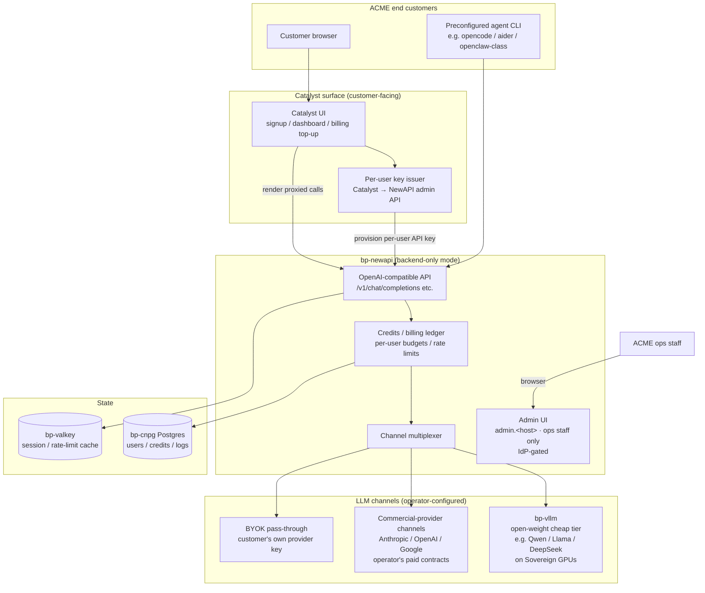

# NewAPI

Multi-tenant LLM marketplace gateway. **Application Blueprint** — see [`docs/PLATFORM-TECH-STACK.md`](../../docs/PLATFORM-TECH-STACK.md) §4.6 (LLM Serving). Catalyst Sovereigns deploy `bp-newapi` when the operator's business model is **reselling LLM access to their own end customers** (with credits, per-key budgets, multi-channel routing, and BYOK), as opposed to the per-developer subscription pattern served by `bp-llm-gateway`.

**Status:** Accepted | **Updated:** 2026-05-01

---

## Overview

NewAPI is the open-source multi-tenant gateway upstream at [github.com/Calcium-Ion/new-api](https://github.com/Calcium-Ion/new-api) (MIT, Go, fork of OneAPI with marketplace-shaped extensions). Catalyst packages it as a Sovereign-deployable blueprint with three operational properties that distinguish it from `bp-llm-gateway`:

1. **Multi-tenant primitives are first-class.** Users, credit balances, per-key rate limits, channel routing, billing logs, and admin RBAC are baked in. The blueprint surfaces these via the upstream's HTTP admin API.
2. **Backend-only deployment is the Catalyst-supported mode.** The upstream NewAPI ships a customer-facing portal UI; in a Catalyst Sovereign, that UI is **not** the customer surface — Catalyst is. NewAPI's UI is reachable on a separate `admin.<host>` virtual host gated by the Sovereign operator's IdP, used by ops staff for channel configuration, balance reconciliation, and audit review.
3. **Compliance defaults are enforced at the blueprint layer.** Channel provenance attestation, geographic AUP enforcement, and BYOK isolation are configured at install time and cannot be silently bypassed by per-tenant overlays.

`bp-newapi` is the install unit a Sovereign operator chooses when they intend to **resell LLM capacity** — not when they intend to consume it themselves. For self-consumption (one organisation, one bill), `bp-llm-gateway` (LiteLLM-based) is the simpler answer.

---

## Reference deployment — ACME Sovereign

ACME is the placeholder operator throughout this document. Replace with your operator's identity in the per-Sovereign overlay at `clusters/<sovereign>/bootstrap-kit/`.



### What lives where

| Concern | Owner | Surface |
|---|---|---|
| Customer signup, login, billing top-up, dashboard | **Catalyst** | `https://<host>` (operator's primary domain) |
| OpenAI-compatible API for client tools (CLI agents, IDE plugins, scripts) | **NewAPI backend** | `https://api.<host>/v1/*` |
| Channel configuration (which providers, which keys, which models) | **NewAPI admin UI** | `https://admin.<host>` — IdP-gated, ops staff only |
| Credit / balance / billing ledger | **NewAPI** (Postgres on bp-cnpg) | NewAPI admin UI + admin API |
| Per-user API keys | **NewAPI** (issued via admin API by Catalyst signup hook) | NewAPI admin API |
| User identity, customer support, content pages | **Catalyst** | Catalyst UI |
| Inference (open-weight cheap tier) | **bp-vllm** | In-cluster ClusterIP |
| Inference (premium / paid resold) | **Anthropic / OpenAI / Google** | Egress over operator's commercial contracts |
| Inference (BYOK) | **Customer's chosen provider** | Egress under customer's key |

### What is **not** here

- **No Axon dependency.** `bp-newapi` is a Sovereign-self-contained gateway. The OpenOva-hosted Axon service plays no role in an ACME deployment.
- **No `openova.io` egress dependency.** All OpenOva-controlled services that would otherwise be called from the customer's data plane are absent. The blueprint's only egress dependencies are: (a) the operator's chosen commercial-provider endpoints, (b) cert-manager ACME challenges, (c) the operator's own observability stack.
- **No customer-facing NewAPI portal UI.** The upstream's customer portal is disabled at ingress (only `admin.<host>` is exposed). Customers see Catalyst.

---

## Tier model

ACME (or any Sovereign operator) configures channels in NewAPI to expose a tiered offering to its customers:

| Tier | Channel type | Operator cost | Customer-facing price | Compliance posture |
|---|---|---|---|---|
| **Cheap / unlimited-feel** | `bp-vllm` in-cluster | GPU + power on the Sovereign | flat-fee or generous credit grant | Operator owns the model weights and hardware; license obligations of the model (Llama Community License, Apache 2, etc.) apply |
| **Premium / paid resold** | Direct commercial contract with Anthropic / OpenAI / Google | Published API rate, paid by operator | Provider rate + operator markup | Operator must hold a commercial account in good standing at each upstream and disclose reseller status in customer ToS |
| **BYOK** | Customer's own provider key | Zero token cost to operator | Flat routing/observability fee | Customer's commercial relationship with the provider is intact; operator never aggregates BYOK keys across customers |
| **Free / promotional** | Subset of `bp-vllm` with rate caps | GPU + power | Free, capped | Backed by the operator's own infrastructure; never by upstream-provider free-tier accounts |

### The single test for channel compliance

> **For every paid token a customer consumes from a commercial-provider channel, there must exist a token of the same kind that the Sovereign operator paid the provider for at their published commercial rate, on an account naming the operator as the customer.**

If this 1:1 cannot be demonstrated for a channel, the channel is non-compliant and must not be enabled. The blueprint's `channels.<name>.attestation` field is mandatory — see `blueprint.yaml`.

---

## Catalyst integration

Two integration points connect Catalyst (customer-facing UI) to NewAPI (backend gateway):

### 1. Per-user API key issuance

When a customer signs up in Catalyst, a Catalyst signup hook calls NewAPI's admin API to:

1. Create a NewAPI user bound to the Catalyst user UUID (1:1 mapping)
2. Issue a per-user API key with a starting credit grant per the operator's plan
3. Store the issued key in the Catalyst user record (encrypted at rest via the operator's KMS)

The customer never sees NewAPI's UI. Their key is rendered inside Catalyst's dashboard, and Catalyst's "regenerate key" / "set spending cap" / "view usage" actions are admin-API calls under the hood.

**Required:** NewAPI admin API token mounted into Catalyst as a Kubernetes secret (`catalyst-newapi-admin-token`), provisioned via `bp-external-secrets`.

### 2. CLI agent preconfiguration

Catalyst ships preconfigured CLI agents to customers — generic Claude-Code-class clients (e.g. `opencode`, `aider`, or any OpenAI-compatible agent) **pointed at NewAPI's `/v1` endpoint with the customer's per-user key**. This gives the customer a turnkey developer experience without the customer having to discover/configure backends.

The preconfigured CLI is bundled in two ways:

- **Download from Catalyst dashboard** — a small launcher script (`acme-cli`) that wraps the upstream agent binary with `OPENAI_BASE_URL=https://api.<host>/v1` and `OPENAI_API_KEY=<per-user-key>` baked in.
- **Container image** — `ghcr.io/<sovereign-org>/acme-cli:<sha>` for customers who prefer a containerised dev environment.

**Critical:** the preconfigured CLI is the **upstream client pointed at a compliant backend**. It MUST NOT carry credentials for any other backend (no Anthropic OAuth, no upstream-provider keys baked into the image). The blueprint enforces this in CI via image scanning rules in `tests/blueprint/newapi-cli-no-leaked-creds.sh`.

---

## Compliance posture

The blueprint enforces these defaults; each is configurable but with explicit warnings on weakening.

| Control | Default | Why |
|---|---|---|
| `channels.<name>.attestation.required` | `true` | Every channel must carry a verifiable commercial-account attestation (provider account ID + contract reference). The blueprint refuses to render a Deployment if any enabled channel lacks attestation. |
| `geo.sanctionedRegions.block` | `["IR", "KP", "SY", "CU", "RU-occupied-UA"]` (US/EU export-control baseline) | Sanctioned-region blocks on Western-provider channels. Operator may extend; reducing requires `--allow-sanctioned-region-relaxation` and a recorded justification. |
| `byok.scope` | `request-scoped` | BYOK keys are passed through per-request and never stored in NewAPI's own credential cache. Cross-customer BYOK aggregation is prohibited. |
| `aup.enforcement` | `provider-strictest` | Each upstream provider's Acceptable Use Policy is enforced downstream. The blueprint pulls policy strings from `policies/<provider>/aup.yaml` and applies them as request-time content checks. |
| `audit.retentionDays` | `730` (2 years) | Per-channel audit log of every request (metadata only — not prompt content unless operator opts in) is retained on the bp-cnpg Postgres. |
| `reseller.disclosureRequired` | `true` | The operator must publish a `/legal/llm-providers` page listing the upstream providers they resell. The blueprint's smoke test asserts the page exists at install time. |

See [`docs/COMPLIANCE-CHANNELS.md`](../../docs/COMPLIANCE-CHANNELS.md) for the channel-attestation form, the AUP-enforcement rule format, and the reseller-disclosure boilerplate.

---

## Setup checklist (for the next agent)

This checklist is the canonical install path. Anyone picking up this blueprint without the conversational context that produced it can follow these steps in order.

### Prerequisites

- [ ] Sovereign cluster bootstrapped to the standard Catalyst baseline (Cilium, cert-manager, sealed-secrets, Flux, Crossplane, OpenBao, SeaweedFS, NATS JetStream, CNPG, Keycloak, Valkey, External Secrets Operator).
- [ ] `bp-vllm` installed and serving at least one open-weight model (the cheap-tier channel).
- [ ] Operator domain (`<host>`) and admin subdomain (`admin.<host>`) registered and pointing at the cluster ingress.
- [ ] Operator has a commercial Anthropic / OpenAI / Google API account if premium channels will be enabled — with reseller terms reviewed by the operator's legal counsel.

### Install steps

1. **Create the Sovereign overlay** at `clusters/<sovereign>/bootstrap-kit/52-newapi.yaml` using the values template in [`docs/BLUEPRINT-AUTHORING.md`](../../docs/BLUEPRINT-AUTHORING.md). Required values:
   - `ingress.host` — `api.<sovereign-domain>` (customer-facing API)
   - `ingress.adminHost` — `admin.<sovereign-domain>` (ops-only admin UI)
   - `keycloak.issuer` — IdP realm URL for ops-staff auth on admin UI
   - `database.existingSecret` — name of the ExternalSecret containing the Postgres DSN (provisioned out-of-band against bp-cnpg)
   - `valkey.url` — in-cluster Valkey URL (`redis://valkey.valkey.svc.cluster.local:6379`)
   - `channels[]` — see step 2

2. **Configure channels.** For each channel the operator wants to expose:
   - **In-cluster vLLM (cheap tier)** — `type: vllm`, `endpoint: http://vllm.vllm.svc.cluster.local:8000/v1`, `models: [<model-list>]`, `attestation: { kind: in-cluster, owner: <operator> }`.
   - **Commercial resale** — `type: openai-compatible`, `endpoint: https://api.<provider>.com/v1`, `existingSecret: <secret-with-provider-key>`, `attestation: { kind: commercial-contract, accountId: <provider-account-id>, contractRef: <doc-link> }`.
   - **BYOK** — `type: byok-passthrough`, `allowedProviders: [anthropic, openai, google]`, `attestation: { kind: byok }`.

3. **Provision external secrets.** For each commercial channel, create an ExternalSecret in the `newapi` namespace pulling from the operator's secret store (OpenBao backed). Required keys depend on provider; see `docs/COMPLIANCE-CHANNELS.md`.

4. **Provision the Postgres database.** Create a Catalyst Crossplane claim of kind `PostgresqlInstance` in the `newapi` namespace, named `newapi-db`. Bp-cnpg will reconcile it to a managed Postgres cluster. The connection string is exposed as a Kubernetes secret.

5. **Reconcile.** Commit the overlay; Flux picks it up; bp-newapi installs. Verify with:
   ```
   kubectl -n newapi get hr,pods,svc,ingress
   curl https://api.<host>/v1/models -H "Authorization: Bearer <test-key>"
   ```

6. **Configure Catalyst integration.** In the Catalyst overlay, set:
   - `catalyst.newapi.enabled: true`
   - `catalyst.newapi.adminEndpoint: http://newapi.newapi.svc.cluster.local:3000/api`
   - `catalyst.newapi.adminTokenSecret: catalyst-newapi-admin-token`
   - The Catalyst signup hook will begin issuing per-user keys against NewAPI on user signup.

7. **Configure CLI agent preconfiguration.** Build the `acme-cli` launcher (or container image) per `docs/CATALYST-CLI-AGENT.md` and publish it to the operator's GHCR. Customers download from their dashboard.

8. **Run the compliance smoke test.** `make test-blueprint-newapi-compliance` verifies that:
   - All enabled channels carry valid attestation
   - Reseller-disclosure page is reachable
   - Sanctioned-region block is enforced (test request from a sanctioned-region IP returns 451)
   - BYOK keys are not retained in any persistent store

### Do not skip

- **Compliance smoke test before customer-facing announcement.** A NewAPI deployment that hasn't passed the smoke test must not be exposed to real customers.
- **Reseller terms in the customer ToS.** The operator's legal counsel must approve the disclosure language. Boilerplate in `docs/COMPLIANCE-CHANNELS.md`.
- **Per-user spending caps as a default policy.** New customers should land with a small initial credit and an explicit top-up flow, not an open-budget key. This protects both the operator and the customer from runaway costs.

---

## What this blueprint deliberately does not include

- **A Western-provider proxy that resells subscription-tier capacity** (Max plans, ChatGPT Plus, Pro tiers, etc.). Channels of `type: subscription-bypass`, `type: oauth-pass-through-to-developer-product`, or any moral equivalent are explicitly rejected at config-validation time. The operator's premium tier is built only on commercial API contracts.
- **Cross-customer BYOK key reuse.** A customer's BYOK key is bound to their requests only, never used to "fall back" for another customer.
- **Free tier backed by upstream providers' free tiers.** Free tier is operator-funded via in-cluster open-weight inference only.

These are not omissions. They are deliberate exclusions based on the compliance posture in [`docs/INVIOLABLE-PRINCIPLES.md`](../../docs/INVIOLABLE-PRINCIPLES.md) and the gateway-compliance analysis recorded in the design session 2026-05-01.

---

## Comparison with `bp-llm-gateway`

| Property | `bp-llm-gateway` (LiteLLM) | `bp-newapi` (NewAPI) |
|---|---|---|
| **Primary use case** | One organisation consumes LLMs internally (Catalyst-Zero, dev tools, internal apps) | Operator resells LLM access to many third-party customers |
| **Multi-tenant credits / billing UI** | Not built-in | Built-in (admin UI; customer-facing UI replaced by Catalyst) |
| **Channel routing** | Yes (LiteLLM router) | Yes (NewAPI channels) |
| **BYOK** | Through callers' own configs | First-class per-user channel |
| **Customer-facing portal** | None | Disabled at ingress; Catalyst is the surface |
| **Audit log** | CNPG-backed, prompt-aware | CNPG-backed, metadata-by-default; prompt content opt-in per operator policy |
| **Auth** | Keycloak SSO for human callers; master keys for CI | Keycloak for ops staff (admin UI); per-user API keys for customers (issued by Catalyst) |
| **Suitable for Sovereign operator reselling** | No | Yes |
| **Suitable for self-consumption** | Yes | Overkill |

A Sovereign may install **both** when it has internal LLM consumption (via `bp-llm-gateway`) and an external customer-facing reseller offering (via `bp-newapi`). They share the underlying `bp-vllm` and commercial-provider channels; they do not share state.

---

## Upstream

- Source: [github.com/Calcium-Ion/new-api](https://github.com/Calcium-Ion/new-api)
- License: MIT
- Active fork lineage: NewAPI is a maintained fork of [github.com/songquanpeng/one-api](https://github.com/songquanpeng/one-api) with marketplace-shaped extensions
- Upstream Helm chart: not provided — this is a Catalyst scratch chart built around the upstream container image

---

## See also

- [`docs/PLATFORM-TECH-STACK.md`](../../docs/PLATFORM-TECH-STACK.md) §4.6 — LLM Serving section
- [`docs/COMPLIANCE-CHANNELS.md`](../../docs/COMPLIANCE-CHANNELS.md) — channel attestation, AUP enforcement, reseller-disclosure boilerplate
- [`docs/CATALYST-CLI-AGENT.md`](../../docs/CATALYST-CLI-AGENT.md) — preconfigured CLI agent packaging
- [`docs/INVIOLABLE-PRINCIPLES.md`](../../docs/INVIOLABLE-PRINCIPLES.md) — non-negotiable platform rules
- [`platform/llm-gateway/README.md`](../llm-gateway/README.md) — sibling blueprint for self-consumption use cases
- [`platform/vllm/README.md`](../vllm/README.md) — required dependency for the cheap-tier channel
