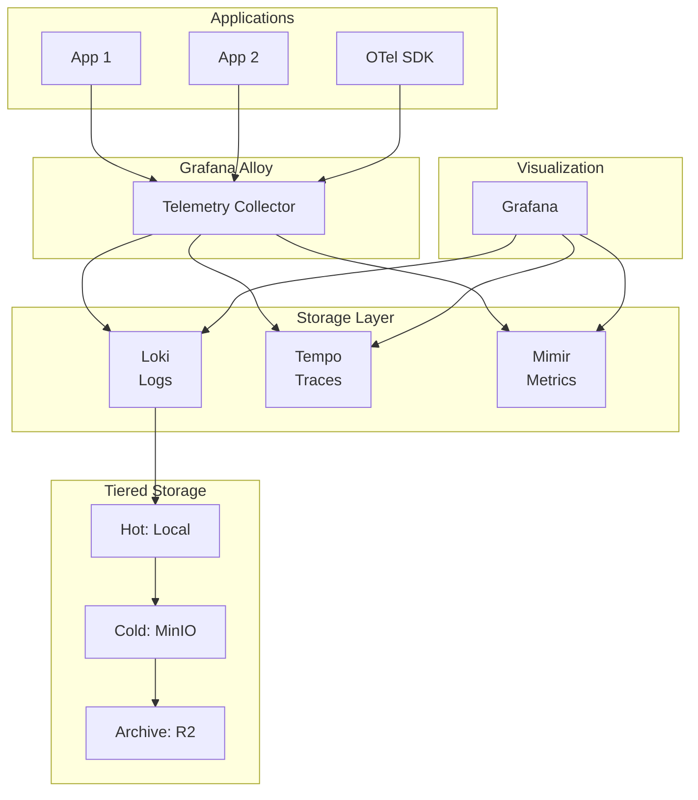
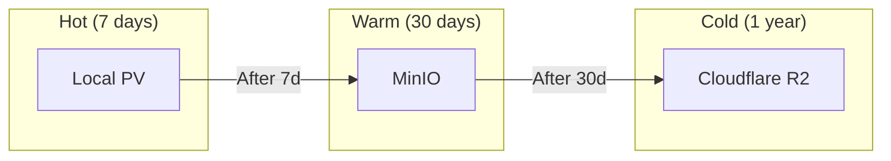
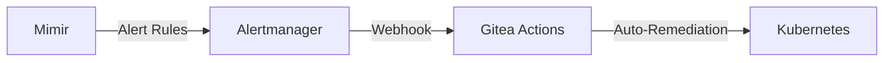

# Grafana Stack

LGTM observability stack for OpenOva platform.

**Status:** Accepted | **Updated:** 2026-01-17

---

## Overview

The Grafana Stack provides unified observability with:
- **Loki** - Log aggregation
- **Grafana** - Visualization
- **Tempo** - Distributed tracing
- **Mimir** - Metrics storage
- **Alloy** - Telemetry collection

---

## Architecture



---

## Components

| Component | Purpose | Memory |
|-----------|---------|--------|
| Grafana Alloy | Telemetry collection (OTLP, Prometheus) | 256MB |
| Loki | Log aggregation | 512MB |
| Tempo | Distributed tracing | 256MB |
| Mimir | Metrics storage | 512MB |
| Grafana | Visualization | 256MB |

---

## Tiered Storage



| Tier | Duration | Storage |
|------|----------|---------|
| Hot | 0-7 days | Local PV |
| Warm | 7-30 days | MinIO |
| Cold | 30d-1 year | Cloudflare R2 |

---

## Configuration

### Alloy Collector

```yaml
apiVersion: v1
kind: ConfigMap
metadata:
  name: alloy-config
  namespace: monitoring
data:
  config.alloy: |
    otelcol.receiver.otlp "default" {
      grpc { endpoint = "0.0.0.0:4317" }
      http { endpoint = "0.0.0.0:4318" }
    }

    otelcol.exporter.loki "default" {
      forward_to = [loki.write.default.receiver]
    }

    otelcol.exporter.otlp "tempo" {
      client { endpoint = "tempo.monitoring.svc:4317" }
    }

    prometheus.scrape "pods" {
      targets = discovery.kubernetes.pods.targets
      forward_to = [prometheus.remote_write.mimir.receiver]
    }
```

### Loki with S3 Backend

```yaml
loki:
  schemaConfig:
    configs:
      - from: 2024-01-01
        store: tsdb
        object_store: s3
        schema: v13

  storage:
    type: s3
    s3:
      endpoint: minio.storage.svc:9000
      bucketnames: loki-data
      access_key_id: ${MINIO_ACCESS_KEY}
      secret_access_key: ${MINIO_SECRET_KEY}
```

---

## OpenTelemetry Integration

Applications send telemetry via OTLP:

```yaml
# OTel auto-instrumentation
apiVersion: opentelemetry.io/v1alpha1
kind: Instrumentation
metadata:
  name: default
  namespace: <tenant>
spec:
  exporter:
    endpoint: http://alloy.monitoring.svc:4317
  propagators:
    - tracecontext
    - baggage
```

---

## Dashboards

| Dashboard | Purpose |
|-----------|---------|
| Platform Overview | Request rates, latencies, errors |
| Cilium Network | Traffic flows, policy drops |
| Flux GitOps | Reconciliation status |
| CNPG Postgres | Database performance |
| AI Hub Overview | LLM inference metrics |
| GPU Metrics | Utilization, memory, temperature |

---

## Alerting

Alerts flow through Alertmanager to Gitea Actions:



---

*Part of [OpenOva](https://openova.io)*
