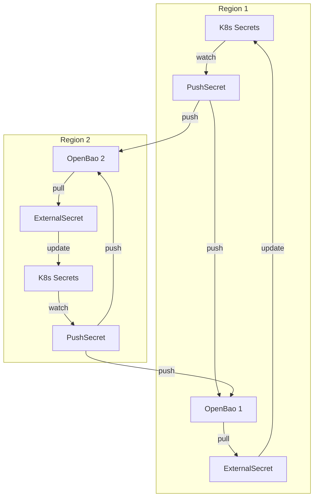

# OpenBao

Secrets management backend for OpenOva platform. API-compatible fork of HashiCorp Vault with MPL 2.0 license.

**Status:** Accepted | **Updated:** 2026-02-09

---

## Overview

OpenBao is a Linux Foundation project forked from HashiCorp Vault after HashiCorp changed Vault's license from MPL 2.0 to the Business Source License (BSL 1.1). OpenBao retains the MPL 2.0 license and provides API-compatible secrets management.

OpenBao provides centralized secrets management with:
- Secrets stored securely outside of Git
- Multi-region active-active deployments
- Integration with External Secrets Operator (ESO)
- Either region can update secrets
- Self-hosted per cluster

---

## Architecture

### Active-Active Bidirectional Sync

Both regions are identical and can independently update secrets. Updates propagate to both OpenBao instances automatically.



**Key Design:**
- **Active-Active**: Both regions can update secrets independently
- **Bidirectional Push**: Each region's PushSecret pushes to **both** OpenBao instances
- **Local Pull**: Each region's ExternalSecret pulls from its **local** OpenBao only
- **Last-Write-Wins**: Latest update overwrites all
- **Self-Stabilizing**: ESO skips updates when values are identical
- **No SOPS**: Secrets never stored in Git

---

## Deployment Options

| Option | Type | Notes |
|--------|------|-------|
| OpenBao Self-Hosted | Self-hosted | Full control, one per cluster |
| AWS Secrets Manager | Managed | If AWS chosen |
| GCP Secret Manager | Managed | If GCP chosen |
| Azure Key Vault | Managed | If Azure chosen |

**Recommended:** OpenBao Self-Hosted for full control

---

## Configuration

### OpenBao Deployment (Helm)

```yaml
server:
  ha:
    enabled: true
    replicas: 3
    raft:
      enabled: true
      config: |
        storage "raft" {
          path = "/openbao/data"
        }

  dataStorage:
    enabled: true
    size: 10Gi
    storageClass: <storage-class>

  ingress:
    enabled: true
    ingressClassName: cilium
    hosts:
      - host: bao.<domain>

injector:
  enabled: false  # Using ESO instead
```

### ClusterSecretStores

Each region needs two ClusterSecretStores - one for local OpenBao, one for remote OpenBao.

```yaml
# Local OpenBao (for ExternalSecret pulls)
apiVersion: external-secrets.io/v1beta1
kind: ClusterSecretStore
metadata:
  name: bao-local
spec:
  provider:
    vault:
      server: "https://bao.region1.<domain>"
      path: "secret"
      version: "v2"
      auth:
        kubernetes:
          mountPath: "kubernetes"
          role: "external-secrets"
---
# Remote OpenBao (for PushSecret)
apiVersion: external-secrets.io/v1beta1
kind: ClusterSecretStore
metadata:
  name: bao-remote
spec:
  provider:
    vault:
      server: "https://bao.region2.<domain>"
      path: "secret"
      version: "v2"
      auth:
        tokenSecretRef:
          name: bao-remote-token
          namespace: external-secrets
          key: token
```

> **Note:** The ESO provider type remains `vault` as OpenBao is API-compatible and ESO uses the same provider configuration.

### PushSecret (Bidirectional)

Pushes to **both** local and remote OpenBao instances simultaneously.

```yaml
apiVersion: external-secrets.io/v1alpha1
kind: PushSecret
metadata:
  name: push-db-credentials
  namespace: databases
spec:
  refreshInterval: 1h
  secretStoreRefs:
    - name: bao-local
      kind: ClusterSecretStore
    - name: bao-remote
      kind: ClusterSecretStore
  selector:
    secret:
      name: db-credentials
  data:
    - match:
        secretKey: password
        remoteRef:
          remoteKey: databases/db-credentials
          property: password
```

### ExternalSecret (Local Pull)

Each region pulls from its **local** OpenBao only.

```yaml
apiVersion: external-secrets.io/v1beta1
kind: ExternalSecret
metadata:
  name: db-credentials
  namespace: databases
spec:
  refreshInterval: 1h
  secretStoreRef:
    name: bao-local
    kind: ClusterSecretStore
  target:
    name: db-credentials
    creationPolicy: Owner
  data:
    - secretKey: password
      remoteRef:
        key: databases/db-credentials
        property: password
```

---

## Bootstrap Procedure

1. Bootstrap wizard deploys OpenBao to both regions
2. OpenBao initialized with Kubernetes auth in each region
3. Operator saves unseal keys securely offline (per region)
4. Cross-region auth tokens created for remote OpenBao access
5. ESO configured with both local and remote ClusterSecretStores
6. Initial secrets created via K8s + PushSecrets

**No SOPS:** Credentials entered interactively during bootstrap, never stored in Git.

---

*Part of [OpenOva](https://openova.io)*
