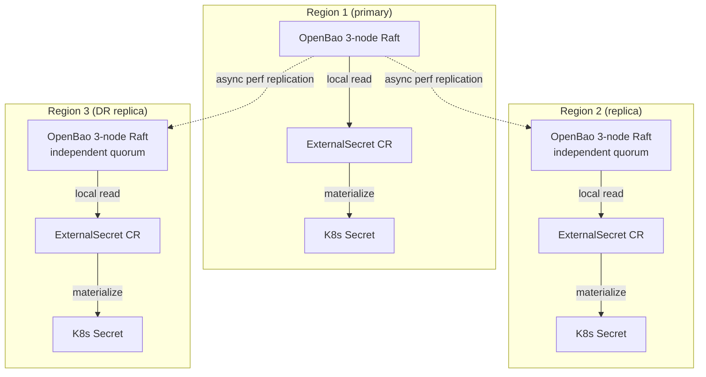

# OpenBao

Secrets management backend for Catalyst. Apache 2.0 / MPL 2.0 fork of HashiCorp Vault, drop-in API-compatible.

**Status:** Accepted | **Updated:** 2026-04-27

> **Catalyst role:** Per-Sovereign supporting service in the Catalyst control plane (see [`docs/PLATFORM-TECH-STACK.md`](../../docs/PLATFORM-TECH-STACK.md) §2.3). For multi-region semantics and rotation policy, [`docs/SECURITY.md`](../../docs/SECURITY.md) is canonical.

---

## Overview

OpenBao is a Linux Foundation project forked from HashiCorp Vault after HashiCorp changed Vault's license from MPL 2.0 to the Business Source License (BSL 1.1). OpenBao retains the open license and provides API-compatible secrets management.

OpenBao provides centralized secrets management with:
- Secrets stored securely outside of Git (Git holds only `ExternalSecret` references).
- **Independent Raft cluster per region** (no stretched cluster).
- Asynchronous Performance Replication from primary region to standbys.
- Integration with External Secrets Operator (ESO).
- Workload authentication via SPIFFE SVID — short-lived, auto-rotating.

---

## Architecture: independent Raft per region (NOT a stretched cluster)

Each region runs its **own** 3-node Raft cluster. Quorum is **intra-region only** — region failures are independent failure domains. Cross-region replication is asynchronous Performance Replication from primary → secondaries.


```mermaid
flowchart TB
    subgraph Region1["Region 1 (primary)"]
        V1[OpenBao 3-node Raft]
        ES1[ExternalSecret CR]
        KS1[K8s Secret]
    end

    subgraph Region2["Region 2 (replica)"]
        V2[OpenBao 3-node Raft<br>independent quorum]
        ES2[ExternalSecret CR]
        KS2[K8s Secret]
    end

    subgraph Region3["Region 3 (DR replica)"]
        V3[OpenBao 3-node Raft<br>independent quorum]
        ES3[ExternalSecret CR]
        KS3[K8s Secret]
    end

    V1 -.->|"async perf replication"| V2
    V1 -.->|"async perf replication"| V3
    V1 -->|"local read"| ES1
    V2 -->|"local read"| ES2
    V3 -->|"local read"| ES3
    ES1 -->|"materialize"| KS1
    ES2 -->|"materialize"| KS2
    ES3 -->|"materialize"| KS3
```

**Key design** (canonical in [`docs/SECURITY.md`](../../docs/SECURITY.md) §5):
- **Independent Raft per region.** No cross-region quorum. A whole-region failure does NOT block any other region.
- **Single-primary writes.** Rotations and new-secret writes go to the primary OpenBao only.
- **Async perf replication.** Lag <1s typical; replicas serve reads at sub-10ms latency.
- **Explicit DR promotion.** Either `sovereign-admin`-approved or automated via failover-controller (with strict criteria — not on every blip).
- **Apps read locally.** Each region's ExternalSecret pulls from its local OpenBao replica.
- **No SOPS.** Plaintext never in Git.

> The earlier active-active bidirectional design was rejected as a stretched cluster — it would have made one region's network blip take down all writes. This file's architecture matches the agreed independent-Raft model.

---

## Deployment Options

| Option | Type | Notes |
|--------|------|-------|
| OpenBao Self-Hosted | Self-hosted | Full control, one per cluster |
| AWS Secrets Manager | Managed | If AWS chosen |
| GCP Secret Manager | Managed | If GCP chosen |
| Azure Key Vault | Managed | If Azure chosen |

**Recommended:** OpenBao Self-Hosted for full control

---

## Configuration

### OpenBao Deployment (Helm)

```yaml
server:
  ha:
    enabled: true
    replicas: 3
    raft:
      enabled: true
      config: |
        storage "raft" {
          path = "/openbao/data"
        }

  dataStorage:
    enabled: true
    size: 10Gi
    storageClass: <storage-class>

  ingress:
    enabled: true
    ingressClassName: cilium
    hosts:
      - host: bao.<domain>

injector:
  enabled: false  # Using ESO instead
```

### ClusterSecretStore (local read)

Each region defines ONE ClusterSecretStore pointing at its local OpenBao replica. Apps in any region read from their local replica only — replication delivers post-write values within seconds.

```yaml
apiVersion: external-secrets.io/v1beta1
kind: ClusterSecretStore
metadata:
  name: bao-local
spec:
  provider:
    vault:                                # ESO provider type stays `vault` —
                                          # OpenBao is wire-compatible.
      server: "https://bao.<location-code>.<sovereign-domain>"
      path: "secret"
      version: "v2"
      auth:
        kubernetes:
          mountPath: "kubernetes"
          role: "external-secrets"
```

> **Note:** The ESO provider type remains `vault` because OpenBao is API-compatible and ESO uses the same provider configuration.

### Writes go to the primary region

Secret rotations, new-secret creates, and policy updates target the **primary** OpenBao only. Replicas refuse writes (Performance Replication is one-way: primary → standby). The ESO `PushSecret` is configured to point at the primary's ClusterSecretStore explicitly:

```yaml
apiVersion: external-secrets.io/v1alpha1
kind: PushSecret
metadata:
  name: push-db-credentials
  namespace: databases
spec:
  refreshInterval: 1h
  secretStoreRefs:
    - name: bao-primary                   # writes target the primary region only
      kind: ClusterSecretStore
  selector:
    secret:
      name: db-credentials
  data:
    - match:
        secretKey: password
        remoteRef:
          remoteKey: databases/db-credentials
          property: password
```

### ExternalSecret (local read in every region)

Reads always pull from the local OpenBao replica.

```yaml
apiVersion: external-secrets.io/v1beta1
kind: ExternalSecret
metadata:
  name: db-credentials
  namespace: databases
spec:
  refreshInterval: 1h
  secretStoreRef:
    name: bao-local
    kind: ClusterSecretStore
  target:
    name: db-credentials
    creationPolicy: Owner
  data:
    - secretKey: password
      remoteRef:
        key: databases/db-credentials
        property: password
```

### DR promotion

If the primary region fails, a replica is explicitly promoted (sovereign-admin approval or failover-controller automation). New writes are blocked briefly during promotion (~30s), then the new primary accepts writes. See [`docs/SECURITY.md`](../../docs/SECURITY.md) §5.2.

---

## Bootstrap Procedure

1. Catalyst bootstrap (Phase 0 of Sovereign provisioning) deploys OpenBao as **independent Raft cluster per region** (no stretched cluster — see [`docs/SECURITY.md`](../../docs/SECURITY.md) §5).
2. OpenBao initialized with Kubernetes auth in each region.
3. The first sovereign-admin saves unseal keys securely offline (per region).
4. Cross-region async perf replication is configured for read availability and DR.
5. ESO configured with local-region ClusterSecretStores; cross-region reads via the same workload SVID.
6. Initial secrets created via K8s + PushSecrets, never plaintext in Git.

**No SOPS:** Credentials entered interactively during bootstrap, never stored in Git. See [`docs/SECURITY.md`](../../docs/SECURITY.md).

---

*Part of [OpenOva](https://openova.io)*
