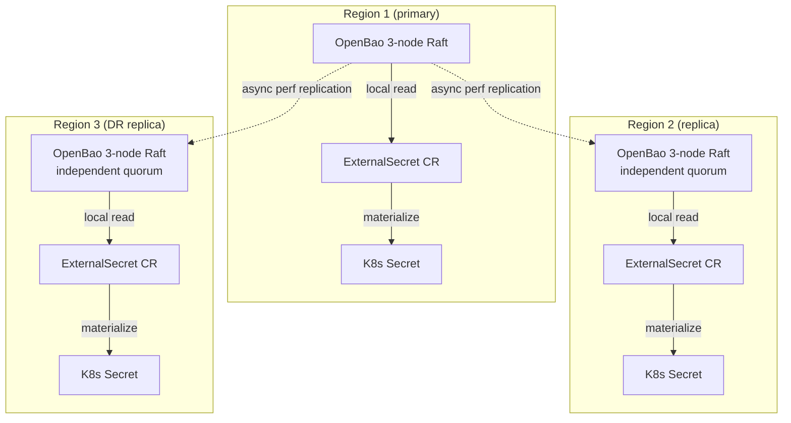

# OpenBao

Secrets management backend for Catalyst. Apache 2.0 / MPL 2.0 fork of HashiCorp Vault, drop-in API-compatible.

**Status:** Accepted | **Updated:** 2026-04-27

> **Catalyst role:** Per-Sovereign supporting service in the Catalyst control plane (see [`docs/ARCHITECTURE.md`](../../docs/ARCHITECTURE.md) §2.3). For multi-region semantics and rotation policy, [`docs/SECURITY.md`](../../docs/SECURITY.md) is canonical.

---

## Overview

OpenBao is a Linux Foundation project forked from HashiCorp Vault after HashiCorp changed Vault's license from MPL 2.0 to the Business Source License (BSL 1.1). OpenBao retains the open license and provides API-compatible secrets management.

OpenBao provides centralized secrets management with:
- Secrets stored securely outside of Git (Git holds only `ExternalSecret` references).
- **Independent Raft cluster per region** (no stretched cluster).
- Asynchronous Performance Replication from primary region to standbys.
- Integration with External Secrets Operator (ESO).
- Workload authentication via SPIFFE SVID — short-lived, auto-rotating.

---

## Architecture: independent Raft per region (NOT a stretched cluster)

Each region runs its **own** 3-node Raft cluster. Quorum is **intra-region only** — region failures are independent failure domains. Cross-region replication is asynchronous Performance Replication from primary → secondaries.


```mermaid
flowchart TB
    subgraph Region1["Region 1 (primary)"]
        V1[OpenBao 3-node Raft]
        ES1[ExternalSecret CR]
        KS1[K8s Secret]
    end

    subgraph Region2["Region 2 (replica)"]
        V2[OpenBao 3-node Raft<br>independent quorum]
        ES2[ExternalSecret CR]
        KS2[K8s Secret]
    end

    subgraph Region3["Region 3 (DR replica)"]
        V3[OpenBao 3-node Raft<br>independent quorum]
        ES3[ExternalSecret CR]
        KS3[K8s Secret]
    end

    V1 -.->|"async perf replication"| V2
    V1 -.->|"async perf replication"| V3
    V1 -->|"local read"| ES1
    V2 -->|"local read"| ES2
    V3 -->|"local read"| ES3
    ES1 -->|"materialize"| KS1
    ES2 -->|"materialize"| KS2
    ES3 -->|"materialize"| KS3
```

**Key design** (canonical in [`docs/SECURITY.md`](../../docs/SECURITY.md) §5):
- **Independent Raft per region.** No cross-region quorum. A whole-region failure does NOT block any other region.
- **Single-primary writes.** Rotations and new-secret writes go to the primary OpenBao only.
- **Async perf replication.** Lag <1s typical; replicas serve reads at sub-10ms latency.
- **Explicit DR promotion.** Either `sovereign-admin`-approved or automated via failover-controller (with strict criteria — not on every blip).
- **Apps read locally.** Each region's ExternalSecret pulls from its local OpenBao replica.
- **No SOPS.** Plaintext never in Git.

> The earlier active-active bidirectional design was rejected as a stretched cluster — it would have made one region's network blip take down all writes. This file's architecture matches the agreed independent-Raft model.

---

## Deployment Options

| Option | Type | Notes |
|--------|------|-------|
| OpenBao Self-Hosted | Self-hosted | Full control, one per cluster |
| AWS Secrets Manager | Managed | If AWS chosen |
| GCP Secret Manager | Managed | If GCP chosen |
| Azure Key Vault | Managed | If Azure chosen |

**Recommended:** OpenBao Self-Hosted for full control

---

## Configuration

### OpenBao Deployment (Helm)

```yaml
server:
  ha:
    enabled: true
    replicas: 3
    raft:
      enabled: true
      config: |
        storage "raft" {
          path = "/openbao/data"
        }

  dataStorage:
    enabled: true
    size: 10Gi
    storageClass: <storage-class>

  ingress:
    enabled: true
    ingressClassName: cilium
    hosts:
      - host: bao.<location-code>.<sovereign-domain>

injector:
  enabled: false  # Using ESO instead
```

### ClusterSecretStore (local read)

Each region defines ONE ClusterSecretStore pointing at its local OpenBao replica. Apps in any region read from their local replica only — replication delivers post-write values within seconds.

```yaml
apiVersion: external-secrets.io/v1beta1
kind: ClusterSecretStore
metadata:
  name: bao-local
spec:
  provider:
    vault:                                # ESO provider type stays `vault` —
                                          # OpenBao is wire-compatible.
      server: "https://bao.<location-code>.<sovereign-domain>"
      path: "secret"
      version: "v2"
      auth:
        kubernetes:
          mountPath: "kubernetes"
          role: "external-secrets"
```

> **Note:** The ESO provider type remains `vault` because OpenBao is API-compatible and ESO uses the same provider configuration.

### Writes go to the primary region

Secret rotations, new-secret creates, and policy updates target the **primary** OpenBao only. Replicas refuse writes (Performance Replication is one-way: primary → standby). The ESO `PushSecret` is configured to point at the primary's ClusterSecretStore explicitly:

```yaml
apiVersion: external-secrets.io/v1alpha1
kind: PushSecret
metadata:
  name: push-db-credentials
  namespace: databases
spec:
  refreshInterval: 1h
  secretStoreRefs:
    - name: bao-primary                   # writes target the primary region only
      kind: ClusterSecretStore
  selector:
    secret:
      name: db-credentials
  data:
    - match:
        secretKey: password
        remoteRef:
          remoteKey: databases/db-credentials
          property: password
```

### ExternalSecret (local read in every region)

Reads always pull from the local OpenBao replica.

```yaml
apiVersion: external-secrets.io/v1beta1
kind: ExternalSecret
metadata:
  name: db-credentials
  namespace: databases
spec:
  refreshInterval: 1h
  secretStoreRef:
    name: bao-local
    kind: ClusterSecretStore
  target:
    name: db-credentials
    creationPolicy: Owner
  data:
    - secretKey: password
      remoteRef:
        key: databases/db-credentials
        property: password
```

### DR promotion

If the primary region fails, a replica is explicitly promoted (sovereign-admin approval or failover-controller automation). New writes are blocked briefly during promotion (~30s), then the new primary accepts writes. See [`docs/SECURITY.md`](../../docs/SECURITY.md) §5.2.

---

## Bootstrap Procedure

1. Catalyst bootstrap (Phase 0 of Sovereign provisioning) deploys OpenBao as **independent Raft cluster per region** (no stretched cluster — see [`docs/SECURITY.md`](../../docs/SECURITY.md) §5).
2. **Auto-unseal flow (issue #316, chart v1.2.0+):** Cloud-init on the control-plane node generates a 32-byte recovery seed, writes it to a single-use K8s Secret `openbao-recovery-seed` in the `openbao` namespace. The bp-openbao Helm chart's post-install init Job (hook weight 5) consumes the seed, calls `bao operator init -recovery-shares=1 -recovery-threshold=1`, persists the recovery key inside OpenBao's auto-unseal config, and deletes the seed Secret on success. The recovery key + root token live ONLY inside OpenBao's Raft state — never in a K8s Secret. Subsequent pod restarts unseal automatically without sovereign-admin intervention. Set `autoUnseal.enabled=true` (default off; cluster overlay flips it on per-Sovereign).
3. **Kubernetes auth bootstrap (issue #316):** A second post-install Job (hook weight 10) enables the Kubernetes auth method, mounts kv-v2 at `secret/`, writes the `external-secrets-read` policy, and binds the `external-secrets` role to the ESO ServiceAccount in `external-secrets-system`. ESO's ClusterSecretStore `vault-region1` (platform/external-secrets) authenticates via this role on every secret read. Configure under `autoUnseal.kubernetesAuth.*`.
4. Cross-region async perf replication is configured for read availability and DR.
5. ESO configured with local-region ClusterSecretStores; cross-region reads via the same workload SVID.
6. Initial secrets created via K8s + PushSecrets, never plaintext in Git.

**No SOPS:** Credentials entered interactively during bootstrap, never stored in Git. See [`docs/SECURITY.md`](../../docs/SECURITY.md).

### Auto-unseal alternatives (out of scope for solo Sovereign)

| Option | When applicable |
|--------|-----------------|
| **A. Shamir + cloud-init seed** | **Default for solo Sovereign — implemented in chart v1.2.0.** No managed-KMS dependency; the recovery key is generated on the control-plane at provision time and persisted only inside OpenBao's own Raft state. |
| B. Transit-seal via peer OpenBao | Multi-region tier-1 corporate cluster (one Sovereign unseals another). Out of scope for omantel/single-region. |
| C. Cloud-KMS auto-unseal (AWS KMS, GCP KMS, Azure Key Vault) | When the Sovereign runs on a hyperscaler that provides managed-KMS. Hetzner has no managed-KMS — Option A is the only viable path on Hetzner. |
| D. Sovereign-admin-supplied recovery shards (air-gap) | Documented in [`docs/SECURITY.md`](../../docs/SECURITY.md). Used when no automated boot-time secret pipeline is acceptable. |

---

## Bootstrap KV-seed (#3888, Refs #3847)

### Why it exists

The founder mandate is *"keep every item possible in Flux"* — thin the control-plane
cloud-init. [#3890](https://github.com/openova-io/openova/issues/3890) evicted
`powerdns-api-credentials` from cloud-init into a Flux-reconciled Secret, but ~5
other inline Secrets STAYED because they are consumed by HelmReleases that
reconcile **at or before** the `openbao(08) → ESO(15) → ClusterSecretStore(15a)`
pipeline becomes functional, **and there was no way to land a per-deployment cred
into openbao KV at provision time** — the `auth-bootstrap` Job revokes the init
root token at the end of slot-08 install, after which no token can write to
`secret/*`. So an `ExternalSecret` had nothing to read FROM.

### The mechanism

`autoUnseal.bootstrapSeed` (default **OFF**) closes that gap. When enabled AND the
control-plane cloud-init writes a one-shot Secret (`openbao-bootstrap-seed`) into
the `openbao` namespace, the `auth-bootstrap` Job — which still holds the **valid
root token** — reads every `data` key from that Secret and writes it into KV at
`<kvMountPath>/<kvPrefix>/<key>` **BEFORE** revoking the root token. An
`ExternalSecret` referencing the `vault-region1` ClusterSecretStore can then
materialise the cred in any consumer namespace. The seed Secret is **single-use**:
its keys are deleted from K8s after a successful KV write so no plaintext cred
lingers in etcd (same posture as `openbao-recovery-seed`). Writes are idempotent
(`bao kv put` overwrites), so Job retries + chart upgrades are safe. Default-OFF
plus an `optional: true` seed mount means the prod-posture render is behaviourally
byte-identical to the pre-#3888 chart (only 3 inert env vars + an env-gated script
block are added). See `autoUnseal.bootstrapSeed.*` in `chart/values.yaml`.

**Seed Secret shape:** each `data` key is a KV path with `__` standing in for `/`
(k8s Secret keys cannot contain `/`); the value body is `field=value` lines. e.g.
a key `harbor-robot__token` with body `token=<robot-token>` lands at
`secret/bootstrap/harbor-robot` field `token`, readable by an ExternalSecret
`remoteRef.key: bootstrap/harbor-robot`, `property: token`.

### Eviction status of the #3890 STAY secrets

**#3888 ships the mechanism but evicts NO secret** — each of the 5 STAY secrets
still has an ordering or cycle blocker that cannot be closed without a change that
itself requires a fresh-prov walk to validate (out of #3888's no-prov scope). The
next eviction becomes a pure data change (one cloud-init `__`-key + one
ExternalSecret CR) once its blocker is cleared:

| Secret | Earliest consumer | Mechanism | Blocker (why not yet evictable) |
|--------|-------------------|-----------|---------------------------------|
| `object-storage` | openbao **slot 08** (its own HR), keycloak 09, gitea 10 | Flux `valuesFrom` | **Hard cycle** — openbao consumes it before openbao/ESO exist. Unbreakable via ESO. |
| `cloud-credentials` | cluster-autoscaler 50, hcloud-ccm 55, Crossplane | Flux `valuesFrom` | Not a flat cred — carries live IaC data (`hcloud-cloud-init: base64(worker-cloud-init)`, network/firewall/ssh-key names). Recomputed per-apply by Terraform; cannot be a static KV value. |
| `harbor-robot-token` | catalyst-api **slot 13** | Pod `secretKeyRef` (**required**) | Hard-required at Pod start (issue #557 `Validate()`), slot 13 < 15a, NOT in catalyst-api's reloader watch list → a late ESO delivery wedges the Pod (`CreateContainerConfigError`). Needs reloader wiring + a prov to prove. |
| `pdm-basicauth` | catalyst-api slot 13 | Pod `secretKeyRef` (optional) | Optional at start but NOT in the reloader watch list → late arrival is never picked up. Needs a reloader-annotation change to the bp-catalyst-platform umbrella + a prov. |
| `handover-jwt-public` | catalyst-api slot 13 | optional volume mount | Reloader annotation lists volume-name `handover-jwt-public`, but the actual Secret is `catalyst-handover-jwt-public` — the names mismatch, so a late ESO delivery does NOT roll the Pod. Needs the reloader name corrected in the umbrella chart + a prov. |

`ghcr-pull` + `openbao-recovery-seed` are genuine bootstrap chicken-and-egg
(the image-pull cred + the openbao recovery seed itself) and are **never**
evictable to ESO.

---

*Part of [OpenOva](https://openova.io)*
