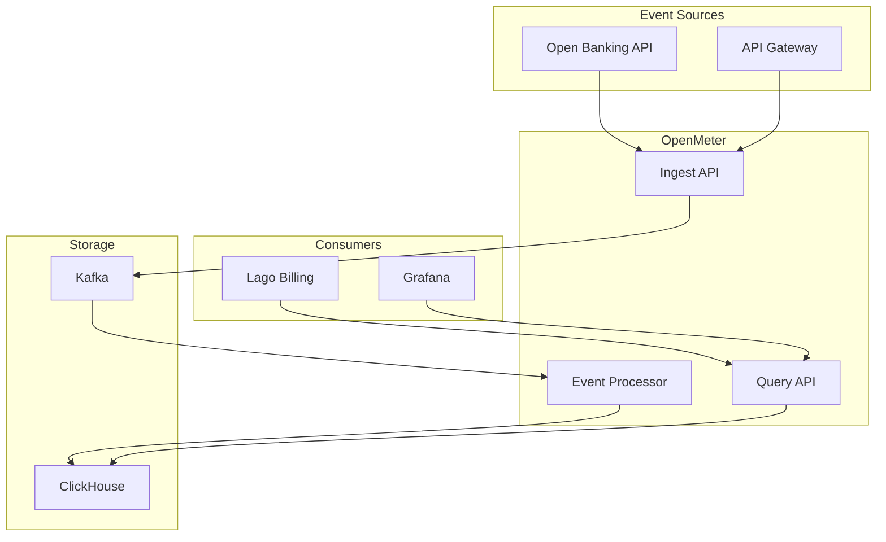
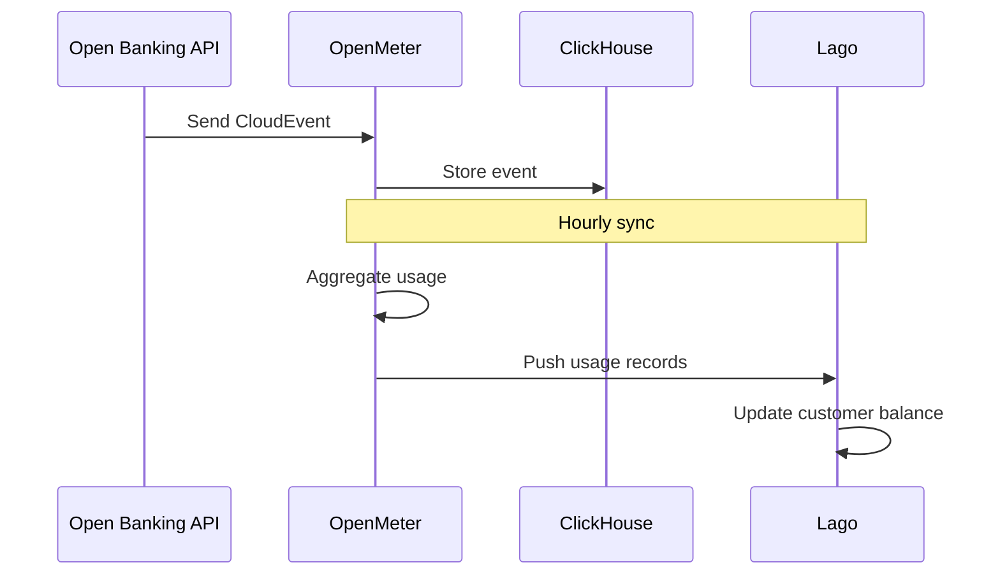
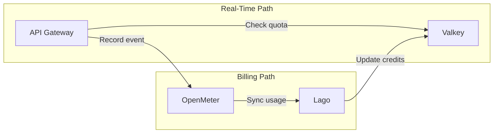

# OpenMeter

Usage metering for OpenOva Open Banking blueprint.

**Status:** Accepted | **Updated:** 2026-01-17

---

## Overview

OpenMeter provides real-time usage metering:
- CloudEvents-based ingestion
- ClickHouse backend for analytics
- Integration with Lago for billing
- Real-time usage dashboards

---

## Architecture



---

## Event Format (CloudEvents)

```json
{
  "specversion": "1.0",
  "type": "api.call",
  "source": "open-banking-api",
  "id": "uuid-here",
  "time": "2024-01-15T10:30:00Z",
  "subject": "tpp-12345",
  "data": {
    "endpoint": "/accounts",
    "method": "GET",
    "status_code": 200,
    "response_time_ms": 45
  }
}
```

---

## Configuration

### OpenMeter Deployment

```yaml
apiVersion: apps/v1
kind: Deployment
metadata:
  name: openmeter
  namespace: open-banking
spec:
  template:
    spec:
      containers:
        - name: openmeter
          image: openmeter/openmeter:v1.0.0
          env:
            - name: OPENMETER_KAFKA_BROKER
              value: kafka-kafka-bootstrap.databases.svc:9092
            - name: OPENMETER_CLICKHOUSE_ADDRESS
              value: clickhouse.databases.svc:9000
            - name: OPENMETER_POSTGRES_URL
              valueFrom:
                secretKeyRef:
                  name: openmeter-db-credentials
                  key: url
```

### Meter Definition

```yaml
meters:
  - slug: api_calls
    description: API call count per TPP
    eventType: api.call
    aggregation: COUNT
    groupBy:
      subject: true
      endpoint: $.data.endpoint
      method: $.data.method

  - slug: api_latency
    description: API latency percentiles
    eventType: api.call
    valueProperty: $.data.response_time_ms
    aggregation: SUM
    groupBy:
      subject: true
      endpoint: $.data.endpoint
```

---

## Integration with Lago

OpenMeter syncs usage to Lago for billing:



### Sync Configuration

```yaml
apiVersion: v1
kind: ConfigMap
metadata:
  name: openmeter-lago-sync
  namespace: open-banking
data:
  config.yaml: |
    lago:
      url: http://lago.open-banking.svc:3000
      api_key_secret: lago-api-key
      sync_interval: 1h
    meters:
      - slug: api_calls
        lago_billable_metric_code: api_calls
```

---

## Quota Checking (Real-Time)

For prepaid credits, Valkey provides real-time quota checks:



---

## Monitoring

| Metric | Description |
|--------|-------------|
| `openmeter_events_ingested_total` | Total events ingested |
| `openmeter_events_processed_total` | Events processed |
| `openmeter_query_latency_seconds` | Query latency |

---

*Part of [OpenOva](https://openova.io)*
