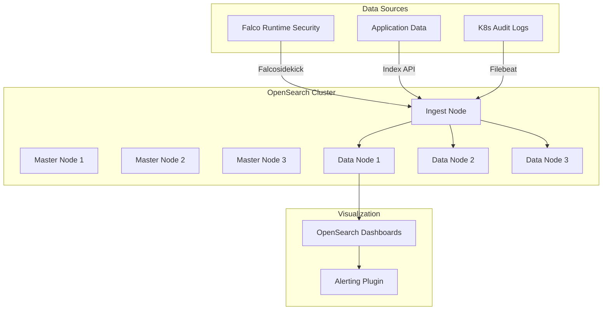
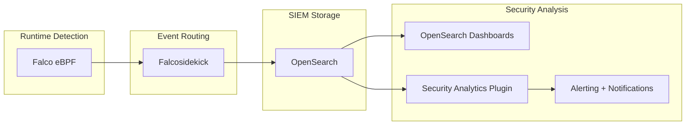

# OpenSearch

Search engine, analytics, and SIEM platform.

**Status:** Accepted | **Updated:** 2026-02-09

---

## Overview

OpenSearch is an open-source search and analytics engine forked from Elasticsearch 7.10.2 after Elastic changed its license from Apache 2.0 to the Business Source License (BSL). Licensed under the Apache License 2.0, OpenSearch is maintained by AWS and a growing community, providing full-text search, log analytics, and security analytics (SIEM) capabilities without licensing restrictions.

In the OpenOva platform, OpenSearch serves two distinct roles. First, it provides full-text search capabilities for applications that need search-as-a-service (product search, document indexing, autocomplete). Second, and critically, it serves as the SIEM backend for runtime security events collected by Falco. OpenSearch Dashboards provides the visualization and alerting layer for both use cases.

OpenSearch is NOT a replacement for Loki in the OpenOva observability stack. Loki handles operational log aggregation from all platform components with label-based indexing optimized for cost-efficient storage. OpenSearch handles application-level search and security event correlation (SIEM) where full-text indexing and complex query capabilities are required.

---

## Architecture

### Search and SIEM



### SIEM Pipeline



---

## Why OpenSearch?

| Factor | OpenSearch | Elasticsearch | Loki |
|--------|-----------|---------------|------|
| License | Apache 2.0 | BSL (proprietary) | AGPL 3.0 |
| Full-text search | Yes | Yes | No (label-based) |
| SIEM capabilities | Security Analytics plugin | X-Pack (paid) | No |
| Application search | Yes | Yes | No |
| Log aggregation | Possible but expensive | Possible but expensive | Optimized for this |
| Storage cost | Index-heavy | Index-heavy | Label-only (cheaper) |
| Dashboards | OpenSearch Dashboards | Kibana (BSL) | Grafana |
| API compatibility | ES 7.10 compatible | Native | LogQL |

**Decision:** Use OpenSearch for full-text application search and SIEM. Use Loki for operational log aggregation. They serve complementary purposes.

---

## Key Features

| Feature | Description |
|---------|-------------|
| Full-Text Search | BM25 scoring, analyzers, fuzzy matching, autocomplete |
| Security Analytics | SIEM plugin with detection rules, correlation, and threat intelligence |
| Index State Management | Automated index lifecycle (hot/warm/cold/delete) |
| Anomaly Detection | ML-based anomaly detection on time-series data |
| Alerting | Rule-based and anomaly-based alerting with webhook/email notifications |
| Snapshot/Restore | Automated backups to MinIO/S3 |
| Cross-Cluster Search | Query across multiple OpenSearch clusters |
| Security Plugin | Fine-grained RBAC, field-level and document-level security |
| OpenSearch Dashboards | Visualization, dashboards, and notebook interface |
| Ingest Pipelines | Transform and enrich data during ingestion |

---

## Configuration

### OpenSearch Cluster (Helm)

```yaml
apiVersion: helm.toolkit.fluxcd.io/v2beta1
kind: HelmRelease
metadata:
  name: opensearch
  namespace: search
spec:
  interval: 10m
  chart:
    spec:
      chart: opensearch
      version: "2.x"
      sourceRef:
        kind: HelmRepository
        name: opensearch
        namespace: flux-system
  values:
    clusterName: opensearch
    masterService: opensearch
    nodeGroup: master

    replicas: 3
    minimumMasterNodes: 2

    roles:
      - master
      - ingest
      - data

    resources:
      requests:
        cpu: 1
        memory: 4Gi
      limits:
        cpu: 4
        memory: 8Gi

    persistence:
      enabled: true
      storageClass: <storage-class>
      size: 200Gi

    config:
      opensearch.yml: |
        cluster.name: opensearch
        network.host: 0.0.0.0
        plugins.security.ssl.transport.pemcert_filepath: certs/tls.crt
        plugins.security.ssl.transport.pemkey_filepath: certs/tls.key
        plugins.security.ssl.transport.pemtrustedcas_filepath: certs/ca.crt
        plugins.security.ssl.http.enabled: true
        plugins.security.ssl.http.pemcert_filepath: certs/tls.crt
        plugins.security.ssl.http.pemkey_filepath: certs/tls.key
        plugins.security.ssl.http.pemtrustedcas_filepath: certs/ca.crt

    extraEnvs:
      - name: OPENSEARCH_INITIAL_ADMIN_PASSWORD
        valueFrom:
          secretKeyRef:
            name: opensearch-credentials
            key: admin-password
```

### OpenSearch Dashboards

```yaml
apiVersion: helm.toolkit.fluxcd.io/v2beta1
kind: HelmRelease
metadata:
  name: opensearch-dashboards
  namespace: search
spec:
  interval: 10m
  chart:
    spec:
      chart: opensearch-dashboards
      version: "2.x"
      sourceRef:
        kind: HelmRepository
        name: opensearch
        namespace: flux-system
  values:
    opensearchHosts: "https://opensearch.search.svc:9200"
    replicaCount: 2
    resources:
      requests:
        cpu: 250m
        memory: 512Mi
      limits:
        cpu: 1
        memory: 1Gi
```

### Index State Management (ISM) Policy

```json
{
  "policy": {
    "policy_id": "siem-lifecycle",
    "description": "SIEM index lifecycle: hot -> warm -> cold -> delete",
    "default_state": "hot",
    "states": [
      {
        "name": "hot",
        "actions": [],
        "transitions": [
          { "state_name": "warm", "conditions": { "min_index_age": "7d" } }
        ]
      },
      {
        "name": "warm",
        "actions": [
          { "read_only": {} },
          { "force_merge": { "max_num_segments": 1 } }
        ],
        "transitions": [
          { "state_name": "cold", "conditions": { "min_index_age": "30d" } }
        ]
      },
      {
        "name": "cold",
        "actions": [
          { "snapshot": { "repository": "minio-backups", "snapshot": "siem-{{ctx.index}}" } }
        ],
        "transitions": [
          { "state_name": "delete", "conditions": { "min_index_age": "90d" } }
        ]
      },
      {
        "name": "delete",
        "actions": [{ "delete": {} }]
      }
    ],
    "ism_template": [
      { "index_patterns": ["falco-*", "security-*"], "priority": 100 }
    ]
  }
}
```

---

## Falco Integration (SIEM)

Falco runtime security events are shipped to OpenSearch via Falcosidekick:

```yaml
# Falcosidekick output configuration
outputs:
  opensearch:
    hostPort: https://opensearch.search.svc:9200
    index: falco
    type: _doc
    minimumPriority: notice
    username: falco-writer
    password:
      secretKeyRef:
        name: opensearch-falco-credentials
        key: password
    createIndexTemplate: true
```

### SIEM Detection Rules

```json
{
  "name": "Container Escape Attempt",
  "enabled": true,
  "schedule": { "period": { "interval": 1, "unit": "MINUTES" } },
  "inputs": [
    {
      "search": {
        "indices": ["falco-*"],
        "query": {
          "bool": {
            "must": [
              { "match": { "rule": "Container Escape" } },
              { "range": { "time": { "gte": "now-5m" } } }
            ]
          }
        }
      }
    }
  ],
  "triggers": [
    {
      "name": "critical-security-alert",
      "severity": "1",
      "condition": { "script": { "source": "ctx.results[0].hits.total.value > 0" } },
      "actions": [
        {
          "name": "notify-security-team",
          "destination_id": "slack-security-channel",
          "message_template": {
            "source": "Container escape attempt detected. {{ctx.results[0].hits.total.value}} events in the last 5 minutes."
          }
        }
      ]
    }
  ]
}
```

---

## Monitoring

| Metric | Description |
|--------|-------------|
| `opensearch_cluster_health_status` | Cluster health (green/yellow/red) |
| `opensearch_cluster_health_number_of_nodes` | Node count |
| `opensearch_indices_indexing_index_total` | Total documents indexed |
| `opensearch_indices_search_query_total` | Total search queries |
| `opensearch_jvm_mem_heap_used_percent` | JVM heap usage |
| `opensearch_indices_store_size_bytes` | Total index storage size |

---

## Consequences

**Positive:**
- Apache 2.0 license with no proprietary feature gates
- Comprehensive SIEM capabilities when paired with Falco
- Full-text search for application use cases that Loki cannot serve
- Built-in security plugin with fine-grained access control
- Index lifecycle management automates data retention and archival

**Negative:**
- JVM-based, requires significant memory for indexing and search
- Full-text indexing is storage-intensive compared to label-based systems (Loki)
- Requires careful capacity planning for shard count and node sizing
- Two search/analytics systems to operate (OpenSearch + Loki) increases complexity
- Security plugin configuration can be complex for multi-tenant setups

---

*Part of [OpenOva](https://openova.io)*
