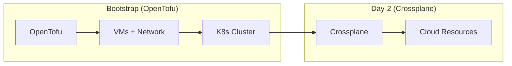
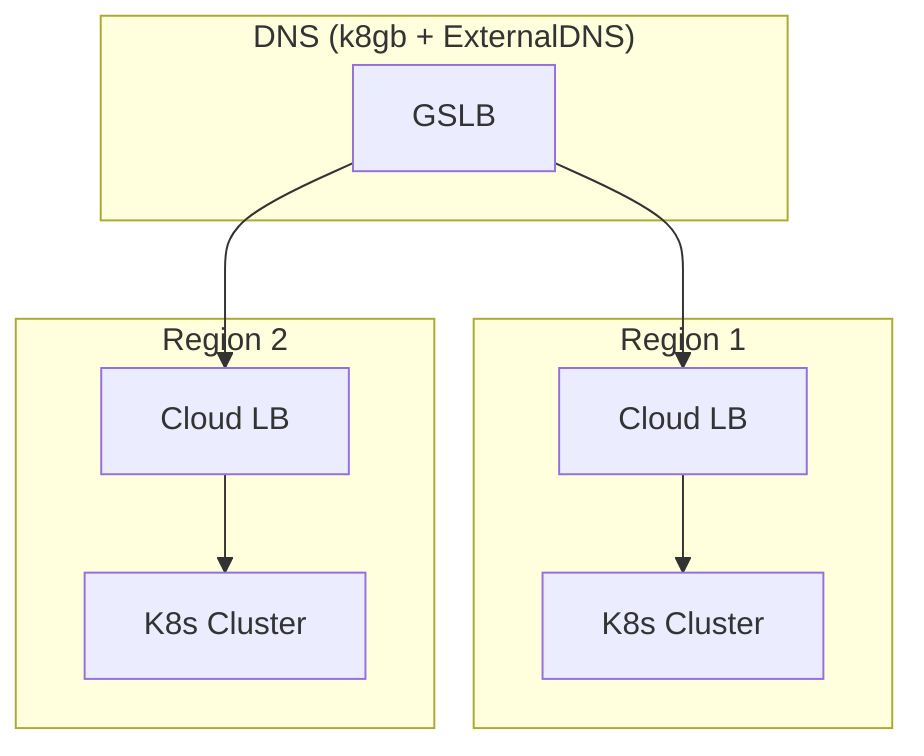

# OpenTofu

Infrastructure as Code for OpenOva Kubernetes platform (bootstrap only). Drop-in replacement for Terraform with MPL 2.0 license.

**Status:** Accepted | **Updated:** 2026-02-09

---

## Overview

OpenTofu is a Linux Foundation / CNCF fork of Terraform, created after HashiCorp changed Terraform's license from MPL 2.0 to the Business Source License (BSL 1.1). OpenTofu retains the MPL 2.0 license and is fully compatible with all Terraform providers and HCL syntax.

OpenTofu provisions the initial infrastructure for Kubernetes clusters. After bootstrap, **Crossplane** handles all day-2 cloud resource provisioning.



---

## Why OpenTofu

| Factor | Detail |
|--------|--------|
| License | MPL 2.0 (open source) |
| Compatibility | 100% compatible with Terraform providers and HCL |
| Governance | Linux Foundation / CNCF project |
| Migration | Drop-in replacement, no code changes required |
| Reason for switch | HashiCorp changed Terraform to BSL 1.1 |

---

## Supported Providers

OpenOva supports multiple cloud providers. Each provider has a corresponding Crossplane provider for day-2 operations.

| Provider | Crossplane Provider |
|----------|---------------------|
| Hetzner Cloud | provider-hcloud |
| Huawei Cloud | provider-huaweicloud |
| Oracle Cloud (OCI) | provider-oci |
| AWS | provider-aws |
| GCP | provider-gcp |
| Azure | provider-azure |

---

## Directory Structure

```
opentofu/
├── modules/
│   ├── <provider>-vm/    # Provider-specific VPS provisioning
│   ├── k3s-cluster/      # K3s installation
│   └── dns-failover/     # CoreDNS + k8gb
├── environments/
│   ├── <provider>-<region>/  # Per-environment configs
│   └── ...
└── README.md
```

---

## Quick Start

```bash
cd environments/<provider>-<region>

# Bootstrap wizard handles credentials interactively
# Creates tofu.tfvars (not committed to Git)

# Initialize and apply
tofu init
tofu plan -var-file=tofu.tfvars
tofu apply -var-file=tofu.tfvars
```

---

## Provider Configuration

### Generic Provider Setup

```hcl
terraform {
  required_providers {
    <provider> = {
      source  = "<provider-source>"
      version = "~> <version>"
    }
  }
}

provider "<provider>" {
  # Credentials via tofu.tfvars or environment variables
}

resource "<provider>_server" "k8s_node" {
  count       = 3
  name        = "<tenant>-k8s-${count.index + 1}"
  # Provider-specific configuration
}

resource "<provider>_network" "k8s_network" {
  name     = "<tenant>-network"
  ip_range = "10.0.0.0/16"
}
```

> **Note:** The `terraform {}` block name is retained for HCL compatibility. OpenTofu uses the same HCL syntax.

---

## K3s Cluster Configuration

### Disabled Components

| Component | Reason |
|-----------|--------|
| traefik | Gateway API (Cilium) handles ingress |
| servicelb | Cloud LB or k8gb DNS-based failover |
| local-storage | App-level replication |
| flannel | Cilium CNI |

### Optimization Parameters

| Parameter | Value | Purpose |
|-----------|-------|---------|
| node-monitor-period | 5s | Faster health detection |
| node-monitor-grace-period | 20s | Faster failover |
| default-watch-cache-size | 50 | Memory optimization |
| quota-backend-bytes | 1GB | etcd limit |
| max-pods | 50 | Per-node limit |

---

## Multi-Region Architecture



---

## Secrets Management

**No SOPS:** All secrets handled via interactive bootstrap.

1. **Bootstrap Wizard** prompts for cloud credentials
2. Creates tofu.tfvars locally (not committed to Git)
3. Provisions infrastructure
4. Initializes OpenBao with generated unseal keys
5. ESO PushSecrets sync to both regional OpenBao instances

See [External Secrets README](../external-secrets/README.md) for full details.

---

## Post-Bootstrap

After OpenTofu provisioning:

1. Install Cilium CNI
2. Bootstrap Flux (from Gitea)
3. Flux deploys remaining components

All subsequent cloud resources are managed by **Crossplane**, not OpenTofu.

---

## Consequences

**Positive:**
- Multi-cloud support
- Crossplane support for Day-2
- Native LoadBalancer support (where available)
- Multi-region capable
- MPL 2.0 license (fully open source)
- Full compatibility with existing Terraform providers and modules

**Negative:**
- Provider-specific modules required
- Some providers have limited managed services

---

*Part of [OpenOva](https://openova.io)*
