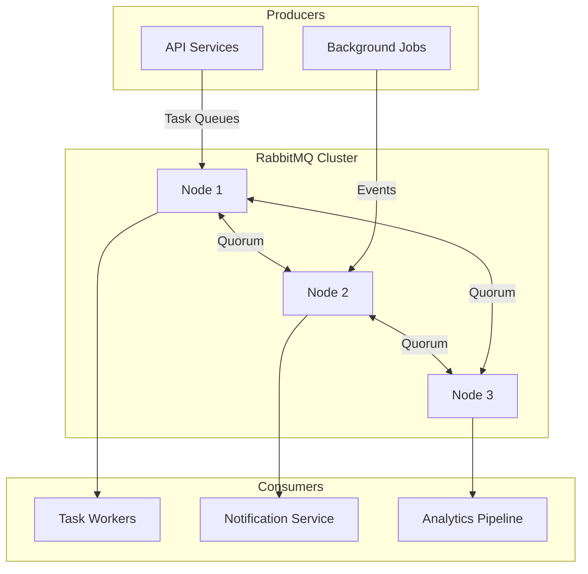
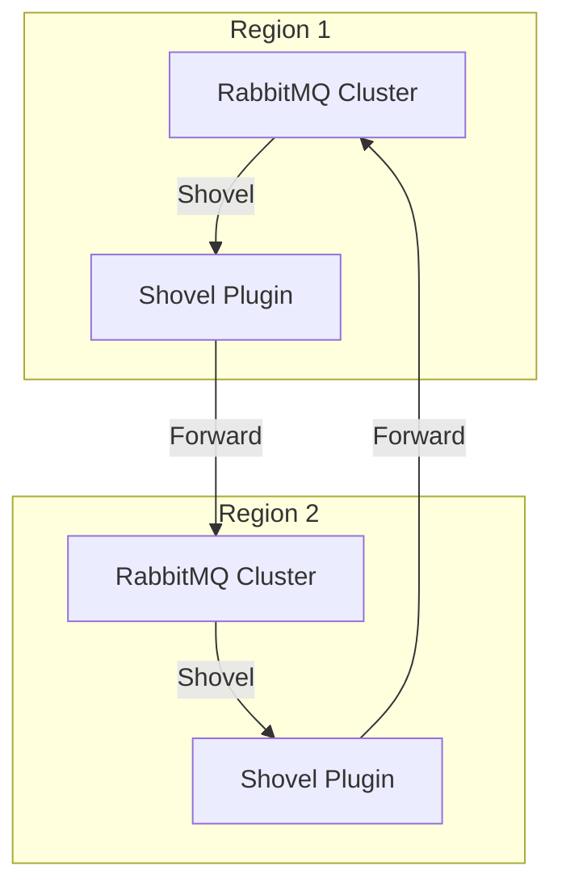

# RabbitMQ

Message broker for task queues, RPC, and pub/sub patterns.

**Status:** Accepted | **Updated:** 2026-02-09

---

## Overview

RabbitMQ is a mature, widely-deployed message broker that implements the Advanced Message Queuing Protocol (AMQP). In the OpenOva platform, RabbitMQ serves as an a la carte component for workloads that require traditional message queuing patterns such as task distribution, request-reply (RPC), and publish/subscribe fanout. It is licensed under the Mozilla Public License 2.0 (MPL 2.0).

Unlike event streaming platforms such as Kafka (via Strimzi), RabbitMQ is purpose-built for scenarios where messages need to be delivered to exactly one consumer, routed based on complex rules, or processed as discrete tasks with acknowledgement semantics. This makes it the natural choice for microservice communication patterns like work queues, delayed processing, and priority-based routing.

The RabbitMQ Cluster Operator provides Kubernetes-native lifecycle management, including automated cluster formation, rolling upgrades, and credential management through Custom Resources.

---

## Architecture

### Single Region



### Multi-Region (Shovel/Federation)



---

## Why RabbitMQ?

| Factor | RabbitMQ | Strimzi/Kafka | ActiveMQ Artemis |
|--------|----------|---------------|------------------|
| Primary use case | Task queues, RPC | Event streaming, CDC | JMS enterprise messaging |
| Protocol | AMQP, MQTT, STOMP | Kafka wire protocol | JMS, AMQP, MQTT, STOMP |
| Message routing | Exchanges + bindings | Topic partitions | Addresses + queues |
| Delivery semantics | At-most-once / at-least-once | At-least-once / exactly-once | At-most-once / at-least-once |
| Message priority | Native support | Not supported | Native support |
| Delayed messages | Plugin-based | Not supported | Native support |
| License | MPL 2.0 | Apache 2.0 | Apache 2.0 |
| Ecosystem | Broad polyglot support | JVM-centric clients | Java/JMS-centric |

**Decision:** RabbitMQ complements Strimzi/Kafka. Use RabbitMQ for task distribution, RPC, and routing-heavy workloads. Use Kafka (via Strimzi) for event streaming, CDC, and log aggregation.

---

## Key Features

| Feature | Description |
|---------|-------------|
| Quorum Queues | Raft-based replicated queues for data safety |
| Exchange Routing | Direct, fanout, topic, and header-based routing |
| Multi-Protocol | AMQP 0-9-1, AMQP 1.0, MQTT 3.1.1/5.0, STOMP |
| Dead Letter Exchanges | Automatic handling of failed messages |
| Priority Queues | Message prioritization (0-255 levels) |
| Shovel / Federation | Cross-cluster and cross-region message forwarding |
| Management UI | Built-in web console for monitoring and administration |
| Stream Queues | Append-only log semantics for replay scenarios |

---

## Configuration

### RabbitMQ Cluster (Operator)

```yaml
apiVersion: rabbitmq.com/v1beta1
kind: RabbitmqCluster
metadata:
  name: rabbitmq
  namespace: messaging
spec:
  replicas: 3
  image: rabbitmq:3.13-management
  resources:
    requests:
      cpu: 500m
      memory: 1Gi
    limits:
      cpu: 2
      memory: 4Gi
  persistence:
    storageClassName: <storage-class>
    storage: 50Gi
  rabbitmq:
    additionalPlugins:
      - rabbitmq_shovel
      - rabbitmq_shovel_management
      - rabbitmq_prometheus
    additionalConfig: |
      cluster_partition_handling = pause_minority
      queue_master_locator = min-masters
      default_consumer_prefetch = 50
      vm_memory_high_watermark.relative = 0.7
  override:
    statefulSet:
      spec:
        template:
          spec:
            topologySpreadConstraints:
              - maxSkew: 1
                topologyKey: topology.kubernetes.io/zone
                whenUnsatisfiable: DoNotSchedule
                labelSelector:
                  matchLabels:
                    app.kubernetes.io/name: rabbitmq
```

### Queue Definition

```yaml
apiVersion: rabbitmq.com/v1beta1
kind: Queue
metadata:
  name: task-queue
  namespace: messaging
spec:
  name: tasks
  type: quorum
  durable: true
  rabbitmqClusterReference:
    name: rabbitmq
  arguments:
    x-delivery-limit: 5
    x-dead-letter-exchange: dlx
    x-dead-letter-routing-key: dead-letter
```

### Exchange and Binding

```yaml
apiVersion: rabbitmq.com/v1beta1
kind: Exchange
metadata:
  name: events-exchange
  namespace: messaging
spec:
  name: events
  type: topic
  durable: true
  rabbitmqClusterReference:
    name: rabbitmq
---
apiVersion: rabbitmq.com/v1beta1
kind: Binding
metadata:
  name: events-binding
  namespace: messaging
spec:
  source: events
  destination: tasks
  destinationType: queue
  routingKey: "order.created.*"
  rabbitmqClusterReference:
    name: rabbitmq
```

---

## Monitoring

| Metric | Description |
|--------|-------------|
| `rabbitmq_queue_messages_ready` | Messages waiting to be consumed |
| `rabbitmq_queue_messages_unacked` | Messages delivered but unacknowledged |
| `rabbitmq_connections` | Total active connections |
| `rabbitmq_channel_consumers` | Consumers per channel |
| `rabbitmq_queue_disk_reads_total` | Disk reads (indicates memory pressure) |
| `rabbitmq_node_mem_used` | Memory usage per node |

---

## Consequences

**Positive:**
- Mature, battle-tested broker with broad language and framework support
- Kubernetes-native operator simplifies lifecycle management
- Quorum queues provide strong data safety guarantees
- Flexible routing model supports diverse messaging patterns
- Multi-protocol support (AMQP, MQTT, STOMP) enables IoT and legacy integration

**Negative:**
- Not suitable for event streaming or log aggregation (use Kafka via Strimzi instead)
- Erlang runtime adds operational complexity for debugging
- Cluster scaling requires careful partition handling
- Memory usage can spike under high queue depth without flow control tuning

---

*Part of [OpenOva](https://openova.io)*
