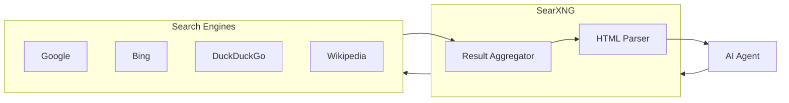

# SearXNG

Privacy-respecting metasearch engine for AI web search.

**Status:** Accepted | **Updated:** 2026-02-07

---

## Overview

SearXNG provides web search capabilities for AI agents without tracking, aggregating results from multiple search engines.



---

## Why SearXNG?

| Feature | Benefit |
|---------|---------|
| No tracking | Privacy-respecting |
| Multiple engines | Comprehensive results |
| Self-hosted | Data sovereignty |
| JSON API | Easy AI integration |
| Customizable | Enable/disable engines |

---

## Use Cases

| Use Case | Description |
|----------|-------------|
| Internet Search Agent | AI-powered web research |
| Fact checking | Verify LLM responses |
| Knowledge augmentation | Supplement RAG |
| News aggregation | Current events |

---

## Configuration

### Helm Values

```yaml
searxng:
  replicas: 1

  config:
    general:
      instance_name: "AI Hub Search"

    search:
      safe_search: 0
      autocomplete: "google"
      default_lang: "en"
      formats:
        - html
        - json

    engines:
      - name: google
        engine: google
        disabled: false
      - name: bing
        engine: bing
        disabled: false
      - name: duckduckgo
        engine: duckduckgo
        disabled: false
      - name: wikipedia
        engine: wikipedia
        disabled: false

    outgoing:
      request_timeout: 5.0
      max_request_timeout: 15.0

  resources:
    requests:
      cpu: 100m
      memory: 256Mi
```

---

## API Usage

### Search Request

```bash
curl "http://searxng.ai-hub.svc:8080/search?q=kubernetes+best+practices&format=json"
```

### Response Format

```json
{
  "query": "kubernetes best practices",
  "results": [
    {
      "url": "https://example.com/k8s-guide",
      "title": "Kubernetes Best Practices Guide",
      "content": "Learn the best practices for...",
      "engine": "google",
      "score": 0.95
    }
  ],
  "number_of_results": 50
}
```

---

## LangChain Integration

```python
from langchain_community.tools import SearxSearchResults

search = SearxSearchResults(
    searx_host="http://searxng.ai-hub.svc:8080",
    k=10  # Number of results
)

# Use in agent
results = search.run("latest AI developments 2026")
```

---

## Internet Search Agent

```python
# In LangServe agent configuration
agents = {
    "internet-search": {
        "model": "qwen3-32b",
        "temperature": 0.5,
        "system": """You are a research assistant with web access.
        Search the web, synthesize results, and cite sources.""",
        "tools": [
            {
                "type": "searxng",
                "endpoint": "http://searxng.ai-hub.svc:8080",
                "max_results": 10
            }
        ]
    }
}
```

---

## Engine Categories

| Category | Engines |
|----------|---------|
| General | Google, Bing, DuckDuckGo |
| Science | Google Scholar, Semantic Scholar |
| News | Google News, Bing News |
| IT | Stack Overflow, GitHub |
| Files | Archive.org |

---

## Rate Limiting

```yaml
outgoing:
  pool_connections: 100
  pool_maxsize: 20
  request_timeout: 5.0

# Rate limit per engine
engines:
  - name: google
    rate_limit: 10  # requests per minute
```

---

## Consequences

**Positive:**
- Privacy-respecting search
- Multiple search engines
- Self-hosted control
- JSON API for AI
- Customizable engines

**Negative:**
- Rate limits from upstream engines
- Result quality varies by engine
- Maintenance required

---

*Part of [OpenOva](https://openova.io)*
