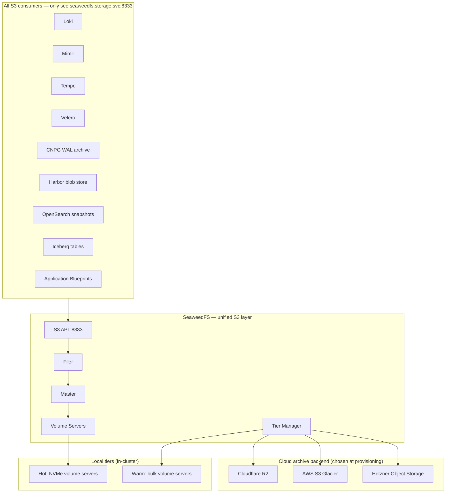
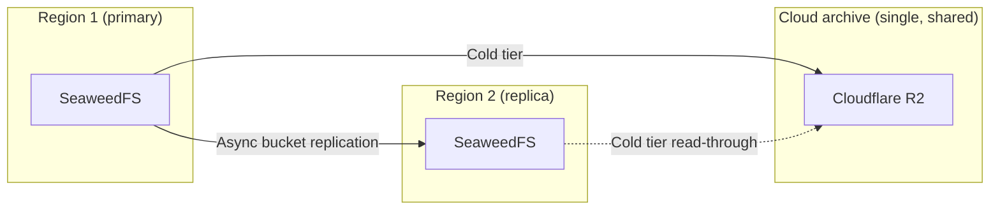

# SeaweedFS

S3-compatible object storage with native archive tiering. Per-host-cluster infrastructure (see [`docs/PLATFORM-TECH-STACK.md`](../../docs/PLATFORM-TECH-STACK.md) §3.5) — runs on every host cluster Catalyst manages. **Acts as the unified S3 encapsulation layer in front of cloud archival object storage** (Cloudflare R2 / AWS S3 Glacier / Hetzner Object Storage / etc.), so every Catalyst component sees a single S3 API while SeaweedFS transparently routes hot/warm/cold tiers.

**Status:** Accepted | **Updated:** 2026-04-28

---

## Overview

SeaweedFS provides a single S3-compatible API that Catalyst components and Application Blueprints consume uniformly, while internally:

- Stores hot data on local NVMe across the host cluster's volume servers
- Tiers warm data to in-cluster bulk storage
- Tiers cold/archival data to a cloud object-storage backend (configured at Sovereign provisioning time)

The encapsulation property is the architectural point: no Catalyst component talks to cloud S3 directly. Every consumer talks to `seaweedfs.storage.svc:8333`. SeaweedFS is the policy boundary for tiering, lifecycle, replication, and audit.

---

## Why SeaweedFS

| Factor | SeaweedFS |
|---|---|
| **License** | Apache 2.0 (truly open source) |
| **API** | S3-compatible (drop-in for any S3 client; no app changes when migrating off MinIO) |
| **Architecture** | Master + volume server split — scales to millions of files per node |
| **Native tiering** | Built-in tiered storage with cloud backends (S3, R2, Glacier, GCS, Azure Blob) — no MinIO ILM-style external policy engine needed |
| **Encryption** | AES-256 at rest, TLS in transit |
| **Replication** | Cross-region async, per-bucket replication policy |
| **Erasure coding** | Reed-Solomon (4+2, 6+3, 8+4) for cost-efficient durability |
| **FUSE / WebDAV / HDFS / Filer APIs** | Optional surfaces for non-S3 consumers |

---

## Architecture



---

## Tiered Storage Strategy

| Tier | Duration | Storage backend | Cost |
|---|---|---|---|
| Hot | 0–7 days | Local NVMe (in-cluster volume servers) | $$$ |
| Warm | 7–30 days | Local bulk (in-cluster volume servers) | $$ |
| Cold | 30d+ | Cloud archive backend (R2 / Glacier / Hetzner) | $ |

Tiering is **automatic and transparent** — the consumer's S3 GET/PUT call goes to the same endpoint regardless of which tier the object lives in. SeaweedFS resolves the tier transparently, fetching from cloud archive on demand if the object has aged past warm.

Cloudflare R2 is the default cold backend (zero egress cost). AWS S3 Glacier and Hetzner Object Storage are first-class alternatives chosen at Sovereign provisioning time.

---

## Configuration

### Deployment (StatefulSet via SeaweedFS Operator)

```yaml
apiVersion: seaweed.seaweedfs.com/v1
kind: Seaweed
metadata:
  name: seaweedfs
  namespace: storage
spec:
  image: chrislusf/seaweedfs:3.71
  master:
    replicas: 3
    volumeSizeLimitMB: 30000
    persistentVolumeClaim:
      storageClassName: fast-nvme
      resources: { requests: { storage: 10Gi } }
  volume:
    replicas: 6
    requests: { cpu: 1, memory: 4Gi }
    persistentVolumeClaim:
      storageClassName: bulk
      resources: { requests: { storage: 1Ti } }
  filer:
    replicas: 2
    config: |
      [postgres]
      enabled = true
      hostname = "seaweedfs-meta-rw.storage.svc"
      port = 5432
      username = "seaweedfs"
      password = "${POSTGRES_PASSWORD}"
      database = "seaweedfs"
  s3:
    replicas: 2
    enabled: true                     # S3 API on :8333 — what every consumer talks to
```

### Cloud archive tier (cold backend)

```yaml
# Configured by sovereign-admin at provisioning time
apiVersion: v1
kind: ConfigMap
metadata:
  name: seaweedfs-tier-config
  namespace: storage
data:
  remote.s3.cold: |
    [s3.cold]
    type = "s3"
    aws_access_key_id = "${R2_ACCESS_KEY}"
    aws_secret_access_key = "${R2_SECRET_KEY}"
    region = "auto"
    bucket = "openova-archive"
    endpoint = "https://<account>.r2.cloudflarestorage.com"
    storage_class = "STANDARD"
```

### Lifecycle policies (per-bucket)

```yaml
# Applied via SeaweedFS S3 API or CRD wrapper
apiVersion: seaweed.seaweedfs.com/v1
kind: BucketLifecycle
metadata:
  name: loki-data
spec:
  bucket: loki-data
  rules:
    - id: TierToCold
      status: Enabled
      filter: { prefix: "logs/" }
      transitions:
        - days: 7
          storageClass: WARM
        - days: 30
          storageClass: COLD          # routes to cold tier (R2/Glacier/etc.) automatically
    - id: ExpireAfterRetention
      status: Enabled
      filter: { prefix: "logs/" }
      expiration: { days: 365 }
```

---

## Buckets (canonical layout — same regardless of cloud backend)

| Bucket | Consumer | Default lifecycle |
|---|---|---|
| `loki-data` | Loki | Tier to cold after 7d, expire after 365d |
| `mimir-data` | Mimir (long-term metrics) | Tier to cold after 7d, expire after 365d |
| `tempo-data` | Tempo | Tier to cold after 7d, expire after 30d |
| `velero-backups` | Velero | Tier to cold after 30d, expire after 90d |
| `cnpg-wal` | CNPG WAL archive | Tier to warm after 1d, expire after 7d |
| `cnpg-base-backups` | CNPG base backups | Tier to cold after 7d, expire after 90d |
| `harbor-data` | Harbor blob store | Tier to cold after 90d, no expiry |
| `opensearch-snapshots` | OpenSearch snapshots | Tier to cold after 30d, expire after 365d |
| `iceberg-warehouse` | Iceberg analytic tables | No automatic transition (Iceberg manages compaction); cold after 90d |
| `livekit-recordings` | LiveKit egress | Tier to cold after 7d, expire after 90d |
| `ai-hub-models` | KServe / vLLM model weights | No automatic transition; pinned to warm |
| `<org>-<app>-*` | Per-Application buckets (auto-created on App install) | Inherits Org default; overridable |

---

## Multi-Region Replication



The cold backend is shared across regions — each region writes warm-aged objects to the same archive bucket, deduplicated by content hash. On region failover, the surviving region reads cold objects directly from cloud archive without needing to re-replicate.

---

## Monitoring

| Metric | Description |
|---|---|
| `seaweedfs_volume_server_disk_usage_bytes` | Per-volume-server disk usage |
| `seaweedfs_s3_request_total` | S3 request count by op |
| `seaweedfs_s3_request_seconds` | S3 request latency histogram |
| `seaweedfs_tier_transition_total` | Objects transitioned per tier |
| `seaweedfs_tier_remote_storage_bytes` | Bytes stored in each cold backend |
| `seaweedfs_master_topology_volume_count` | Volumes per data center / rack |

---

## Migration from MinIO

SeaweedFS is a drop-in S3 replacement:

1. **No application changes** — same S3 API surface (PUT, GET, MULTIPART, presigned URLs, ListObjectsV2, etc.).
2. **Same client libraries** — boto3, AWS SDK for Go/Java/JS, mc client all work unchanged against `seaweedfs.storage.svc:8333`.
3. **Bucket migration** — `mc mirror` from MinIO → SeaweedFS, or use SeaweedFS's `weed filer.remote.sync` to ingest existing data.
4. **Tiering simplification** — MinIO's external ILM + tier configuration is replaced by SeaweedFS's native tiered storage. One configuration boundary instead of two.
5. **Encapsulation upgrade** — direct S3 calls to cloud providers (which were scattered across components) are replaced by uniform calls to SeaweedFS, which routes to the right tier. Audit log, encryption, and lifecycle policy are now applied at one boundary.

---

*Part of [OpenOva](https://openova.io)*
