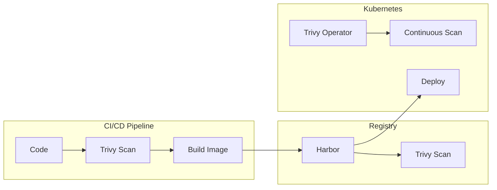
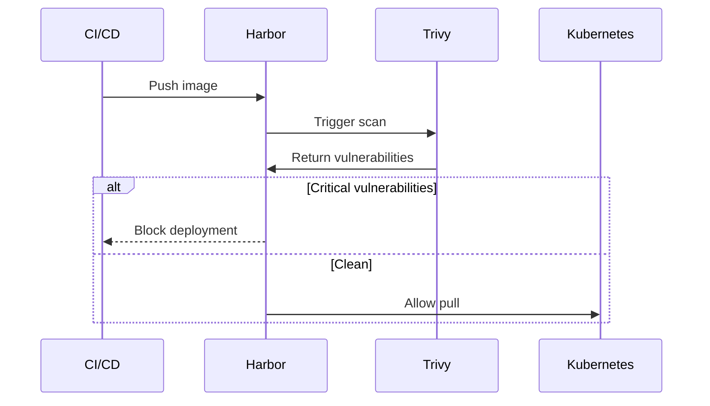

# Trivy

Security scanning for containers, Kubernetes manifests, and IaC.

**Status:** Accepted | **Updated:** 2026-02-07

---

## Overview

Trivy provides unified security scanning at multiple levels: CI/CD, registry, and runtime.



---

## Scanning Levels

| Level | Integration | Trigger |
|-------|-------------|---------|
| CI/CD | Gitea Actions | On push/PR |
| Registry | Harbor (built-in) | On push |
| Runtime | Trivy Operator | Continuous |

---

## Scanning Capabilities

| Target | Command |
|--------|---------|
| Container images | `trivy image` |
| Kubernetes manifests | `trivy config` |
| IaC (Terraform) | `trivy config` |
| SBOM generation | `trivy sbom` |
| Secrets detection | `trivy fs --scanners secret` |

---

## Harbor Integration

Harbor includes Trivy scanning. Images are automatically scanned on push.



---

## Scan Policies

| Severity | CI/CD Action | Harbor Action |
|----------|--------------|---------------|
| Critical | Fail build | Block pull |
| High | Warn | Allow (configurable) |
| Medium | Info | Allow |
| Low | Info | Allow |

---

## Trivy Operator

Continuous runtime scanning in Kubernetes:

```yaml
apiVersion: aquasecurity.github.io/v1alpha1
kind: VulnerabilityReport
# Generated automatically for each workload
```

### Installation

```yaml
apiVersion: helm.toolkit.fluxcd.io/v2beta1
kind: HelmRelease
metadata:
  name: trivy-operator
  namespace: trivy-system
spec:
  interval: 10m
  chart:
    spec:
      chart: trivy-operator
      version: "0.20.x"
      sourceRef:
        kind: HelmRepository
        name: aqua
        namespace: flux-system
  values:
    trivy:
      ignoreUnfixed: true
    operator:
      scanJobsConcurrentLimit: 5
```

---

## CI/CD Integration

### Gitea Actions

```yaml
name: Security Scan
on: [push, pull_request]

jobs:
  scan:
    runs-on: ubuntu-latest
    steps:
      - uses: actions/checkout@v4

      - name: Scan filesystem
        uses: aquasecurity/trivy-action@master
        with:
          scan-type: 'fs'
          scan-ref: '.'
          severity: 'CRITICAL,HIGH'
          exit-code: '1'

      - name: Scan Kubernetes manifests
        uses: aquasecurity/trivy-action@master
        with:
          scan-type: 'config'
          scan-ref: './k8s'
          severity: 'CRITICAL,HIGH'
```

---

## Kyverno Policy

Block deployment of vulnerable images:

```yaml
apiVersion: kyverno.io/v1
kind: ClusterPolicy
metadata:
  name: block-vulnerable-images
spec:
  validationFailureAction: Enforce
  rules:
    - name: check-vulnerabilities
      match:
        any:
          - resources:
              kinds:
                - Pod
      verifyImages:
        - imageReferences:
            - "harbor.<domain>/*"
          attestations:
            - type: https://cosign.sigstore.dev/attestation/vuln/v1
              conditions:
                - all:
                    - key: "{{ scanner }}"
                      operator: Equals
                      value: "trivy"
                    - key: "{{ criticalCount }}"
                      operator: LessThanOrEquals
                      value: "0"
```

---

## Monitoring

### Key Metrics

| Metric | Query |
|--------|-------|
| Vulnerability count | `trivy_vulnerability_id` |
| Critical vulns | `count(trivy_vulnerability_id{severity="CRITICAL"})` |
| Scan status | `trivy_image_vulnerabilities` |

### Alerts

```yaml
apiVersion: monitoring.coreos.com/v1
kind: PrometheusRule
metadata:
  name: trivy-alerts
  namespace: monitoring
spec:
  groups:
    - name: trivy
      rules:
        - alert: CriticalVulnerabilityFound
          expr: count(trivy_vulnerability_id{severity="CRITICAL"}) > 0
          for: 5m
          labels:
            severity: critical
          annotations:
            summary: "Critical vulnerability detected"
```

---

## Consequences

**Positive:**
- Unified scanning across CI/CD, registry, and runtime
- Integrated with Harbor (mandatory component)
- Shift-left security with fast feedback
- SBOM generation for compliance

**Negative:**
- False positives require triage
- Scan time adds to CI/CD pipeline
- Operator resources in cluster

---

*Part of [OpenOva](https://openova.io)*
