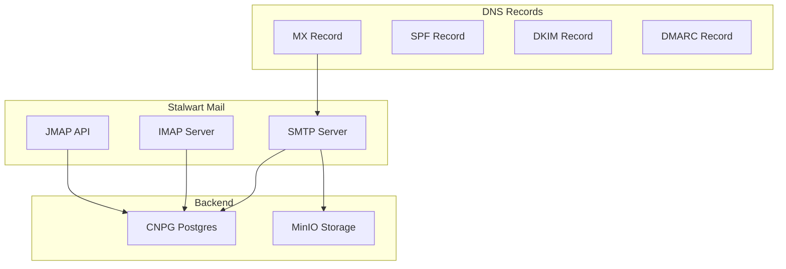

# Stalwart

Self-hosted email server for OpenOva platform.

**Status:** Accepted | **Updated:** 2026-01-17

---

## Overview

Stalwart provides self-hosted email with:
- SMTP, IMAP, and JMAP support
- Modern Rust implementation
- DKIM, SPF, DMARC compliance
- Anti-spam filtering

---

## Architecture



---

## Protocols

| Protocol | Port | Purpose |
|----------|------|---------|
| SMTP | 25/465/587 | Sending mail |
| IMAP | 993 | Mail access |
| JMAP | 443 | Modern API |

---

## Configuration

### Stalwart Deployment

```yaml
apiVersion: apps/v1
kind: Deployment
metadata:
  name: stalwart
  namespace: communication
spec:
  replicas: 2
  template:
    spec:
      containers:
        - name: stalwart
          image: stalwartlabs/mail-server:latest
          ports:
            - containerPort: 25
              name: smtp
            - containerPort: 465
              name: smtps
            - containerPort: 587
              name: submission
            - containerPort: 993
              name: imaps
            - containerPort: 8080
              name: jmap
          env:
            - name: STALWART_DATABASE_URL
              valueFrom:
                secretKeyRef:
                  name: stalwart-db-credentials
                  key: url
```

### DNS Records

```yaml
# Required DNS records
dns_records:
  - type: MX
    name: <domain>
    value: mail.<domain>
    priority: 10

  - type: TXT
    name: <domain>
    value: "v=spf1 mx ip4:<server-ip> -all"

  - type: TXT
    name: default._domainkey.<domain>
    value: "v=DKIM1; k=rsa; p=<public-key>"

  - type: TXT
    name: _dmarc.<domain>
    value: "v=DMARC1; p=reject; rua=mailto:dmarc@<domain>"
```

---

## Anti-Spam

Stalwart includes built-in spam filtering:

| Feature | Description |
|---------|-------------|
| SpamAssassin | Rule-based filtering |
| DNSBL | Blocklist checking |
| Greylisting | Temporary rejection |
| Rate limiting | Abuse prevention |

---

## Monitoring

| Metric | Description |
|--------|-------------|
| `stalwart_messages_received_total` | Received messages |
| `stalwart_messages_sent_total` | Sent messages |
| `stalwart_spam_blocked_total` | Blocked spam |
| `stalwart_queue_size` | Queue depth |

---

*Part of [OpenOva](https://openova.io)*
