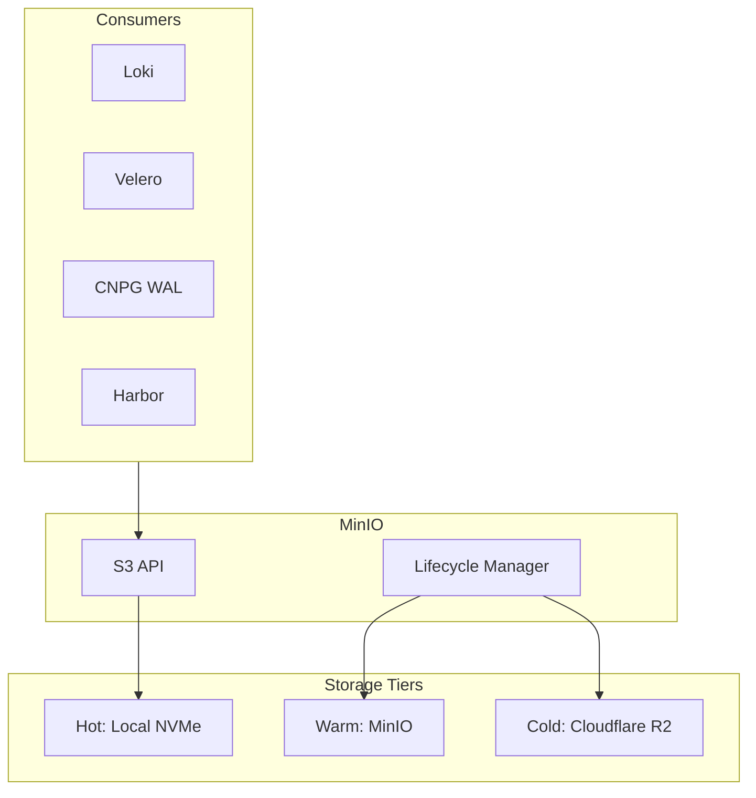
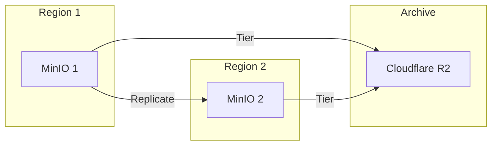

# MinIO

S3-compatible object storage for OpenOva platform.

**Status:** Accepted | **Updated:** 2026-01-17

---

## Overview

MinIO provides S3-compatible object storage with:
- Tiered storage (hot/warm/cold)
- Cross-region replication
- Lifecycle policies
- Integration with all platform components

---

## Architecture



---

## Tiered Storage Strategy

| Tier | Duration | Storage | Cost |
|------|----------|---------|------|
| Hot | 0-7 days | Local NVMe | $$$ |
| Warm | 7-30 days | MinIO | $$ |
| Cold | 30d+ | Cloudflare R2 | $ |

Cloudflare R2 provides zero egress costs for archival storage.

---

## Configuration

### MinIO Deployment

```yaml
apiVersion: apps/v1
kind: StatefulSet
metadata:
  name: minio
  namespace: storage
spec:
  replicas: 4
  template:
    spec:
      containers:
        - name: minio
          image: minio/minio:RELEASE.2024-01-01
          args:
            - server
            - /data
            - --console-address
            - ":9001"
          env:
            - name: MINIO_ROOT_USER
              valueFrom:
                secretKeyRef:
                  name: minio-credentials
                  key: access-key
            - name: MINIO_ROOT_PASSWORD
              valueFrom:
                secretKeyRef:
                  name: minio-credentials
                  key: secret-key
          volumeMounts:
            - name: data
              mountPath: /data
```

### Lifecycle Policy

```json
{
  "Rules": [
    {
      "ID": "TierToR2",
      "Status": "Enabled",
      "Filter": {
        "Prefix": "logs/"
      },
      "Transition": {
        "Days": 30,
        "StorageClass": "GLACIER"
      }
    },
    {
      "ID": "ExpireOldLogs",
      "Status": "Enabled",
      "Filter": {
        "Prefix": "logs/"
      },
      "Expiration": {
        "Days": 365
      }
    }
  ]
}
```

### R2 Tiering Configuration

```yaml
# mc admin tier add command
mc admin tier add minio r2-tier \
  --endpoint https://<account>.r2.cloudflarestorage.com \
  --access-key ${R2_ACCESS_KEY} \
  --secret-key ${R2_SECRET_KEY} \
  --bucket openova-archive \
  --region auto
```

---

## Buckets

| Bucket | Purpose | Lifecycle |
|--------|---------|-----------|
| `loki-data` | Log storage | Tier after 30d |
| `tempo-data` | Trace storage | Tier after 30d |
| `velero-backups` | K8s backups | Keep 90d |
| `cnpg-wal` | PostgreSQL WAL | Keep 7d |
| `harbor-data` | Container images | No expiry |
| `ai-hub-models` | LLM model weights | No expiry |

---

## Multi-Region Replication



---

## Monitoring

| Metric | Description |
|--------|-------------|
| `minio_bucket_usage_total_bytes` | Bucket size |
| `minio_s3_requests_total` | S3 request count |
| `minio_s3_requests_errors_total` | S3 errors |
| `minio_node_disk_used_bytes` | Disk usage |

---

*Part of [OpenOva](https://openova.io)*
