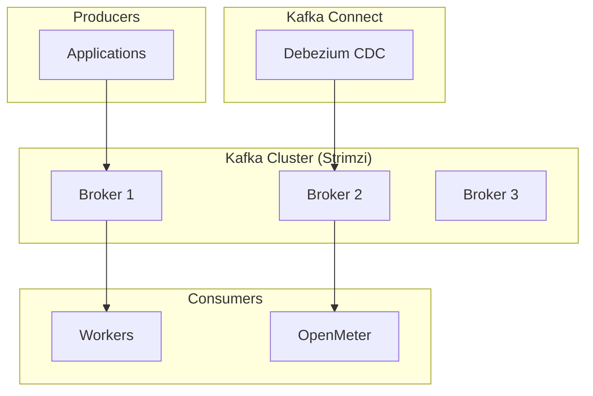
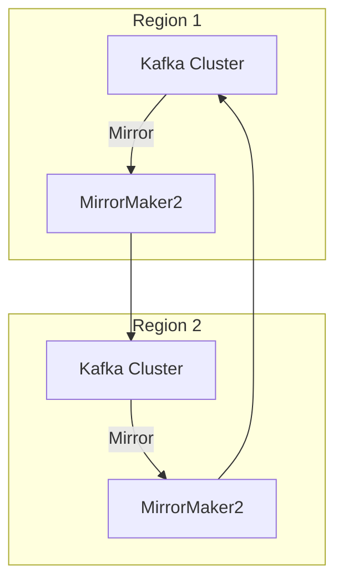
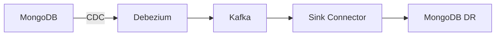

# Strimzi (Apache Kafka)

Apache Kafka on Kubernetes via the Strimzi operator.

**Status:** Accepted | **Updated:** 2026-02-09

---

## Overview

Strimzi provides a Kubernetes-native way to run Apache Kafka clusters. Both Strimzi and Apache Kafka are Apache 2.0 licensed. Strimzi replaces Redpanda, which changed to the Business Source License (BSL 1.1).

Strimzi manages the full Kafka ecosystem on Kubernetes:
- **Kafka brokers** with KRaft mode (no ZooKeeper dependency)
- **Kafka Connect** for Debezium CDC integration
- **MirrorMaker2** for cross-region topic replication
- **Schema Registry** (Apicurio) for schema management

---

## Architecture

### Single Region



### Multi-Region (MirrorMaker2)



MirrorMaker2 provides active-active cross-region replication with automatic topic and consumer group offset synchronization.

---

## Why Strimzi + Kafka

| Factor | Detail |
|--------|--------|
| License | Apache 2.0 (both Strimzi and Kafka) |
| Maturity | Kafka is the industry standard for event streaming |
| KRaft mode | No ZooKeeper dependency (simplified operations) |
| Ecosystem | Kafka Connect, MirrorMaker2, Schema Registry |
| CNCF | Strimzi is a CNCF Sandbox project |
| Reason for switch | Redpanda changed to BSL 1.1 |

---

## Configuration

### Kafka Cluster (Strimzi)

```yaml
apiVersion: kafka.strimzi.io/v1beta2
kind: Kafka
metadata:
  name: kafka
  namespace: databases
spec:
  kafka:
    version: 3.7.0
    replicas: 3
    listeners:
      - name: plain
        port: 9092
        type: internal
        tls: false
      - name: tls
        port: 9093
        type: internal
        tls: true
    config:
      auto.create.topics.enable: "false"
      default.replication.factor: 3
      min.insync.replicas: 2
      offsets.topic.replication.factor: 3
      transaction.state.log.replication.factor: 3
      transaction.state.log.min.isr: 2
    storage:
      type: persistent-claim
      size: 100Gi
      class: <storage-class>
    resources:
      requests:
        cpu: 1
        memory: 2Gi
      limits:
        cpu: 2
        memory: 4Gi
  zookeeper:
    replicas: 0  # KRaft mode - no ZooKeeper
  entityOperator:
    topicOperator: {}
    userOperator: {}
```

### Kafka Connect (for Debezium)

```yaml
apiVersion: kafka.strimzi.io/v1beta2
kind: KafkaConnect
metadata:
  name: kafka-connect
  namespace: databases
  annotations:
    strimzi.io/use-connector-resources: "true"
spec:
  version: 3.7.0
  replicas: 2
  bootstrapServers: kafka-kafka-bootstrap:9092
  config:
    group.id: connect-cluster
    offset.storage.topic: connect-offsets
    config.storage.topic: connect-configs
    status.storage.topic: connect-status
    offset.storage.replication.factor: 3
    config.storage.replication.factor: 3
    status.storage.replication.factor: 3
  build:
    output:
      type: docker
      image: harbor.<domain>/kafka-connect:latest
    plugins:
      - name: debezium-mongodb
        artifacts:
          - type: maven
            group: io.debezium
            artifact: debezium-connector-mongodb
            version: 2.6.1.Final
```

### MirrorMaker2 Configuration

```yaml
apiVersion: kafka.strimzi.io/v1beta2
kind: KafkaMirrorMaker2
metadata:
  name: mm2
  namespace: databases
spec:
  version: 3.7.0
  replicas: 2
  connectCluster: "region2"
  clusters:
    - alias: "region1"
      bootstrapServers: kafka-kafka-bootstrap.region1.<domain>:9092
      tls: {}
    - alias: "region2"
      bootstrapServers: kafka-kafka-bootstrap.databases.svc:9092
  mirrors:
    - sourceCluster: "region1"
      targetCluster: "region2"
      sourceConnector:
        config:
          replication.factor: 3
          offset-syncs.topic.replication.factor: 3
          heartbeats.topic.replication.factor: 3
          checkpoints.topic.replication.factor: 3
          sync.topic.acls.enabled: "false"
      topicsPattern: ".*"
      groupsPattern: ".*"
```

---

## Topics

| Topic Pattern | Purpose | Retention |
|---------------|---------|-----------|
| `cdc.mongodb.*` | MongoDB CDC events | 7 days |
| `events.*` | Application events | 7 days |
| `openmeter.*` | Usage metering | 30 days |

---

## Monitoring

| Metric | Description |
|--------|-------------|
| `kafka_server_brokertopicmetrics_messagesin_total` | Messages in per second |
| `kafka_server_replicamanager_underreplicatedpartitions` | Under-replicated partitions |
| `kafka_controller_kafkacontroller_activecontrollercount` | Active controller count |
| `kafka_consumer_consumer_fetch_manager_metrics_records_lag_max` | Consumer lag |
| `strimzi_resources` | Strimzi-managed resource count |

---

## Debezium Integration

Kafka (via Strimzi) serves as the transport layer for CDC:



---

*Part of [OpenOva](https://openova.io)*
