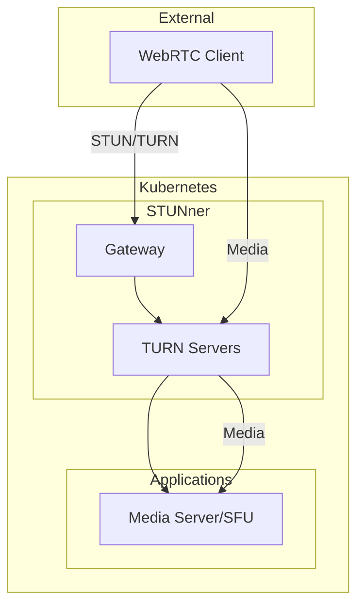

# STUNner

K8s-native TURN/STUN for WebRTC NAT traversal. **Application Blueprint** (see [`docs/PLATFORM-TECH-STACK.md`](../../docs/PLATFORM-TECH-STACK.md) §4.5 — Communication). Used by `bp-relay` to make LiveKit (WebRTC SFU) reachable from clients behind NATs.

**Status:** Accepted | **Updated:** 2026-04-30

---

## Blueprint chart

This folder ships an umbrella Helm chart at `chart/` that wraps the upstream `stunner/stunner-gateway-operator` chart (1.1.0) under `dependencies:`. Catalyst-curated overlay templates render alongside:

- `chart/templates/gatewayclass.yaml` — `gateway.networking.k8s.io/v1.GatewayClass` claiming the operator (`stunner.l7mp.io/gateway-operator` controller). Capabilities-gated on Gateway-API CRDs (delivered by `bp-cilium`).
- `chart/templates/networkpolicy.yaml` — locks operator + dataplane pods to the minimum ingress/egress (DEFAULT FALSE; per-Sovereign overlay opts in once consumer namespaces are pinned).
- `chart/templates/servicemonitor.yaml` — `monitoring.coreos.com/v1.ServiceMonitor` (DEFAULT FALSE per [`docs/BLUEPRINT-AUTHORING.md`](../../docs/BLUEPRINT-AUTHORING.md) §11.2; double-gated on Capabilities).
- `chart/templates/hpa.yaml` — `autoscaling/v2.HorizontalPodAutoscaler` for the dataplane Deployment (DEFAULT FALSE).

**Cilium-native Gateway integration**: STUNner registers a GatewayClass and the operator dynamically materializes dataplane Deployments backing each Gateway CR. UDP port range default 30000-32767 matches the range opened at the Sovereign edge firewall (Crossplane `bp-firewall` composition).

---

## Overview

STUNner provides WebRTC connectivity:
- Kubernetes-native STUN/TURN server
- Gateway API integration
- Scalable media relay
- NAT traversal for video/audio

---

## Architecture



---

## Why STUNner

| Factor | STUNner | Traditional TURN |
|--------|---------|-----------------|
| Deployment | Kubernetes-native | Separate VMs |
| Scaling | HPA/KEDA | Manual |
| Configuration | Gateway API CRDs | Config files |
| Integration | Native K8s | External |

---

## Configuration

### Gateway

```yaml
apiVersion: gateway.networking.k8s.io/v1
kind: Gateway
metadata:
  name: stunner-gateway
  namespace: stunner
spec:
  gatewayClassName: stunner-gatewayclass
  listeners:
    - name: udp-listener
      port: 3478
      protocol: TURN-UDP
    - name: tcp-listener
      port: 3478
      protocol: TURN-TCP
```

### UDPRoute

```yaml
apiVersion: stunner.l7mp.io/v1
kind: UDPRoute
metadata:
  name: media-route
  namespace: stunner
spec:
  parentRefs:
    - name: stunner-gateway
  rules:
    - backendRefs:
        - name: media-server
          namespace: apps
```

### GatewayConfig

```yaml
apiVersion: stunner.l7mp.io/v1
kind: GatewayConfig
metadata:
  name: stunner-config
  namespace: stunner
spec:
  realm: stunner.<env>.<sovereign-domain>
  authType: longterm
  userName: stunner
  password:
    name: stunner-credentials
    namespace: stunner
    key: password
```

---

## TURN Authentication

STUNner supports long-term credentials:

```yaml
# Generate time-limited credentials
apiVersion: stunner.l7mp.io/v1
kind: GatewayConfig
spec:
  authType: longterm
  authLifetime: 86400  # 24 hours
```

---

## Scaling

STUNner scales with KEDA based on connection count:

```yaml
apiVersion: keda.sh/v1alpha1
kind: ScaledObject
metadata:
  name: stunner-scaler
  namespace: stunner
spec:
  scaleTargetRef:
    name: stunner
  minReplicaCount: 2
  maxReplicaCount: 10
  triggers:
    - type: prometheus
      metadata:
        serverAddress: http://mimir.monitoring.svc:8080/prometheus
        metricName: stunner_allocations_active
        query: sum(stunner_allocations_active)
        threshold: "100"
```

---

## Monitoring

| Metric | Description |
|--------|-------------|
| `stunner_allocations_active` | Active TURN allocations |
| `stunner_bytes_received_total` | Received bytes |
| `stunner_bytes_sent_total` | Sent bytes |
| `stunner_connections_total` | Total connections |

---

*Part of [OpenOva](https://openova.io)*
