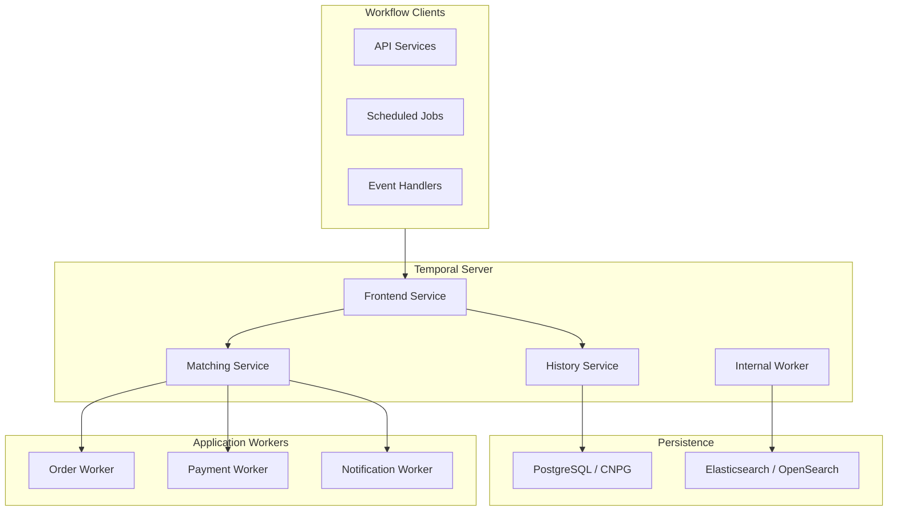
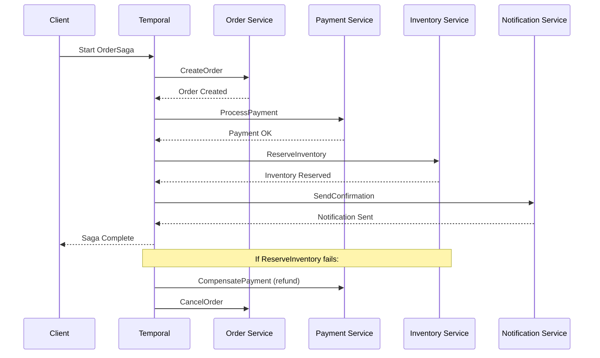

# Temporal

Durable workflow orchestration for microservices.

**Status:** Accepted | **Updated:** 2026-02-09

---

## Overview

Temporal is a durable execution platform that makes it simple to build reliable, long-running workflows and microservice orchestrations. Unlike traditional message queues or job schedulers, Temporal provides durable execution: workflow code survives process crashes, node failures, and even entire cluster restarts without losing state. Developers write workflows as ordinary code in their language of choice, and Temporal handles retries, timeouts, and state persistence transparently.

Within OpenOva, Temporal serves as the workflow orchestration engine for the **Fuse** microservices integration product. It handles saga patterns for distributed transactions, long-running business processes, scheduled jobs, and any operation that needs reliable execution across multiple services. Temporal replaces fragile combinations of message queues, cron jobs, and custom state machines with a single, battle-tested platform.

Temporal's architecture separates the server (which manages workflow state) from workers (which execute workflow and activity code). Workers are stateless and can be scaled independently. The server persists all workflow state to a database, ensuring that workflows survive any infrastructure failure. SDKs are available for Go, Java, Python, and TypeScript, making Temporal accessible to polyglot teams.

---

## Architecture



### Saga Pattern



---

## Key Features

| Feature | Description |
|---------|-------------|
| Durable Execution | Workflows survive process/node/cluster failures |
| Saga Orchestration | Coordinate distributed transactions with compensation |
| Retry Policies | Configurable retry with exponential backoff per activity |
| Timeouts | Start-to-close, schedule-to-start, and heartbeat timeouts |
| Cron Workflows | Replace cron jobs with reliable scheduled workflows |
| Versioning | Deploy new workflow logic without breaking running instances |
| Signals & Queries | Send data to and read state from running workflows |
| Child Workflows | Compose complex workflows from smaller building blocks |
| Visibility | Search and filter workflows by custom attributes |

---

## Configuration

### Helm Values

```yaml
temporal:
  server:
    replicas: 3
    config:
      persistence:
        default:
          driver: sql
          sql:
            driver: postgres12
            host: temporal-postgres.databases.svc
            port: 5432
            database: temporal
            user: temporal
            password: ${PG_PASSWORD}  # From ESO
        visibility:
          driver: sql
          sql:
            driver: postgres12
            host: temporal-postgres.databases.svc
            port: 5432
            database: temporal_visibility
            user: temporal
            password: ${PG_PASSWORD}  # From ESO

    resources:
      requests:
        cpu: 500m
        memory: 1Gi
      limits:
        cpu: 2
        memory: 4Gi

  admintools:
    enabled: true

  web:
    enabled: true
    ingress:
      enabled: true
      hosts:
        - temporal.fuse.<domain>

  prometheus:
    enabled: true
```

### Namespace Setup

```bash
# Create Temporal namespace for workload isolation
tctl namespace register \
  --namespace orders \
  --retention 30d \
  --description "Order processing workflows"
```

---

## Workflow Examples

### Go SDK - Order Saga

```go
package workflows

import (
    "time"
    "go.temporal.io/sdk/temporal"
    "go.temporal.io/sdk/workflow"
)

func OrderSagaWorkflow(ctx workflow.Context, order Order) (OrderResult, error) {
    retryPolicy := &temporal.RetryPolicy{
        InitialInterval:    time.Second,
        BackoffCoefficient: 2.0,
        MaximumInterval:    time.Minute,
        MaximumAttempts:    5,
    }
    activityOpts := workflow.ActivityOptions{
        StartToCloseTimeout: 30 * time.Second,
        RetryPolicy:         retryPolicy,
    }
    ctx = workflow.WithActivityOptions(ctx, activityOpts)

    // Step 1: Create Order
    var orderID string
    err := workflow.ExecuteActivity(ctx, CreateOrder, order).Get(ctx, &orderID)
    if err != nil {
        return OrderResult{}, err
    }

    // Step 2: Process Payment (with compensation)
    var paymentID string
    err = workflow.ExecuteActivity(ctx, ProcessPayment, orderID, order.Amount).Get(ctx, &paymentID)
    if err != nil {
        // Compensate: cancel the order
        _ = workflow.ExecuteActivity(ctx, CancelOrder, orderID).Get(ctx, nil)
        return OrderResult{}, err
    }

    // Step 3: Reserve Inventory (with compensation)
    err = workflow.ExecuteActivity(ctx, ReserveInventory, orderID, order.Items).Get(ctx, nil)
    if err != nil {
        // Compensate: refund payment, cancel order
        _ = workflow.ExecuteActivity(ctx, RefundPayment, paymentID).Get(ctx, nil)
        _ = workflow.ExecuteActivity(ctx, CancelOrder, orderID).Get(ctx, nil)
        return OrderResult{}, err
    }

    // Step 4: Send Confirmation
    _ = workflow.ExecuteActivity(ctx, SendConfirmation, orderID).Get(ctx, nil)

    return OrderResult{OrderID: orderID, PaymentID: paymentID, Status: "completed"}, nil
}
```

### Python SDK - Data Pipeline

```python
from temporalio import workflow, activity
from datetime import timedelta

@activity.defn
async def extract_data(source: str) -> dict:
    # Extract data from source system
    ...

@activity.defn
async def transform_data(raw_data: dict) -> dict:
    # Apply business transformations
    ...

@activity.defn
async def load_data(transformed: dict) -> str:
    # Write to destination
    ...

@workflow.defn
class DataPipelineWorkflow:
    @workflow.run
    async def run(self, source: str) -> str:
        raw = await workflow.execute_activity(
            extract_data, source,
            start_to_close_timeout=timedelta(minutes=10),
        )
        transformed = await workflow.execute_activity(
            transform_data, raw,
            start_to_close_timeout=timedelta(minutes=30),
        )
        result = await workflow.execute_activity(
            load_data, transformed,
            start_to_close_timeout=timedelta(minutes=10),
        )
        return result
```

---

## Worker Deployment

```yaml
apiVersion: apps/v1
kind: Deployment
metadata:
  name: order-workflow-worker
  namespace: fuse
spec:
  replicas: 3
  template:
    spec:
      containers:
        - name: worker
          image: registry.<domain>/fuse/order-worker:latest
          env:
            - name: TEMPORAL_HOST
              value: temporal-frontend.temporal.svc:7233
            - name: TEMPORAL_NAMESPACE
              value: orders
            - name: TEMPORAL_TASK_QUEUE
              value: order-processing
          resources:
            requests:
              cpu: 250m
              memory: 512Mi
            limits:
              cpu: 1
              memory: 1Gi
```

---

## Monitoring

| Metric | Description |
|--------|-------------|
| `temporal_workflow_started_total` | Workflows started |
| `temporal_workflow_completed_total` | Workflows completed successfully |
| `temporal_workflow_failed_total` | Workflows failed |
| `temporal_workflow_task_queue_depth` | Pending tasks per queue |
| `temporal_activity_execution_latency` | Activity execution duration |
| `temporal_workflow_endtoend_latency` | Total workflow duration |
| `temporal_schedule_missed_catchup_window` | Missed cron schedule executions |

---

## Consequences

**Positive:**
- Durable execution eliminates custom retry/state-machine code across all services
- Saga pattern support simplifies distributed transaction management
- Multi-language SDKs (Go, Java, Python, TypeScript) suit polyglot teams
- Workflow versioning enables safe deployments without breaking running instances
- Built-in visibility and search make debugging production workflows practical
- Cron workflows replace fragile crontab/CronJob setups with reliable scheduling

**Negative:**
- Requires PostgreSQL for persistence, adding a database dependency
- Temporal server itself needs careful sizing and operational attention
- Workflow determinism constraints require developer discipline (no random, no system clock)
- Learning curve for understanding event sourcing and replay semantics
- Debugging replayed workflows requires familiarity with Temporal's execution model
- Large workflow histories can impact performance without proper archival configuration

---

*Part of [OpenOva Fuse](https://openova.io) - Microservices Integration*
