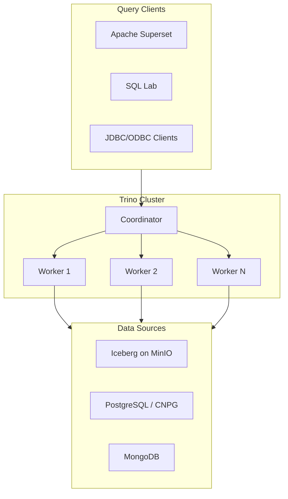

# Trino

Distributed SQL query engine for federated analytics.

**Status:** Accepted | **Updated:** 2026-02-09

---

## Overview

Trino is a massively parallel processing (MPP) SQL query engine designed to query data where it lives. Originally created as Presto at Facebook, Trino was forked to preserve open-source governance and has since become the leading engine for interactive analytics at scale. It connects to dozens of data sources through a connector architecture, enabling true federated queries across Iceberg tables, PostgreSQL, MongoDB, and more from a single SQL interface.

Within OpenOva, Trino serves as the unified query layer for the **Titan** data lakehouse product. It provides the SQL interface that Superset uses for dashboards and ad-hoc exploration, queries Iceberg tables stored on MinIO, and federates across operational databases when needed. Trino's ability to push predicates down to source systems and its advanced cost-based optimizer make it suitable for both interactive exploration and scheduled reporting workloads.

Trino's architecture separates coordinators from workers, enabling independent scaling of query planning and execution. Workers can be autoscaled with KEDA based on query queue depth, ensuring cost-efficient resource usage while maintaining low latency for interactive queries.

---

## Architecture



---

## Key Features

| Feature | Description |
|---------|-------------|
| Federated Queries | Join data across Iceberg, PostgreSQL, MongoDB in one SQL query |
| Cost-Based Optimizer | Advanced query planning with column statistics and histograms |
| Predicate Pushdown | Filters pushed to source systems for minimal data transfer |
| Dynamic Filtering | Runtime bloom filters reduce scan volumes by orders of magnitude |
| Fault-Tolerant Execution | Retry failed tasks without restarting entire queries |
| Spill to Disk | Handle queries larger than available memory |
| SQL Standard | Full ANSI SQL support with window functions, CTEs, arrays, maps |
| Connector Architecture | 40+ connectors for diverse data sources |

---

## Connectors

| Connector | Data Source | Use Case |
|-----------|------------|----------|
| `iceberg` | Iceberg tables on MinIO | Primary analytics warehouse |
| `postgresql` | CNPG clusters | Operational data federation |
| `mongodb` | MongoDB instances | Document data federation |
| `memory` | In-memory tables | Temporary staging |
| `system` | Trino internals | Query monitoring |

---

## Configuration

### Helm Values

```yaml
trino:
  coordinator:
    replicas: 1
    resources:
      requests:
        cpu: 2
        memory: 8Gi
      limits:
        cpu: 4
        memory: 16Gi
    config:
      query.max-memory: 50GB
      query.max-memory-per-node: 10GB
      query.max-total-memory-per-node: 12GB

  worker:
    replicas: 3
    autoscaling:
      enabled: true
      minReplicas: 2
      maxReplicas: 10
      targetCPUUtilizationPercentage: 70
    resources:
      requests:
        cpu: 4
        memory: 16Gi
      limits:
        cpu: 8
        memory: 32Gi

  catalogs:
    iceberg: |
      connector.name=iceberg
      iceberg.catalog.type=jdbc
      iceberg.jdbc-catalog.connection-url=jdbc:postgresql://titan-postgres.databases.svc:5432/iceberg_catalog
      iceberg.jdbc-catalog.connection-user=${PG_USER}
      iceberg.jdbc-catalog.connection-password=${PG_PASSWORD}
      iceberg.file-format=PARQUET
      iceberg.compression-codec=ZSTD
      hive.s3.endpoint=http://minio.storage.svc:9000
      hive.s3.aws-access-key=${MINIO_ACCESS_KEY}
      hive.s3.aws-secret-key=${MINIO_SECRET_KEY}
      hive.s3.path-style-access=true

    postgresql: |
      connector.name=postgresql
      connection-url=jdbc:postgresql://app-postgres.databases.svc:5432/app
      connection-user=${PG_USER}
      connection-password=${PG_PASSWORD}

    mongodb: |
      connector.name=mongodb
      mongodb.connection-url=mongodb://mongodb.databases.svc:27017
      mongodb.schema-collection=_schema
```

### KEDA Autoscaling

```yaml
apiVersion: keda.sh/v1alpha1
kind: ScaledObject
metadata:
  name: trino-worker-scaler
  namespace: data-lakehouse
spec:
  scaleTargetRef:
    name: trino-worker
  minReplicaCount: 2
  maxReplicaCount: 10
  triggers:
    - type: prometheus
      metadata:
        serverAddress: http://mimir.monitoring.svc:9090
        metricName: trino_queued_queries
        query: trino_queued_queries{cluster="titan"}
        threshold: "5"
```

---

## Federated Query Example

```sql
-- Join Iceberg analytics with live PostgreSQL data
SELECT
    e.event_type,
    u.email,
    u.plan_tier,
    COUNT(*) AS event_count
FROM iceberg.analytics.events e
JOIN postgresql.public.users u
    ON e.user_id = CAST(u.id AS VARCHAR)
WHERE e.created_at >= CURRENT_DATE - INTERVAL '7' DAY
GROUP BY e.event_type, u.email, u.plan_tier
ORDER BY event_count DESC
LIMIT 100;
```

---

## Resource Groups

Control query concurrency and resource allocation per user group.

```json
{
  "rootGroups": [
    {
      "name": "interactive",
      "maxQueued": 100,
      "hardConcurrencyLimit": 20,
      "schedulingWeight": 10,
      "jmxExport": true
    },
    {
      "name": "batch",
      "maxQueued": 500,
      "hardConcurrencyLimit": 5,
      "schedulingWeight": 1,
      "jmxExport": true
    }
  ],
  "selectors": [
    {
      "source": "superset",
      "group": "interactive"
    },
    {
      "source": ".*scheduled.*",
      "group": "batch"
    }
  ]
}
```

---

## Monitoring

| Metric | Description |
|--------|-------------|
| `trino_queued_queries` | Queries waiting for resources |
| `trino_running_queries` | Currently executing queries |
| `trino_blocked_queries` | Queries blocked on resources |
| `trino_query_execution_time_seconds` | Query execution duration |
| `trino_input_data_bytes` | Data scanned per query |
| `trino_output_data_bytes` | Data returned per query |
| `trino_worker_memory_pool_bytes` | Worker memory utilisation |

---

## Consequences

**Positive:**
- Single SQL interface across all data sources eliminates data copying
- Federated queries enable real-time joins between analytics and operational data
- Cost-based optimizer and predicate pushdown deliver interactive latency
- Horizontal scaling with KEDA provides elastic compute for variable workloads
- Open-source with strong community and no vendor lock-in
- ANSI SQL compliance minimises learning curve for analysts

**Negative:**
- Coordinator is a single point of failure (mitigated by fast restart and state recovery)
- Memory-intensive joins on large datasets may require spill-to-disk tuning
- Connector quality varies; Iceberg and PostgreSQL are mature, others less so
- Query performance depends heavily on Iceberg table maintenance (compaction, sorting)
- No built-in persistent storage; all results are ephemeral

---

*Part of [OpenOva Titan](https://openova.io) - Data Lakehouse*
