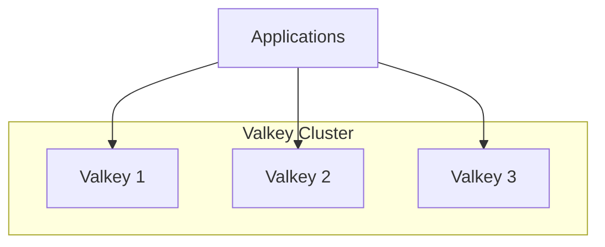
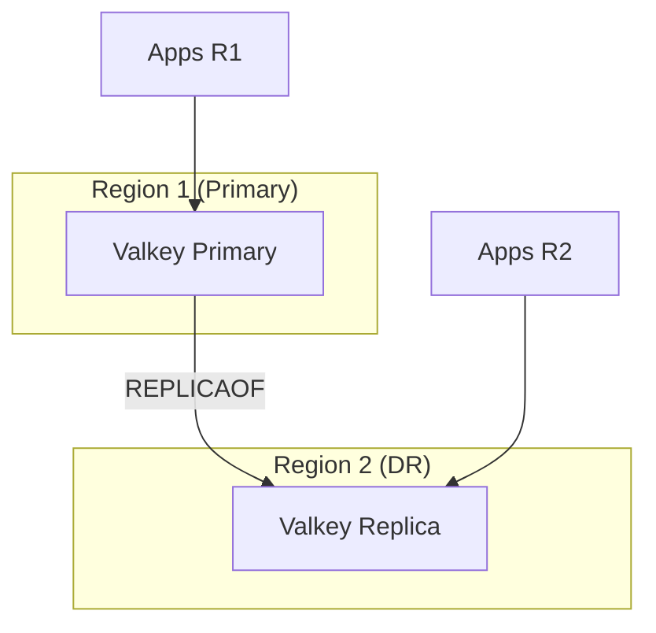

# Valkey

Redis-compatible in-memory cache for OpenOva platform.

**Status:** Accepted | **Updated:** 2026-01-18

---

## Overview

Valkey provides in-memory caching for sessions, rate limiting, and ephemeral data with multi-region replication support.

As an OSS support provider, OpenOva requires truly open-source components:
- **Redis OSS**: RSALv2 + SSPL license (since March 2024) - not open source
- **Dragonfly**: BSL 1.1 license - not open source
- **Valkey**: BSD-3 license - truly open source

---

## Why Valkey

| Factor | Valkey |
|--------|--------|
| **License** | BSD-3 (truly open source) |
| **Governance** | Linux Foundation |
| **Backing** | AWS, Google, Oracle, Ericsson, Snap |
| **Origin** | Fork of Redis 7.2.4 |
| **Compatibility** | 100% Redis API compatible |
| **DR Strategy** | REPLICAOF (same as Redis) |

---

## Architecture

### Single Region



### Multi-Region DR



---

## DR Strategy: REPLICAOF

Valkey supports Redis REPLICAOF for async replication:

```bash
# On DR region Valkey
REPLICAOF primary-valkey.region1.svc.cluster.local 6379

# Promote DR to primary (failover)
REPLICAOF NO ONE
```

| Aspect | Value |
|--------|-------|
| Replication | Asynchronous |
| Lag | Milliseconds to seconds |
| Consistency | Eventual |
| Failover | Manual promotion |

---

## Configuration

### Primary Region

```yaml
apiVersion: apps/v1
kind: StatefulSet
metadata:
  name: valkey
  namespace: databases
spec:
  replicas: 1
  template:
    spec:
      containers:
        - name: valkey
          image: valkey/valkey:8-alpine
          args:
            - --requirepass
            - $(VALKEY_PASSWORD)
            - --maxmemory
            - 2gb
          ports:
            - containerPort: 6379
          env:
            - name: VALKEY_PASSWORD
              valueFrom:
                secretKeyRef:
                  name: valkey-credentials
                  key: password
```

### DR Region (Replica)

```yaml
apiVersion: apps/v1
kind: StatefulSet
metadata:
  name: valkey
  namespace: databases
spec:
  replicas: 1
  template:
    spec:
      containers:
        - name: valkey
          image: valkey/valkey:8-alpine
          args:
            - --requirepass
            - $(VALKEY_PASSWORD)
            - --maxmemory
            - 2gb
            - --replicaof
            - valkey.region1.<domain>
            - "6379"
            - --masterauth
            - $(MASTER_PASSWORD)
```

---

## Use Cases

| Use Case | TTL | Eviction | DR Needed |
|----------|-----|----------|-----------|
| Session cache | 24h | LRU | Yes |
| Rate limiting | 1m | Fixed | No (local) |
| API cache | 5m | LRU | Optional |
| Feature flags | 1m | LRU | Yes |

---

## Monitoring

| Metric | Description |
|--------|-------------|
| `valkey_connected_replicas` | Number of connected replicas |
| `valkey_replication_lag` | Replication lag in bytes |
| `valkey_used_memory` | Memory usage |
| `valkey_commands_processed_total` | Total commands processed |

---

## Migration from Redis/Dragonfly

Valkey is a drop-in replacement:

1. **No application changes** - Same Redis protocol
2. **Same client libraries** - Redis clients work unchanged
3. **Same commands** - Full Redis command compatibility
4. **Same REPLICAOF** - Identical DR pattern

---

*Part of [OpenOva](https://openova.io)*
