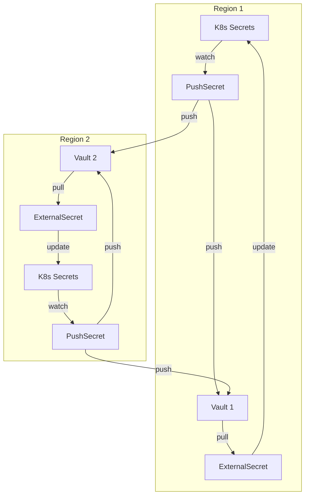

# Vault

HashiCorp Vault secrets backend for OpenOva platform.

**Status:** Accepted | **Updated:** 2026-01-26

---

## Overview

Vault provides centralized secrets management with:
- Secrets stored securely outside of Git
- Multi-region active-active deployments
- Integration with External Secrets Operator (ESO)
- Either region can update secrets
- Self-hosted per cluster

---

## Architecture

### Active-Active Bidirectional Sync

Both regions are identical and can independently update secrets. Updates propagate to both Vaults automatically.



**Key Design:**
- **Active-Active**: Both regions can update secrets independently
- **Bidirectional Push**: Each region's PushSecret pushes to **both** Vaults
- **Local Pull**: Each region's ExternalSecret pulls from its **local** Vault only
- **Last-Write-Wins**: Latest update overwrites all
- **Self-Stabilizing**: ESO skips updates when values are identical
- **No SOPS**: Secrets never stored in Git

---

## Deployment Options

| Option | Type | Notes |
|--------|------|-------|
| Vault Self-Hosted | Self-hosted | Full control, one per cluster |
| HCP Vault | Managed | HashiCorp Cloud Platform |
| AWS Secrets Manager | Managed | If AWS chosen |
| GCP Secret Manager | Managed | If GCP chosen |
| Azure Key Vault | Managed | If Azure chosen |

**Recommended:** Vault Self-Hosted for full control

---

## Configuration

### Vault Deployment (Helm)

```yaml
server:
  ha:
    enabled: true
    replicas: 3
    raft:
      enabled: true
      config: |
        storage "raft" {
          path = "/vault/data"
        }

  dataStorage:
    enabled: true
    size: 10Gi
    storageClass: <storage-class>

  ingress:
    enabled: true
    ingressClassName: cilium
    hosts:
      - host: vault.<domain>

injector:
  enabled: false  # Using ESO instead
```

### ClusterSecretStores

Each region needs two ClusterSecretStores - one for local Vault, one for remote Vault.

```yaml
# Local Vault (for ExternalSecret pulls)
apiVersion: external-secrets.io/v1beta1
kind: ClusterSecretStore
metadata:
  name: vault-local
spec:
  provider:
    vault:
      server: "https://vault.region1.<domain>"
      path: "secret"
      version: "v2"
      auth:
        kubernetes:
          mountPath: "kubernetes"
          role: "external-secrets"
---
# Remote Vault (for PushSecret)
apiVersion: external-secrets.io/v1beta1
kind: ClusterSecretStore
metadata:
  name: vault-remote
spec:
  provider:
    vault:
      server: "https://vault.region2.<domain>"
      path: "secret"
      version: "v2"
      auth:
        tokenSecretRef:
          name: vault-remote-token
          namespace: external-secrets
          key: token
```

### PushSecret (Bidirectional)

Pushes to **both** local and remote Vaults simultaneously.

```yaml
apiVersion: external-secrets.io/v1alpha1
kind: PushSecret
metadata:
  name: push-db-credentials
  namespace: databases
spec:
  refreshInterval: 1h
  secretStoreRefs:
    - name: vault-local
      kind: ClusterSecretStore
    - name: vault-remote
      kind: ClusterSecretStore
  selector:
    secret:
      name: db-credentials
  data:
    - match:
        secretKey: password
        remoteRef:
          remoteKey: databases/db-credentials
          property: password
```

### ExternalSecret (Local Pull)

Each region pulls from its **local** Vault only.

```yaml
apiVersion: external-secrets.io/v1beta1
kind: ExternalSecret
metadata:
  name: db-credentials
  namespace: databases
spec:
  refreshInterval: 1h
  secretStoreRef:
    name: vault-local
    kind: ClusterSecretStore
  target:
    name: db-credentials
    creationPolicy: Owner
  data:
    - secretKey: password
      remoteRef:
        key: databases/db-credentials
        property: password
```

---

## Bootstrap Procedure

1. Bootstrap wizard deploys Vault to both regions
2. Vault initialized with Kubernetes auth in each region
3. Operator saves unseal keys securely offline (per region)
4. Cross-region auth tokens created for remote Vault access
5. ESO configured with both local and remote ClusterSecretStores
6. Initial secrets created via K8s + PushSecrets

**No SOPS:** Credentials entered interactively during bootstrap, never stored in Git.

---

*Part of [OpenOva](https://openova.io)*
