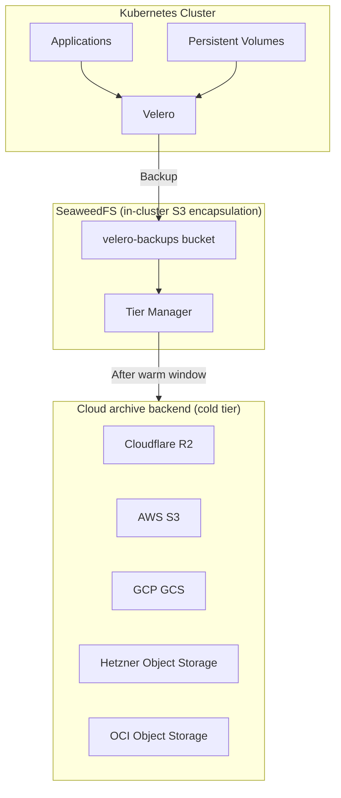
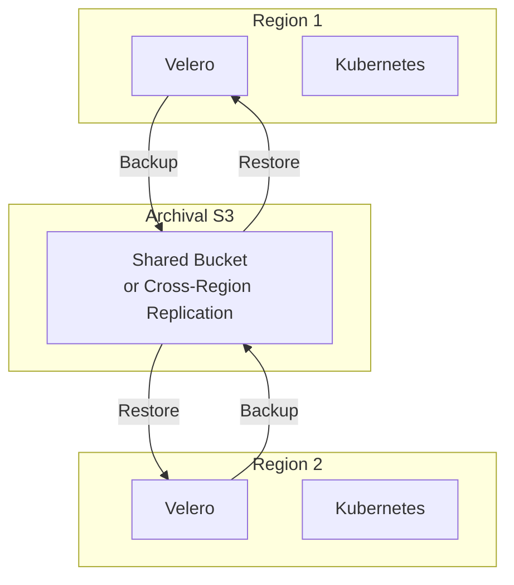
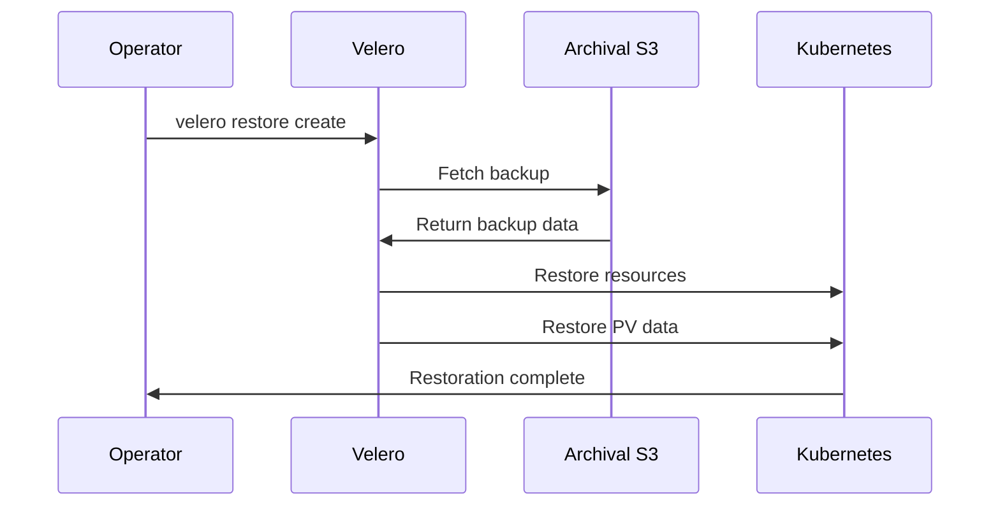

# Velero

Kubernetes backup/restore for disaster recovery. Per-host-cluster infrastructure (see [`docs/PLATFORM-TECH-STACK.md`](../../docs/PLATFORM-TECH-STACK.md) §3.5) — runs on every host cluster Catalyst manages. Backups land in the `velero-backups` bucket on **SeaweedFS**, which is Catalyst's unified S3 encapsulation layer; SeaweedFS's cold-tier policy automatically transitions backup objects to the configured cloud archival backend (Cloudflare R2 / AWS S3 / Hetzner Object Storage / etc.) so backups survive cluster failure without any direct cloud-S3 call from Velero itself.

**Status:** Accepted | **Updated:** 2026-04-28

---

## Overview

Velero provides Kubernetes-native backup. **All Velero output goes to the same single S3 endpoint** — `seaweedfs.storage.svc:8333`, bucket `velero-backups`. SeaweedFS handles the rest: hot-tier in-cluster for fast restore of recent backups; cold-tier in cloud archival storage for backups beyond the configured warm-window.



---

## Why route through SeaweedFS

| Property | Direct cloud-S3 calls | Through SeaweedFS encapsulation |
|---|---|---|
| Number of S3 endpoints in Catalyst components | N (one per consumer × cloud) | **1** (`seaweedfs.storage.svc:8333`) |
| Hot-restore latency for recent backups | Cloud round-trip | **Near-zero (in-cluster cache)** |
| Audit / lifecycle / encryption boundary | Per-component | **One central boundary** |
| Air-gap deployment | Requires direct cloud reachability | **Works with SeaweedFS-only mode** (see SRE §7) |

**Backups survive cluster failure** because SeaweedFS's cold tier is the cloud archival backend, not the in-cluster volumes. Even if the entire host cluster is destroyed, backups beyond the warm window already live in the cold backend (R2 / Glacier / etc.) and a restoring SeaweedFS can read them through.

---

## Storage Backend Options

| Provider | Availability | Egress Fees | Notes |
|----------|--------------|-------------|-------|
| **Cloud Provider Storage** | Default | Varies | Hetzner, OCI, Huawei OBS |
| Cloudflare R2 | Always available | **Free** | Zero egress, multi-cloud friendly |
| AWS S3 | Available | $0.09/GB | Full featured |
| GCP GCS | Available | $0.12/GB | Full featured |

**Default:** Cloud provider's object storage (Hetzner Object Storage, OCI Object Storage, etc.)

**Alternative:** Cloudflare R2 for zero egress fees, useful for multi-cloud or egress-heavy scenarios.

---

## Configuration

### Cloudflare R2 (Zero Egress)

```yaml
apiVersion: velero.io/v1
kind: BackupStorageLocation
metadata:
  name: r2-backup
  namespace: velero
spec:
  provider: aws
  bucket: <org>-backups
  config:
    region: auto
    s3ForcePathStyle: "true"
    s3Url: https://<account-id>.r2.cloudflarestorage.com
  credential:
    name: r2-credentials
    key: cloud
```

### AWS S3

```yaml
apiVersion: velero.io/v1
kind: BackupStorageLocation
metadata:
  name: s3-backup
  namespace: velero
spec:
  provider: aws
  bucket: <org>-backups
  config:
    region: us-east-1
  credential:
    name: aws-credentials
    key: cloud
```

### GCP GCS

```yaml
apiVersion: velero.io/v1
kind: BackupStorageLocation
metadata:
  name: gcs-backup
  namespace: velero
spec:
  provider: gcp
  bucket: <org>-backups
  credential:
    name: gcp-credentials
    key: cloud
```

---

## Backup Schedule

```yaml
apiVersion: velero.io/v1
kind: Schedule
metadata:
  name: daily-backup
  namespace: velero
spec:
  schedule: "0 2 * * *"  # Daily at 2 AM
  template:
    includedNamespaces:
      - "*"
    excludedNamespaces:
      - velero
      - kube-system
    includedResources:
      - "*"
    excludedResources:
      - events
      - events.events.k8s.io
    storageLocation: r2-backup
    ttl: 720h  # 30 days
```

### Backup Strategy

| Resource | Schedule | Retention |
|----------|----------|-----------|
| All namespaces | Daily 2 AM | 30 days |
| Databases (labels) | Hourly | 7 days |
| Secrets | Daily | 90 days |
| PVs (snapshots) | Daily | 14 days |

---

## Multi-Region Backup



Both regions can:
- Backup to same bucket (different prefixes)
- Restore from either region's backups
- Use for cross-region disaster recovery

---

## Restore Procedure



### Commands

```bash
# List available backups
velero backup get

# Restore entire backup
velero restore create --from-backup daily-backup-20260116

# Restore specific namespace
velero restore create --from-backup daily-backup-20260116 \
  --include-namespaces databases

# Restore to different namespace
velero restore create --from-backup daily-backup-20260116 \
  --include-namespaces databases \
  --namespace-mappings databases:databases-restored
```

---

## Operations

### Check Backup Status

```bash
# List backups
velero backup get

# Describe specific backup
velero backup describe daily-backup-20260116

# Check backup logs
velero backup logs daily-backup-20260116
```

### Verify Backup Location

```bash
# Check backup storage locations
velero backup-location get

# Verify connection
velero backup-location check r2-backup
```

### Manual Backup

```bash
# Create manual backup
velero backup create manual-backup-$(date +%Y%m%d)

# Backup specific namespace
velero backup create db-backup-$(date +%Y%m%d) \
  --include-namespaces databases
```

---

## Consequences

**Positive:**
- K8s-native backup
- Flexible storage backends
- Zero egress with Cloudflare R2
- Cross-region restore capability
- Incremental backups

**Negative:**
- Requires external S3 (by design)
- PV backup requires CSI snapshots
- Large restores take time

---

*Part of [OpenOva](https://openova.io)*
