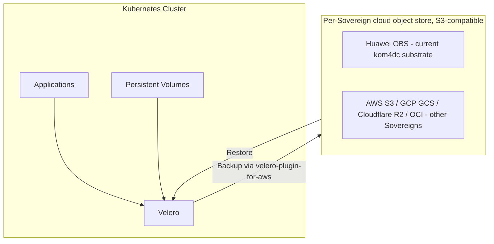
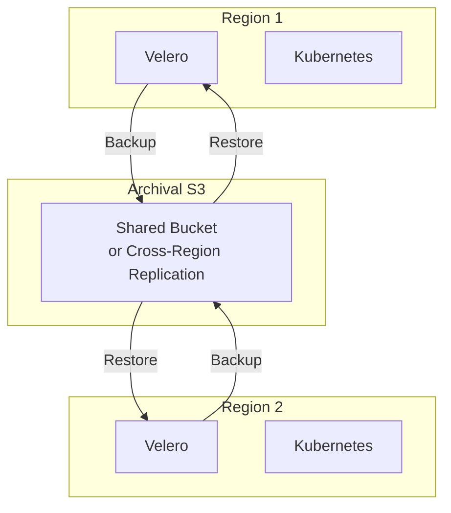
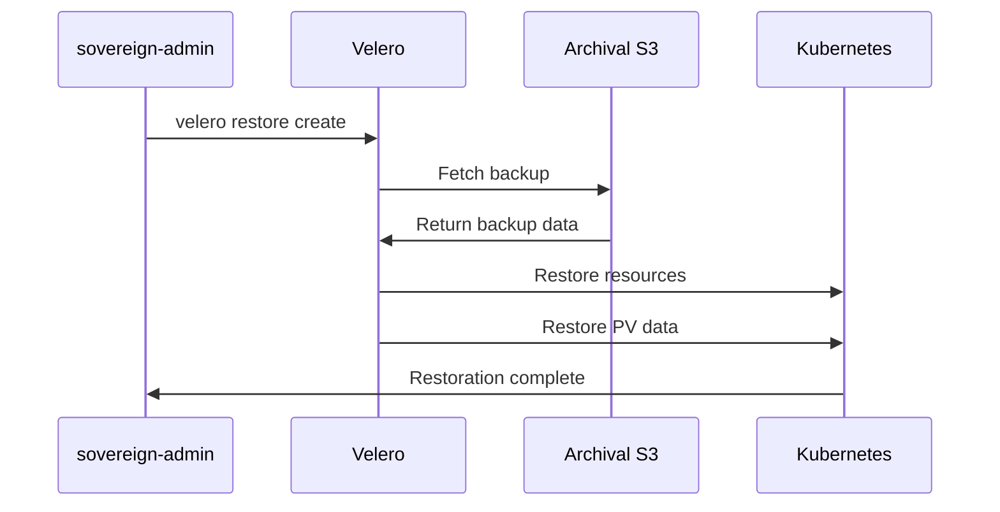

# Velero

Kubernetes backup/restore for disaster recovery. Per-host-cluster infrastructure (see [`docs/ARCHITECTURE.md`](../../docs/ARCHITECTURE.md) §3.5) — runs on every host cluster Catalyst manages. Backups land **directly** in the per-Sovereign cloud object store (Huawei OBS on the current kom4dc substrate; any S3-compatible backend on other Sovereigns) via `velero-plugin-for-aws`, wired from the canonical `flux-system/object-storage` Secret. S3-aware apps like Velero write straight to the cloud-provider's native S3 endpoint — SeaweedFS is **NOT** in the Velero backup path (it is reserved as a POSIX→S3 buffer for legacy POSIX-only writers). Because backups live in the cloud object store, they survive total loss of the host cluster.

**Status:** Accepted | **Updated:** 2026-04-28

---

## Overview

Velero provides Kubernetes-native backup. **All Velero output goes directly to the per-Sovereign cloud object store** via `velero-plugin-for-aws` — on the current Huawei kom4dc substrate that is Huawei OBS; a future AWS / Azure / GCP / OCI Sovereign uses the same Secret seam and chart-values shape (vendor-agnostic since #425). The `provider` / `bucket` / `region` / `s3Url` fields are populated by the per-Sovereign HelmRelease from the `flux-system/object-storage` Secret, so nothing is hardcoded in the Blueprint.


```mermaid
flowchart TB
    subgraph K8s["Kubernetes Cluster"]
        Velero[Velero]
        Apps[Applications]
        PVs[Persistent Volumes]
    end

    subgraph Cloud["Per-Sovereign cloud object store, S3-compatible"]
        OBS[Huawei OBS - current kom4dc substrate]
        Other[AWS S3 / GCP GCS / Cloudflare R2 / OCI - other Sovereigns]
    end

    Apps --> Velero
    PVs --> Velero
    Velero -->|"Backup via velero-plugin-for-aws"| Cloud
    Cloud -->|"Restore"| Velero
```

---

## Why write direct to cloud S3

Velero speaks S3 natively through `velero-plugin-for-aws`, so it writes straight to the per-Sovereign cloud object store — there is **no** in-cluster proxy in the backup path. SeaweedFS is **not** used here; it is reserved as a POSIX→S3 buffer for legacy POSIX-only writers and is not in the minimal Sovereign set.

| Property | Detail |
|---|---|
| Backup endpoint | Per-Sovereign cloud object store (Huawei OBS on kom4dc; any S3-compatible backend elsewhere) |
| Plugin | `velero-plugin-for-aws` (every supported cloud's native object store speaks the S3 API) |
| Credential seam | `flux-system/object-storage` Secret, wired via Flux `valuesFrom` (vendor-agnostic since #425) |
| Survives cluster loss | Yes — backups live in the cloud object store, not in-cluster volumes |

---

## Storage Backend Options

| Provider | Availability | Egress Fees | Notes |
|----------|--------------|-------------|-------|
| **Cloud Provider Storage** | Default | Varies | Huawei OBS (current kom4dc substrate), OCI; Hetzner (legacy) |
| Cloudflare R2 | Always available | **Free** | Zero egress, multi-cloud friendly |
| AWS S3 | Available | $0.09/GB | Full featured |
| GCP GCS | Available | $0.12/GB | Full featured |

**Default:** The per-Sovereign cloud provider's object storage — Huawei OBS on the current kom4dc substrate (Hetzner Object Storage / OCI Object Storage are legacy/optional).

**Alternative:** Cloudflare R2 for zero egress fees, useful for multi-cloud or egress-heavy scenarios.

---

## Configuration

### Cloudflare R2 (Zero Egress)

```yaml
apiVersion: velero.io/v1
kind: BackupStorageLocation
metadata:
  name: r2-backup
  namespace: velero
spec:
  provider: aws
  bucket: <org>-backups
  config:
    region: auto
    s3ForcePathStyle: "true"
    s3Url: https://<account-id>.r2.cloudflarestorage.com
  credential:
    name: r2-credentials
    key: cloud
```

### AWS S3

```yaml
apiVersion: velero.io/v1
kind: BackupStorageLocation
metadata:
  name: s3-backup
  namespace: velero
spec:
  provider: aws
  bucket: <org>-backups
  config:
    region: us-east-1
  credential:
    name: aws-credentials
    key: cloud
```

### GCP GCS

```yaml
apiVersion: velero.io/v1
kind: BackupStorageLocation
metadata:
  name: gcs-backup
  namespace: velero
spec:
  provider: gcp
  bucket: <org>-backups
  credential:
    name: gcp-credentials
    key: cloud
```

---

## Backup Schedule

```yaml
apiVersion: velero.io/v1
kind: Schedule
metadata:
  name: daily-backup
  namespace: velero
spec:
  schedule: "0 2 * * *"  # Daily at 2 AM
  template:
    includedNamespaces:
      - "*"
    excludedNamespaces:
      - velero
      - kube-system
    includedResources:
      - "*"
    excludedResources:
      - events
      - events.events.k8s.io
    storageLocation: r2-backup
    ttl: 720h  # 30 days
```

### Backup Strategy

| Resource | Schedule | Retention |
|----------|----------|-----------|
| All namespaces | Daily 2 AM | 30 days |
| Databases (labels) | Hourly | 7 days |
| Secrets | Daily | 90 days |
| PVs (snapshots) | Daily | 14 days |

---

## Multi-Region Backup


```mermaid
flowchart TB
    subgraph Region1["Region 1"]
        V1[Velero]
        K1[Kubernetes]
    end

    subgraph Region2["Region 2"]
        V2[Velero]
        K2[Kubernetes]
    end

    subgraph Archival["Archival S3"]
        Bucket[Shared Bucket<br/>or Cross-Region Replication]
    end

    V1 -->|"Backup"| Bucket
    V2 -->|"Backup"| Bucket
    Bucket -->|"Restore"| V1
    Bucket -->|"Restore"| V2
```

Both regions can:
- Backup to same bucket (different prefixes)
- Restore from either region's backups
- Use for cross-region disaster recovery

---

## Restore Procedure


```mermaid
sequenceDiagram
    participant Op as sovereign-admin
    participant Velero as Velero
    participant S3 as Archival S3
    participant K8s as Kubernetes

    Op->>Velero: velero restore create
    Velero->>S3: Fetch backup
    S3->>Velero: Return backup data
    Velero->>K8s: Restore resources
    Velero->>K8s: Restore PV data
    K8s->>Op: Restoration complete
```

### Commands

```bash
# List available backups
velero backup get

# Restore entire backup
velero restore create --from-backup daily-backup-20260116

# Restore specific namespace
velero restore create --from-backup daily-backup-20260116 \
  --include-namespaces databases

# Restore to different namespace
velero restore create --from-backup daily-backup-20260116 \
  --include-namespaces databases \
  --namespace-mappings databases:databases-restored
```

---

## Operations

### Check Backup Status

```bash
# List backups
velero backup get

# Describe specific backup
velero backup describe daily-backup-20260116

# Check backup logs
velero backup logs daily-backup-20260116
```

### Verify Backup Location

```bash
# Check backup storage locations
velero backup-location get

# Verify connection
velero backup-location check r2-backup
```

### Manual Backup

```bash
# Create manual backup
velero backup create manual-backup-$(date +%Y%m%d)

# Backup specific namespace
velero backup create db-backup-$(date +%Y%m%d) \
  --include-namespaces databases
```

---

## Consequences

**Positive:**
- K8s-native backup
- Flexible storage backends
- Zero egress with Cloudflare R2
- Cross-region restore capability
- Incremental backups

**Negative:**
- Requires external S3 (by design)
- PV backup requires CSI snapshots
- Large restores take time

---

*Part of [OpenOva](https://openova.io)*
