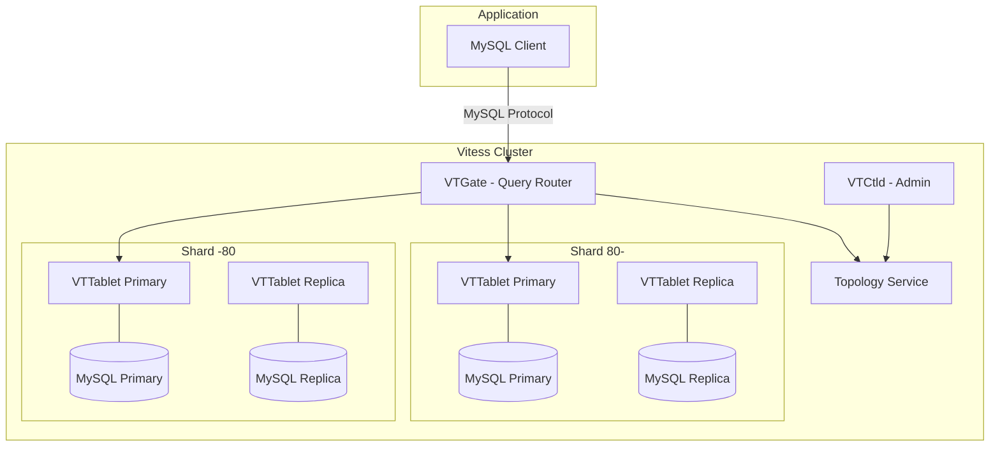
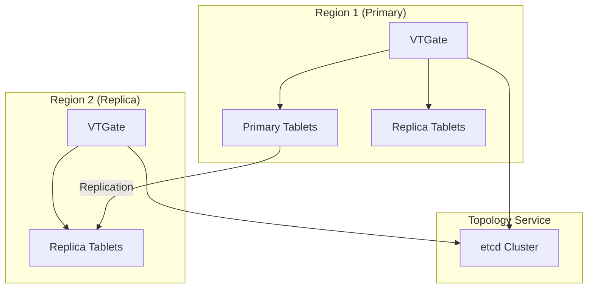
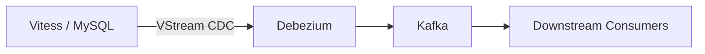

# Vitess

MySQL-compatible horizontal scaling and sharding for Kubernetes.

**Status:** Accepted | **Updated:** 2026-02-09

---

## Overview

Vitess is a CNCF Graduated database orchestration system for horizontal scaling of MySQL. Licensed under the Apache License 2.0, Vitess was originally developed at YouTube to solve MySQL scaling challenges and is now used in production by Slack, GitHub, HubSpot, and many other organizations at scale. PlanetScaleDB is the commercial offering built on Vitess.

In the OpenOva platform, Vitess is offered as an a la carte component for workloads that require MySQL compatibility with horizontal sharding transparent to the application. While CNPG (PostgreSQL) is the primary relational database for the platform, many enterprise applications are built on MySQL and migrating to PostgreSQL is not always feasible. Vitess allows these workloads to run on Kubernetes with automatic sharding, online DDL, and connection pooling without application changes.

Vitess sits between the application and MySQL, presenting a MySQL wire-protocol interface. Applications connect to VTGate (the Vitess proxy) as though it were a standard MySQL server, while Vitess transparently routes queries across shards managed by VTTablet processes running alongside MySQL instances.

---

## Architecture

### Vitess Components



### Multi-Region



---

## Why Vitess?

| Factor | Vitess | CNPG (PostgreSQL) | Plain MySQL |
|--------|--------|-------------------|-------------|
| Horizontal sharding | Transparent, automatic | Not built-in (Citus extension) | Manual |
| Wire protocol | MySQL | PostgreSQL | MySQL |
| Online DDL | Built-in (gh-ost style) | Requires pg_repack | Requires pt-osc |
| Connection pooling | Built-in (VTGate) | PgBouncer | ProxySQL |
| CNCF status | Graduated | N/A | N/A |
| Kubernetes-native | Vitess Operator | CNPG Operator | Manual |
| Multi-shard queries | Scatter-gather | N/A | N/A |
| License | Apache 2.0 | Apache 2.0 | GPL 2.0 |

**Decision:** Use Vitess for MySQL workloads that require horizontal scaling. Use CNPG for PostgreSQL workloads. Do not use plain MySQL on Kubernetes.

---

## Key Features

| Feature | Description |
|---------|-------------|
| Transparent Sharding | Applications connect via MySQL protocol without shard awareness |
| VSchema | Declarative sharding scheme with vindexes for key distribution |
| Online DDL | Non-blocking schema migrations on live databases |
| Connection Pooling | VTGate multiplexes thousands of app connections to fewer MySQL connections |
| Query Routing | Automatic routing of queries to the correct shard(s) |
| Resharding | Online shard splitting and merging without downtime |
| Backup/Restore | Automated backups to MinIO/S3 with point-in-time recovery |
| Topology Service | etcd-backed cluster metadata and service discovery |
| VReplication | Built-in change stream processing for materialized views and CDC |
| MoveTables | Online migration of tables between keyspaces |

---

## Configuration

### Vitess Cluster (Vitess Operator)

```yaml
apiVersion: planetscale.com/v2
kind: VitessCluster
metadata:
  name: vitess
  namespace: databases
spec:
  images:
    vtgate: vitess/lite:19.0
    vttablet: vitess/lite:19.0
    vtctld: vitess/lite:19.0
    mysqld:
      mysql80Compatible: vitess/lite:19.0
  cells:
    - name: zone1
      gateway:
        replicas: 2
        resources:
          requests:
            cpu: 500m
            memory: 512Mi
          limits:
            cpu: 2
            memory: 2Gi
  keyspaces:
    - name: commerce
      turndownPolicy: Immediate
      partitionings:
        - equal:
            parts: 2
            shardTemplate:
              databaseInitScriptSecret:
                name: vitess-init-script
                key: init.sql
              tabletPools:
                - cell: zone1
                  type: replica
                  replicas: 2
                  mysqld:
                    resources:
                      requests:
                        cpu: 500m
                        memory: 1Gi
                      limits:
                        cpu: 2
                        memory: 4Gi
                  dataVolumeClaimTemplate:
                    storageClassName: <storage-class>
                    accessModes:
                      - ReadWriteOnce
                    resources:
                      requests:
                        storage: 100Gi
  updateStrategy:
    type: Immediate
```

### VSchema (Sharding Configuration)

```yaml
apiVersion: planetscale.com/v2
kind: VitessKeyspace
metadata:
  name: commerce
  namespace: databases
spec:
  name: commerce
  vschema: |
    {
      "sharded": true,
      "vindexes": {
        "hash": {
          "type": "hash"
        }
      },
      "tables": {
        "orders": {
          "column_vindexes": [
            {
              "column": "customer_id",
              "name": "hash"
            }
          ]
        },
        "customers": {
          "column_vindexes": [
            {
              "column": "id",
              "name": "hash"
            }
          ]
        }
      }
    }
```

### Backup Configuration

```yaml
apiVersion: planetscale.com/v2
kind: VitessBackupStorage
metadata:
  name: vitess-backup
  namespace: databases
spec:
  location:
    s3:
      bucket: vitess-backups
      endpoint: http://minio.storage.svc:9000
      region: us-east-1
      authSecret:
        name: minio-credentials
        key: access-key
      forcePathStyle: true
```

---

## Monitoring

| Metric | Description |
|--------|-------------|
| `vtgate_queries_total` | Total queries processed by VTGate |
| `vtgate_error_count` | Query errors by error code |
| `vttablet_query_latency_seconds` | Tablet-level query latency |
| `vttablet_queries_in_flight` | Currently executing queries |
| `mysql_global_status_threads_connected` | MySQL connection count |
| `vitess_replication_lag_seconds` | Replication lag per tablet |

---

## Debezium Integration

Vitess supports CDC via Debezium for change data capture:



Vitess provides VStream, a native change stream API. Debezium's Vitess connector reads VStream events and publishes them to Kafka topics.

---

## Consequences

**Positive:**
- CNCF Graduated with proven production use at massive scale (YouTube, Slack, GitHub)
- Transparent horizontal sharding without application changes
- Online DDL eliminates maintenance windows for schema changes
- Built-in connection pooling reduces MySQL connection overhead
- Native Kubernetes operator for lifecycle management

**Negative:**
- Adds operational complexity compared to single-instance MySQL
- Some MySQL features are restricted in sharded mode (cross-shard foreign keys)
- Requires understanding of VSchema and vindexes for optimal shard distribution
- Topology service (etcd) adds an additional stateful dependency
- Not a replacement for PostgreSQL workloads (use CNPG instead)

---

*Part of [OpenOva](https://openova.io)*
