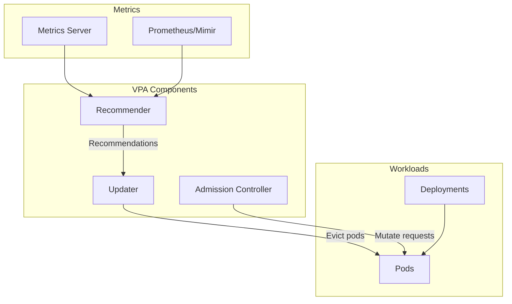
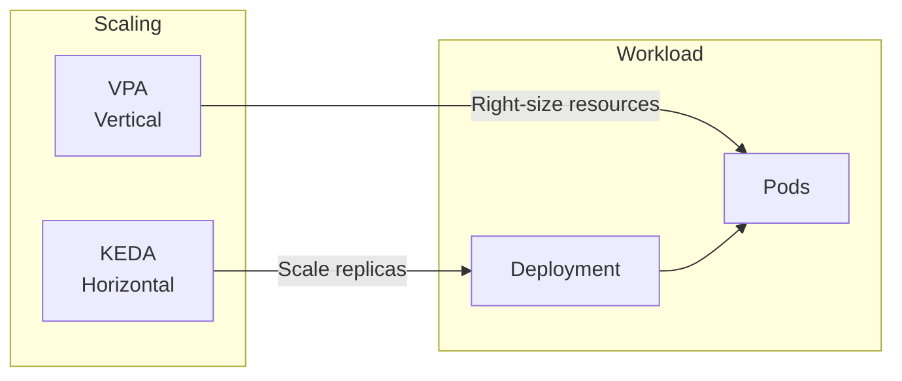

# Vertical Pod Autoscaler (VPA)

Automated resource right-sizing for OpenOva platform.

**Status:** Accepted | **Updated:** 2026-01-16

---

## Overview

VPA provides automated resource optimization:
- Reduces over-provisioning waste
- Prevents under-provisioning issues
- Works alongside horizontal scaling (KEDA)
- Provides recommendations even if not auto-applying

---

## Architecture



---

## Update Modes

| Mode | Behavior | Use Case |
|------|----------|----------|
| `Off` | Recommendations only | Analysis, not auto-apply |
| `Initial` | Apply on pod creation | Batch jobs |
| `Auto` | Evict and recreate | Long-running services |
| `Recreate` | Same as Auto | Legacy compatibility |

**Recommended:** `Auto` for most workloads

---

## Configuration

### VPA Resource

```yaml
apiVersion: autoscaling.k8s.io/v1
kind: VerticalPodAutoscaler
metadata:
  name: <tenant>-app-vpa
  namespace: <tenant>
spec:
  targetRef:
    apiVersion: apps/v1
    kind: Deployment
    name: <tenant>-app
  updatePolicy:
    updateMode: Auto
  resourcePolicy:
    containerPolicies:
      - containerName: "*"
        minAllowed:
          cpu: 50m
          memory: 64Mi
        maxAllowed:
          cpu: 2
          memory: 4Gi
        controlledResources:
          - cpu
          - memory
        controlledValues: RequestsAndLimits
```

### Kyverno Auto-Generation

Kyverno automatically generates VPAs for deployments:

```yaml
apiVersion: kyverno.io/v1
kind: ClusterPolicy
metadata:
  name: generate-vpa
spec:
  rules:
    - name: generate-vpa-for-deployment
      match:
        any:
          - resources:
              kinds:
                - Deployment
      exclude:
        any:
          - resources:
              annotations:
                vpa.openova.io/skip: "true"
      generate:
        apiVersion: autoscaling.k8s.io/v1
        kind: VerticalPodAutoscaler
        name: "{{request.object.metadata.name}}-vpa"
        namespace: "{{request.object.metadata.namespace}}"
        data:
          spec:
            targetRef:
              apiVersion: apps/v1
              kind: Deployment
              name: "{{request.object.metadata.name}}"
            updatePolicy:
              updateMode: Auto
```

---

## VPA + KEDA Interaction



**Coordination:**
- VPA handles CPU/memory per pod
- KEDA handles replica count
- Combined: optimal resource utilization

---

## Monitoring

| Metric | Description |
|--------|-------------|
| `vpa_recommender_*` | Recommender metrics |
| `vpa_updater_*` | Updater metrics |
| `container_resource_recommendations` | Per-container recommendations |

### Dashboard

Grafana dashboard shows:
- Current vs recommended resources
- Historical recommendations
- Eviction events
- Cost savings estimates

---

*Part of [OpenOva](https://openova.io)*
