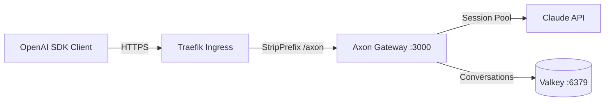

# OpenOva Axon

OpenAI-compatible API gateway backed by Claude. Drop-in replacement for any OpenAI SDK client.

**Base URL:** `https://api.openova.io/axon/v1`

---

## Quick Start

```bash
curl https://api.openova.io/axon/v1/chat/completions \
  -H "Authorization: Bearer YOUR_API_KEY" \
  -H "Content-Type: application/json" \
  -d '{
    "model": "claude-sonnet-4-6",
    "messages": [{"role": "user", "content": "Hello!"}]
  }'
```

## SDK Integration

### Python

```bash
pip install openai
```

```python
from openai import OpenAI

client = OpenAI(
    base_url="https://api.openova.io/axon/v1",
    api_key="YOUR_API_KEY",
)

response = client.chat.completions.create(
    model="claude-sonnet-4-6",
    messages=[{"role": "user", "content": "Hello!"}],
)
print(response.choices[0].message.content)
```

### Node.js

```bash
npm install openai
```

```typescript
import OpenAI from "openai";

const client = new OpenAI({
  baseURL: "https://api.openova.io/axon/v1",
  apiKey: "YOUR_API_KEY",
});

const response = await client.chat.completions.create({
  model: "claude-sonnet-4-6",
  messages: [{ role: "user", content: "Hello!" }],
});
console.log(response.choices[0].message.content);
```

### Environment Variables

Works with any tool that reads `OPENAI_BASE_URL` and `OPENAI_API_KEY`:

```bash
export OPENAI_BASE_URL="https://api.openova.io/axon/v1"
export OPENAI_API_KEY="YOUR_API_KEY"
```

---

## Models

| Model ID | Alias (OpenAI) | Description |
|----------|----------------|-------------|
| `claude-opus-4-6` | `gpt-4` | Most capable |
| `claude-sonnet-4-6` | `gpt-4o`, `gpt-4-turbo` | Balanced speed and quality (default) |
| `claude-haiku-4-5` | `gpt-3.5-turbo`, `gpt-4o-mini` | Fastest |

OpenAI model names are automatically mapped to their Claude equivalents.

```bash
# List available models
curl https://api.openova.io/axon/v1/models \
  -H "Authorization: Bearer YOUR_API_KEY"
```

---

## API Reference

### `POST /v1/chat/completions`

OpenAI-compatible chat completion endpoint.

**Request:**

```json
{
  "model": "claude-sonnet-4-6",
  "messages": [
    {"role": "system", "content": "You are a helpful assistant."},
    {"role": "user", "content": "What is Kubernetes?"}
  ],
  "stream": false,
  "temperature": 0.7,
  "max_tokens": 1024
}
```

**Response:**

```json
{
  "id": "chatcmpl-...",
  "object": "chat.completion",
  "model": "claude-sonnet-4-6",
  "choices": [{
    "index": 0,
    "message": {"role": "assistant", "content": "..."},
    "finish_reason": "stop"
  }],
  "usage": {"prompt_tokens": 0, "completion_tokens": 0, "total_tokens": 0},
  "conversation_id": "conv-..."
}
```

### Streaming

Set `"stream": true` to receive Server-Sent Events:

```bash
curl -N https://api.openova.io/axon/v1/chat/completions \
  -H "Authorization: Bearer YOUR_API_KEY" \
  -H "Content-Type: application/json" \
  -d '{
    "model": "claude-sonnet-4-6",
    "stream": true,
    "messages": [{"role": "user", "content": "Count to 5."}]
  }'
```

### Conversations

Every response includes a `conversation_id`. Pass it back to continue the conversation:

```bash
# Start a conversation
CONV_ID=$(curl -s https://api.openova.io/axon/v1/chat/completions \
  -H "Authorization: Bearer YOUR_API_KEY" \
  -H "Content-Type: application/json" \
  -d '{"model":"claude-sonnet-4-6","messages":[{"role":"user","content":"Remember: the answer is 42."}]}' \
  | jq -r '.conversation_id')

# Continue it
curl https://api.openova.io/axon/v1/chat/completions \
  -H "Authorization: Bearer YOUR_API_KEY" \
  -H "Content-Type: application/json" \
  -d "{\"model\":\"claude-sonnet-4-6\",\"conversation_id\":\"$CONV_ID\",\"messages\":[{\"role\":\"user\",\"content\":\"What is the answer?\"}]}"
```

### `GET /v1/models`

List available models. Requires authentication.

### `GET /health`

Health check. No authentication required. Returns `{"status": "ok"}`.

### `GET /stats`

Pool and conversation metrics. No authentication required.

---

## Supported Parameters

| Parameter | Type | Description |
|-----------|------|-------------|
| `model` | string | Model ID or OpenAI alias |
| `messages` | array | Chat messages (`role` + `content`) |
| `stream` | boolean | Enable SSE streaming (default: `false`) |
| `temperature` | number | Sampling temperature |
| `max_tokens` | number | Maximum response length |
| `top_p` | number | Nucleus sampling |
| `stop` | string/array | Stop sequences |
| `conversation_id` | string | Continue an existing conversation |
| `response_format` | object | `{"type": "json_object"}` for JSON output |
| `stream_options` | object | `{"include_usage": true}` for usage in stream |

---

## Authentication

All `/v1/*` endpoints require a Bearer token:

```
Authorization: Bearer YOUR_API_KEY
```

Unauthenticated requests return `401`.

---

## Architecture



Axon maintains a pre-warmed pool of Claude Agent SDK sessions for low-latency responses. Conversations are stored in Valkey with a 7-day TTL.

---

## Self-Hosting

Axon ships as a Helm chart at `products/axon/chart/`. See [chart/values.yaml](chart/values.yaml) for configuration.

```bash
# Requires: Claude subscription credentials, K8s cluster with Traefik
helm install axon ./products/axon/chart \
  --namespace axon --create-namespace \
  --set image.tag=latest \
  --set ingress.host=your-domain.com
```

Required secrets:
- `axon-secrets` — `AXON_API_KEYS` (comma-separated bearer tokens)
- `axon-claude-auth` — `.credentials.json` from a Claude subscription
- `ghcr-pull-secret` — Docker registry credentials for GHCR

---

*Part of [OpenOva](https://openova.io)*
