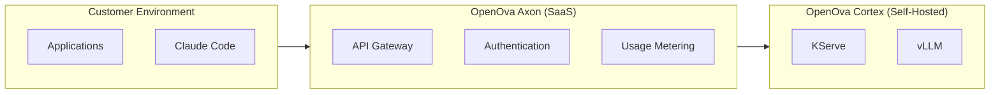

# OpenOva Axon

SaaS LLM inference gateway connecting to OpenOva Cortex.

**Status:** Accepted | **Updated:** 2026-02-26

---

## Overview

OpenOva Axon is a hosted inference gateway that provides managed access to LLM capabilities. It acts as the neural link between customer applications and OpenOva Cortex (self-hosted AI Hub), offering subscription-based LLM access without requiring customers to deploy their own GPU infrastructure.



---

## Key Features

- OpenAI-compatible API endpoint
- Subscription-based access with usage metering
- Automatic routing to optimal model instances
- Rate limiting and quota management
- Claude Code integration via ANTHROPIC_BASE_URL

## Relationship to Cortex

| Aspect | Cortex | Axon |
|--------|--------|------|
| Deployment | Self-hosted (customer cluster) | SaaS (OpenOva hosted) |
| GPU | Customer provides | OpenOva provides |
| Use case | Full AI platform | LLM inference only |
| Control | Full customization | Managed service |

## Usage

```bash
# Configure Claude Code with Axon
export ANTHROPIC_BASE_URL="https://axon.openova.io/v1"
export ANTHROPIC_API_KEY="your-subscription-token"

# Use Claude Code normally
claude "Explain this code..."
```

---

## Deployment

Axon is a SaaS service operated by OpenOva. No customer deployment required.

For self-hosted inference, deploy [OpenOva Cortex](../cortex/) instead.

---

*Part of [OpenOva](https://openova.io)*
