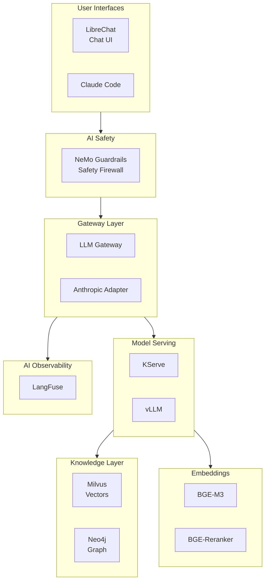

# OpenOva Cortex

Enterprise AI platform with LLM serving, RAG, AI safety, and LLM observability.

**Status:** Accepted | **Updated:** 2026-02-26

---

## Overview

OpenOva Cortex is an enterprise AI product that bundles AI/ML infrastructure components with AI safety and observability for enterprise AI deployments.


```mermaid
flowchart TB
    subgraph UI["User Interfaces"]
        LibreChat[LibreChat<br/>Chat UI]
        ClaudeCode[Claude Code]
    end

    subgraph Safety["AI Safety"]
        Guardrails[NeMo Guardrails<br/>Safety Firewall]
    end

    subgraph Gateway["Gateway Layer"]
        LLMGateway[LLM Gateway]
        Adapter[Anthropic Adapter]
    end

    subgraph Serving["Model Serving"]
        KServe[KServe]
        vLLM[vLLM]
    end

    subgraph Knowledge["Knowledge Layer"]
        Milvus[Milvus<br/>Vectors]
        Neo4j[Neo4j<br/>Graph]
    end

    subgraph Embeddings["Embeddings"]
        BGE[BGE-M3]
        Reranker[BGE-Reranker]
    end

    subgraph Observability["AI Observability"]
        LangFuse[LangFuse]
    end

    UI --> Safety
    Safety --> Gateway
    Gateway --> Serving
    Serving --> Knowledge
    Serving --> Embeddings
    Gateway --> Observability
```

---

## Components

All components are in `platform/` (flat structure):

| Component | Purpose | Location |
|-----------|---------|----------|
| [llm-gateway](../../platform/llm-gateway/) | Subscription-based LLM access | platform/llm-gateway |
| [anthropic-adapter](../../platform/anthropic-adapter/) | Claude API translation | platform/anthropic-adapter |
| [knative](../../platform/knative/) | Serverless platform | platform/knative |
| [kserve](../../platform/kserve/) | Model serving | platform/kserve |
| [vllm](../../platform/vllm/) | LLM inference | platform/vllm |
| [milvus](../../platform/milvus/) | Vector database | platform/milvus |
| [neo4j](../../platform/neo4j/) | Graph database | platform/neo4j |
| [librechat](../../platform/librechat/) | Chat UI | platform/librechat |
| [bge](../../platform/bge/) | Embeddings + reranking | platform/bge |
| [nemo-guardrails](../../platform/nemo-guardrails/) | AI safety firewall | platform/nemo-guardrails |
| [langfuse](../../platform/langfuse/) | LLM observability | platform/langfuse |

---

## Architecture

```
┌─────────────────────────────────────────────────────────────┐
│                     User Interfaces                         │
│  ┌──────────┐  ┌──────────┐  ┌──────────┐                  │
│  │LibreChat │  │Claude    │  │  Custom  │                  │
│  │  (Chat)  │  │  Code    │  │   Apps   │                  │
│  └────┬─────┘  └────┬─────┘  └────┬─────┘                  │
└───────┼─────────────┼─────────────┼─────────────────────────┘
        │             │             │
        ▼             ▼             ▼
┌─────────────────────────────────────────────────────────────┐
│                    AI Safety Layer                           │
│  ┌─────────────────────────────────────────────────────┐    │
│  │           NeMo Guardrails                           │    │
│  │  (Prompt injection, PII filter, topic control)      │    │
│  └──────────────────────┬──────────────────────────────┘    │
└─────────────────────────┼───────────────────────────────────┘
                          │
                          ▼
┌─────────────────────────────────────────────────────────────┐
│                    Gateway Layer                            │
│  ┌─────────────────────┐  ┌─────────────────────┐          │
│  │    LLM Gateway      │  │  Anthropic Adapter  │          │
│  │ (Subscription Proxy)│  │  (API Translation)  │          │
│  └──────────┬──────────┘  └──────────┬──────────┘          │
└─────────────┼────────────────────────┼──────────────────────┘
              │                        │
              ▼                        ▼
┌─────────────────────────────────────────────────────────────┐
│                    Model Serving                            │
│  ┌─────────────────────┐  ┌─────────────────────┐          │
│  │       KServe        │  │        vLLM         │          │
│  │   (Orchestration)   │  │     (Inference)     │          │
│  └─────────────────────┘  └─────────────────────┘          │
└─────────────────────────────────────────────────────────────┘
         │              │
         ▼              ▼
┌─────────────────────────────────────────────────────────────┐
│                   Knowledge Layer                           │
│  ┌─────────────────────┐  ┌─────────────────────┐          │
│  │       Milvus        │  │       Neo4j         │          │
│  │   (Vector Store)    │  │   (Graph Store)     │          │
│  └─────────────────────┘  └─────────────────────┘          │
└─────────────────────────────────────────────────────────────┘
         │
         ▼
┌─────────────────────────────────────────────────────────────┐
│                   Embedding Layer                           │
│  ┌─────────────────────┐  ┌─────────────────────┐          │
│  │       BGE-M3        │  │    BGE-Reranker     │          │
│  │    (Embeddings)     │  │  (Cross-Encoder)    │          │
│  └─────────────────────┘  └─────────────────────┘          │
└─────────────────────────────────────────────────────────────┘

                  LangFuse (traces all LLM calls)
```

---

## Agent Presets

| Agent | Purpose | Retrieval |
|-------|---------|-----------|
| **Deep Thinker** | Complex reasoning with CoT | None |
| **Quick Thinker** | Fast responses | None |
| **Compliance Advisor** | Regulatory knowledge | Vector + Graph |
| **AIOps Advisor** | Infrastructure docs | Vector |
| **Dev Advisor** | Development standards | Vector |
| **CAD Advisor** | Document comparison | Ephemeral Vector |

---

## Deployment

### Enable Cortex Product

```yaml
apiVersion: kustomize.toolkit.fluxcd.io/v1
kind: Kustomization
metadata:
  name: ai-hub
  namespace: flux-system
spec:
  interval: 10m
  path: ./ai-hub/deploy
  prune: true
  sourceRef:
    kind: GitRepository
    name: openova-blueprints
  postBuild:
    substitute:
      ORGANIZATION: ${ORGANIZATION}
      SOVEREIGN_DOMAIN: ${SOVEREIGN_DOMAIN}
      GPU_NODE_POOL: ${GPU_NODE_POOL}
```

---

## Configuration

| Parameter | Description | Default |
|-----------|-------------|---------|
| `ORGANIZATION` | Catalyst Organization identifier (the multi-tenancy unit per [`docs/GLOSSARY.md`](../../docs/GLOSSARY.md); previously labelled "tenant" — banned term) | Required |
| `SOVEREIGN_DOMAIN` | Sovereign's base domain (e.g. `omantel.openova.io`, `acme.com`) | Required |
| `GPU_NODE_POOL` | GPU node label | Required |
| `LLM_MODEL` | Default LLM | `qwen3-32b` |
| `EMBEDDING_MODEL` | Embedding model | `bge-m3` |
| `VECTOR_DIM` | Vector dimensions | `1024` |

---

## Resource Requirements

| Component | Replicas | CPU | Memory | GPU |
|-----------|----------|-----|--------|-----|
| vLLM | 1 | 4 | 32Gi | 2x A10 |
| BGE-M3 | 1 | 2 | 4Gi | 1x A10 |
| BGE-Reranker | 1 | 1 | 2Gi | 1x A10 |
| Milvus | 3 | 2 | 8Gi | - |
| Neo4j | 1 | 2 | 4Gi | - |
| LibreChat | 2 | 0.5 | 1Gi | - |
| LLM Gateway | 2 | 0.25 | 512Mi | - |
| NeMo Guardrails | 2 | 1 | 2Gi | - |
| LangFuse | 2 | 0.5 | 1Gi | - |
| **Total** | - | ~16 | ~56Gi | 4x A10 |

---

## GPU Requirements

| GPU Type | Minimum | Recommended |
|----------|---------|-------------|
| NVIDIA A10 | 2 | 4 |
| NVIDIA A100 | 1 | 2 |
| NVIDIA H100 | 1 | 1 |

---

## Use Cases

### Claude Code with Internal Models

```bash
# Configure Claude Code
export ANTHROPIC_BASE_URL="https://llm-gateway.<env>.<sovereign-domain>/v1"
export ANTHROPIC_API_KEY="your-subscription-token"

# Use Claude Code normally
claude "Explain this code..."
```

### RAG-Powered Chat

```bash
# Access LibreChat
https://chat.<env>.<sovereign-domain>

# Select agent preset (e.g., Compliance Advisor)
# Upload documents for context
# Ask questions with citations
```

---

## Monitoring

### Key Metrics

| Metric | Query |
|--------|-------|
| LLM latency | `vllm_request_duration_seconds` |
| Token throughput | `vllm_generation_tokens_total` |
| GPU utilization | `DCGM_FI_DEV_GPU_UTIL` |
| Guardrail blocks | `nemo_guardrails_blocked_total` |
| LLM cost | via LangFuse dashboard |

### Grafana Dashboards

| Dashboard | Purpose |
|-----------|---------|
| AI Hub Overview | Request rates, latencies |
| GPU Metrics | Utilization, memory |
| RAG Analytics | Retrieval quality, citations |
| AI Safety | Guardrail activations, blocked prompts |
| LLM Cost | Per-model, per-user cost tracking (LangFuse) |

---

## Operations

### Health Checks

```bash
# Check all components
kubectl get pods -n ai-hub

# Check vLLM
curl http://vllm.ai-hub.svc:8000/health

# Check Milvus
kubectl exec -it milvus-proxy-0 -n ai-hub -- curl localhost:9091/healthz
```

---

## Troubleshooting

| Issue | Cause | Resolution |
|-------|-------|------------|
| OOM on vLLM | Model too large | Increase GPU memory or use quantization |
| Slow retrieval | Index not optimized | Rebuild Milvus index |
| Empty responses | No relevant chunks | Check embedding quality |
| GPU not detected | Driver issue | Verify NVIDIA device plugin |
| Prompt injection | Guardrails not configured | Review NeMo Guardrails rules |

---

*Part of [OpenOva](https://openova.io)*
