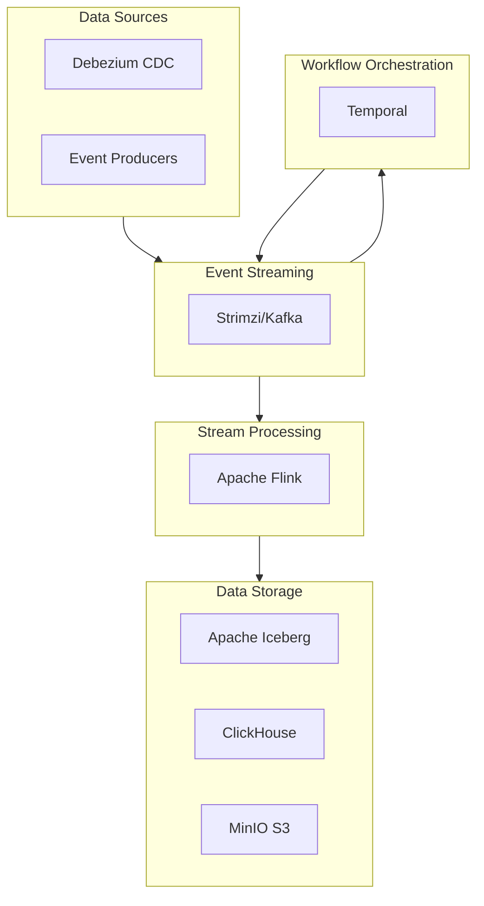

# OpenOva Fabric

Event-driven data integration and lakehouse analytics platform.

**Status:** Accepted | **Updated:** 2026-02-26

---

## Overview

OpenOva Fabric merges data lakehouse and microservices integration into a single product. It provides event-driven data pipelines, stream processing, saga orchestration, and analytics — replacing the former separate Titan and Fuse products.



---

## Components

All components are in `platform/` (flat structure):

| Component | Purpose | Location |
|-----------|---------|----------|
| [strimzi](../../platform/strimzi/) | Apache Kafka event streaming | platform/strimzi |
| [flink](../../platform/flink/) | Stream and batch processing | platform/flink |
| [temporal](../../platform/temporal/) | Saga orchestration + compensation | platform/temporal |
| [debezium](../../platform/debezium/) | Change data capture (CDC) | platform/debezium |
| [iceberg](../../platform/iceberg/) | Open table format (lakehouse) | platform/iceberg |
| [clickhouse](../../platform/clickhouse/) | OLAP analytics database | platform/clickhouse |
| [minio](../../platform/minio/) | Object storage (S3) | platform/minio |

---

## Use Cases

### Event-Driven Integration

```
Source DB → Debezium CDC → Kafka → Flink Processing → Target DB/Iceberg
```

### Saga Orchestration

```
Temporal Workflow → Step 1 (Kafka) → Step 2 (Kafka) → Compensation on failure
```

### Real-Time Analytics

```
Kafka → Flink → ClickHouse → Grafana Dashboards
```

### Data Lakehouse

```
Kafka → Flink → Iceberg (MinIO) → SQL queries via ClickHouse
```

---

## Resource Requirements

| Component | Replicas | CPU | Memory |
|-----------|----------|-----|--------|
| Strimzi/Kafka | 3 | 2 | 8Gi |
| Flink JobManager | 1 | 1 | 2Gi |
| Flink TaskManager | 2 | 2 | 4Gi |
| Temporal | 3 | 1 | 2Gi |
| ClickHouse | 2 | 4 | 16Gi |
| Debezium | 1 | 0.5 | 1Gi |
| **Total** | - | **14.5** | **41Gi** |

---

## Deployment

```yaml
apiVersion: kustomize.toolkit.fluxcd.io/v1
kind: Kustomization
metadata:
  name: fabric
  namespace: flux-system
spec:
  interval: 10m
  path: ./products/fabric/deploy
  prune: true
  sourceRef:
    kind: GitRepository
    name: openova-blueprints
```

---

## Configuration

| Parameter | Description | Default |
|-----------|-------------|---------|
| `TENANT` | Tenant identifier | Required |
| `DOMAIN` | Base domain | Required |
| `KAFKA_REPLICAS` | Kafka broker count | `3` |
| `FLINK_PARALLELISM` | Flink task parallelism | `2` |
| `CLICKHOUSE_SHARDS` | ClickHouse shard count | `1` |

---

*Part of [OpenOva](https://openova.io)*
