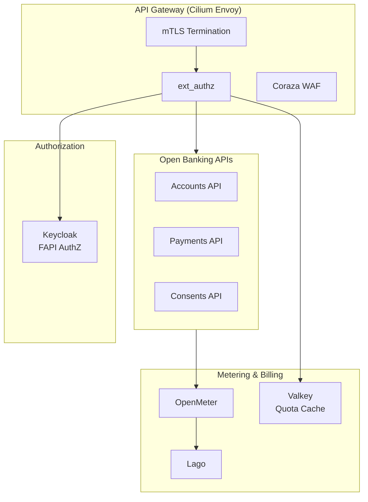

# OpenOva Fingate

Fintech sandbox environments with PSD2/FAPI compliance, TPP management, and API monetization.

**Status:** Accepted | **Updated:** 2026-02-09

---

## Overview

OpenOva Fingate is a product that provides a complete fintech sandbox environment leveraging existing OpenOva infrastructure (Cilium/Envoy) with purpose-built Open Banking components.



---

## Architecture

### Request Flow

```
TPP Request (eIDAS cert)
    |
    v
Cilium Ingress (Envoy)
    |
    | 1. mTLS termination
    | 2. Extract client certificate
    | 3. Call ext_authz
    v
ext_authz Service
    |
    | 4. Validate eIDAS cert
    | 5. Lookup TPP in registry
    | 6. Verify consent
    | 7. Check/decrement quota
    v
Backend Services --> Kafka --> OpenMeter --> Lago
```

### Why Envoy (Not Kong/Tyk)

| Aspect | Kong/Tyk | Envoy + Services |
|--------|----------|------------------|
| Consistency | Different proxy | Same as Cilium |
| Observability | Separate metrics | Unified Grafana |
| Customization | Plugin system | Standard services |
| Operational burden | HA database | Stateless ext_authz |

---

## Components

### A La Carte Components (Reusable)

| Component | Purpose | License |
|-----------|---------|---------|
| Keycloak | FAPI Authorization Server | Apache 2.0 |
| OpenMeter | Usage metering | Apache 2.0 |
| Lago | Billing and invoicing | AGPL-3.0 |

### Custom Services (Open Banking Specific)

| Service | Purpose |
|---------|---------|
| ext-authz | Central authorization (eIDAS, consent, TPP) |
| accounts-api | Open Banking Accounts API |
| payments-api | Open Banking Payments API |
| consents-api | Consent management |
| tpp-management | TPP registry and lifecycle |
| sandbox-data | Mock data for testing |

### Existing Components Leveraged

| Component | Role |
|-----------|------|
| Cilium/Envoy | API Gateway (mTLS, routing, rate limiting) |
| Coraza | WAF (OWASP CRS) |
| Valkey | Quota cache (real-time credit tracking) |
| Strimzi/Kafka | Metering event streaming |
| CNPG | Consent and TPP data storage |

---

## Monetization Models

| Model | Description |
|-------|-------------|
| Prepaid | Buy credits upfront, atomic decrement in Valkey |
| Post-paid | Meter usage, invoice at period end |
| Subscription + Overage | Monthly fee + per-call overage |
| Tiered | Volume-based pricing |

### Prepaid Flow

```
TPP buys credits --> Lago --> Sync to Valkey
                                   |
Request --> ext_authz --> Valkey: atomic DECR
                                   |
                         balance > 0 --> ALLOW
                         balance <= 0 --> BLOCK (402)
```

### Post-paid Flow

```
Request --> Access Log --> Kafka --> OpenMeter --> Lago invoice
```

---

## API Specifications

### Supported Standards

| Standard | Version | Status |
|----------|---------|--------|
| UK Open Banking | 3.1.10 | Supported |
| Berlin Group NextGenPSD2 | 1.3.8 | Planned |
| STET | 1.4.2 | Planned |

### Endpoints

```yaml
# Accounts API
/accounts:
  GET: List accounts (requires consent)
/accounts/{accountId}/balances:
  GET: Get account balances
/accounts/{accountId}/transactions:
  GET: Get account transactions

# Payments API
/payments:
  POST: Initiate payment
/payments/{paymentId}:
  GET: Get payment status

# Consents API
/consents:
  POST: Create consent request
/consents/{consentId}:
  GET: Get consent status
  DELETE: Revoke consent
```

---

## Security

### mTLS with eIDAS Certificates

```
1. Verify certificate chain against eIDAS trust anchors
2. Check certificate not expired
3. Verify OCSP status (not revoked)
4. Extract TPP authorization number
5. Validate roles (AISP, PISP, CBPII) against operation
```

### Supported Certificate Types

| Type | OID | Roles |
|------|-----|-------|
| QWAC | 0.4.0.19495.2.1 | Transport (mTLS) |
| QSealC | 0.4.0.19495.2.2 | Signing (JWS) |

### Rate Limits

| Tier | Requests/Second | Requests/Day |
|------|-----------------|--------------|
| Sandbox | 10 | 10,000 |
| Starter | 50 | 100,000 |
| Growth | 200 | 500,000 |
| Enterprise | Custom | Custom |

---

## Deployment

### Enable Product

```yaml
apiVersion: kustomize.toolkit.fluxcd.io/v1
kind: Kustomization
metadata:
  name: open-banking
  namespace: flux-system
spec:
  interval: 10m
  path: ./open-banking/deploy
  prune: true
  sourceRef:
    kind: GitRepository
    name: openova-blueprints
  postBuild:
    substitute:
      TENANT: ${TENANT}
      DOMAIN: ${DOMAIN}
```

### Gateway Routes

```yaml
apiVersion: gateway.networking.k8s.io/v1
kind: HTTPRoute
metadata:
  name: open-banking-api
  namespace: open-banking
spec:
  parentRefs:
    - name: cilium-gateway
      namespace: cilium-system
  hostnames:
    - "api.openbanking.${TENANT}.${DOMAIN}"
  rules:
    - matches:
        - path:
            type: PathPrefix
            value: /accounts
      filters:
        - type: ExtensionRef
          extensionRef:
            group: cilium.io
            kind: CiliumEnvoyConfig
            name: ext-authz-filter
      backendRefs:
        - name: accounts-api
          port: 8080
```

---

## Configuration

| Parameter | Description | Default |
|-----------|-------------|---------|
| `TENANT` | Tenant identifier | Required |
| `DOMAIN` | Base domain | Required |
| `OB_STANDARD` | Open Banking standard | `uk-ob-3.1` |
| `SANDBOX_ENABLED` | Enable sandbox mode | `true` |
| `KEYCLOAK_REPLICAS` | Keycloak replicas | `2` |
| `RATE_LIMIT_RPS` | Default rate limit | `100` |

---

## Sandbox

### Test Data

| Account ID | Type | Currency | Balance |
|------------|------|----------|---------|
| acc-001 | Current | GBP | 1,500.00 |
| acc-002 | Savings | GBP | 25,000.00 |
| acc-003 | Current | EUR | 3,200.50 |

### Test Certificates

Pre-generated eIDAS test certificates:
- `test-aisp.pem` - AISP certificate
- `test-pisp.pem` - PISP certificate
- `test-cbpii.pem` - CBPII certificate

### Simulation Modes

| Mode | Behavior |
|------|----------|
| Happy Path | All requests succeed |
| Error Simulation | Configurable error responses |
| Latency Injection | Configurable delays |

---

## Operations

### Health Checks

```bash
# Check all components
kubectl get pods -n open-banking
kubectl get pods -n open-banking-metering

# Check Keycloak
curl -k https://auth.openbanking.${TENANT}.${DOMAIN}/health

# Check API
curl -k https://api.openbanking.${TENANT}.${DOMAIN}/health
```

### Smoke Test

```bash
export CERT=/path/to/test-aisp.pem
export KEY=/path/to/test-aisp-key.pem

# Get access token
TOKEN=$(curl -X POST \
  --cert $CERT --key $KEY \
  https://auth.openbanking.${TENANT}.${DOMAIN}/realms/open-banking/protocol/openid-connect/token \
  -d "grant_type=client_credentials&client_id=test-aisp" | jq -r '.access_token')

# Call Accounts API
curl -H "Authorization: Bearer $TOKEN" \
  --cert $CERT --key $KEY \
  https://api.openbanking.${TENANT}.${DOMAIN}/accounts
```

### TPP Onboarding

1. TPP submits registration via Developer Portal (Backstage)
2. Validate eIDAS certificate
3. Create TPP record in registry
4. Assign billing plan
5. Issue sandbox credentials

---

## Monitoring

### Grafana Dashboards

| Dashboard | Purpose |
|-----------|---------|
| API Overview | Request rates, latencies, errors |
| TPP Analytics | Per-TPP usage, quotas |
| SLA Compliance | Uptime vs targets |
| Monetization | Revenue, usage by plan |

### Key Metrics

```promql
# Request rate by TPP
sum(rate(open_banking_requests_total[5m])) by (tpp_id)

# Error rate
sum(rate(open_banking_requests_total{status=~"5.."}[5m])) /
sum(rate(open_banking_requests_total[5m]))

# Quota remaining
open_banking_credits_remaining
```

---

## Resource Requirements

| Component | Replicas | CPU | Memory |
|-----------|----------|-----|--------|
| Keycloak | 2 | 2 | 4Gi |
| ext_authz | 3 | 1.5 | 1.5Gi |
| Accounts API | 2 | 1 | 1Gi |
| Payments API | 2 | 1 | 1Gi |
| Consents API | 2 | 0.5 | 512Mi |
| OpenMeter | 2 | 1 | 2Gi |
| Lago | 2 | 1 | 2Gi |
| **Total** | - | **8.5** | **12.5Gi** |

---

## Troubleshooting

| Issue | Cause | Resolution |
|-------|-------|------------|
| 401 Unauthorized | Invalid/expired certificate | Check eIDAS cert validity |
| 403 Forbidden | TPP not registered | Verify TPP onboarding |
| 429 Too Many Requests | Quota exceeded | Check billing plan limits |
| 502 Bad Gateway | Backend unavailable | Check pod health |

---

## Consequences

**Positive:**
- Leverages existing Cilium/Envoy investment
- Full control over Open Banking logic
- Unified observability with Grafana
- Supports multiple Open Banking specs
- Both prepaid and post-paid monetization

**Negative:**
- More development than off-the-shelf
- Need to maintain spec compliance
- Requires Open Banking domain expertise

---

*Part of [OpenOva](https://openova.io)*
