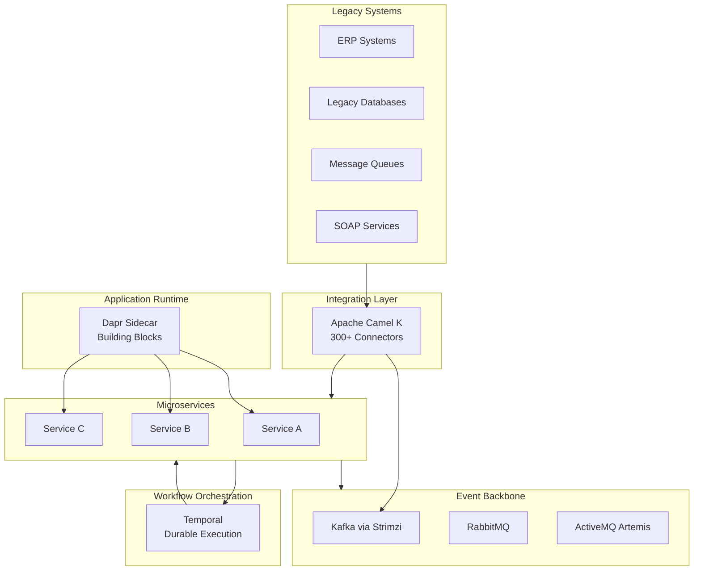

# OpenOva Fuse

Enterprise microservices integration platform.

**Status:** Accepted | **Updated:** 2026-02-09

---

## Overview

OpenOva Fuse is the glue that holds microservice architectures together. It provides the integration patterns, workflow orchestration, and distributed application building blocks that enterprises need when decomposing monoliths or building new microservice-based systems.

Fuse replaces expensive proprietary integration platforms (MuleSoft, IBM Integration Bus, TIBCO) with curated open-source alternatives that run natively on Kubernetes.

## Architecture

## Components

| Component | Purpose | Location |
|-----------|---------|----------|
| [temporal](../../platform/temporal/) | Durable workflow orchestration (saga patterns) | platform/temporal |
| [camel](../../platform/camel/) | Enterprise integration (300+ connectors) | platform/camel |
| [dapr](../../platform/dapr/) | Microservice building blocks (state, pub/sub) | platform/dapr |

Also leverages: Strimzi/Kafka (event streaming), RabbitMQ (message queuing), ActiveMQ Artemis (JMS), Cilium (service mesh).

## Use Cases

| Use Case | Components | Description |
|----------|-----------|-------------|
| Monolith decomposition | Camel + Temporal | Strangler fig pattern with reliable orchestration |
| Legacy integration | Camel K | Connect SOAP, FTP, JDBC, JMS to cloud-native services |
| Distributed transactions | Temporal | Saga patterns replacing two-phase commit |
| Event-driven architecture | Dapr + Kafka | Pub/sub with portable building blocks |
| Service composition | Dapr + Temporal | Reliable multi-service workflows |

## Consequences

**Positive:**
- Complete microservices integration stack
- Replaces MuleSoft/IBM IIB/TIBCO
- All open-source (Apache 2.0 + MIT)
- K8s-native deployment
- Language-agnostic (Dapr sidecar)

**Negative:**
- Multiple paradigms to learn (Camel EIP, Temporal workflows, Dapr building blocks)
- Requires microservices architecture maturity
- Temporal server is stateful (needs PostgreSQL)

---

*Part of [OpenOva](https://openova.io)*
